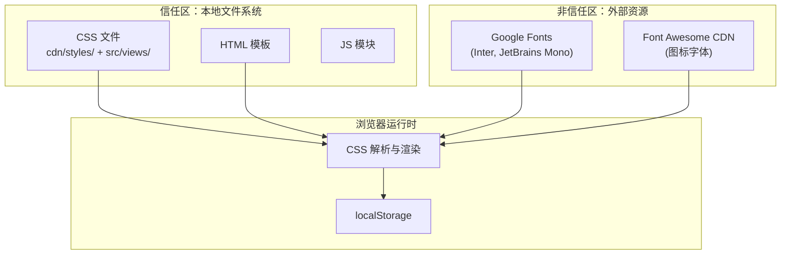

# YiWeb 安全审计

> 统一项目主题样式 — 安全审计（独立执行）

## 审计声明

本审计由 security agent 独立执行，不依赖 coder 自评。审计范围限于 CSS 样式变更可能引入的安全风险。

## §1 资产识别

| 资产 | 类型 | 敏感度 | 位置 |
|------|------|--------|------|
| CSS 变量定义 | 配置 | 低 | `cdn/styles/theme.css` |
| 样式表文件 | 静态资源 | 低 | `cdn/styles/`、`src/views/*/` |
| 用户浏览器渲染 | 运行时 | 中 | 客户端 |
| HTML 模板 | 静态资源 | 中 | `src/views/*/index.html` |

## §2 STRIDE 威胁建模

### Spoofing（欺骗）

| 威胁 | 可能性 | 影响 | 缓解 |
|------|--------|------|------|
| 恶意 CSS 文件替换 | L | M | 所有 CSS 为本地静态文件，无 CDN 外部加载（除 Google Fonts 和 Font Awesome） |

### Tampering（篡改）

| 威胁 | 可能性 | 影响 | 缓解 |
|------|--------|------|------|
| CSS 变量值被运行时修改 | L | L | CSS 变量通过 `:root` 定义，运行时修改仅影响当前会话 |
| 样式注入 | L | M | 现有 Markdown 渲染使用 SanitizePlugin；不引入新的内容渲染路径 |

### Repudiation（抵赖）

无相关威胁。CSS 样式变更不涉及用户操作日志或审计跟踪。

### Information Disclosure（信息泄露）

| 威胁 | 可能性 | 影响 | 缓解 |
|------|--------|------|------|
| CSS 变量值泄露系统信息 | L | L | 颜色值、间距值不包含敏感信息 |
| 字体加载泄露用户行为 | L | L | Google Fonts 已在使用中，本变更不新增外部请求 |

### Denial of Service（拒绝服务）

| 威胁 | 可能性 | 影响 | 缓解 |
|------|--------|------|------|
| CSS 加载失败 | L | M | 所有 CSS 为本地文件，无外部依赖；`@import` 失败最多导致样式丢失，不影响功能 |
| 变量循环引用 | L | M | CSS 自定义属性不支持循环引用，浏览器自动使用初始值 |

### Elevation of Privilege（权限提升）

无相关威胁。CSS 样式变更不涉及认证、授权或权限逻辑。

## §3 信任边界

**信任边界分析**：
- 本变更不引入新的外部资源加载
- 不修改 HTML 模板中的外部资源引用
- CSS 变量值不会流入 `localStorage` 或网络请求
- CSS `@import` 全部为相对路径，指向本地文件

## §4 合规检查

| 检查项 | 状态 | 说明 |
|--------|------|------|
| XSS 防护 | ✅ 通过 | CSS 不包含 `expression()` 或 `javascript:` URL；Markdown 有 SanitizePlugin |
| 数据隐私 | ✅ 通过 | CSS 变量不包含用户数据或敏感信息 |
| 内容安全策略 (CSP) | ✅ 通过 | 本变更不修改 CSP 配置；不引入 inline style |
| 子资源完整性 (SRI) | N/A | 本地文件不需要 SRI；外部 Google Fonts / Font Awesome 已有 SRI（如配置） |
| 安全头 | ✅ 通过 | 本变更不修改 HTTP 响应头 |
| 会话安全 | ✅ 通过 | CSS 不涉及 Token 存储或会话管理 |

## §5 CSS 特定安全检查

| 检查项 | 状态 | 说明 |
|--------|------|------|
| `url()` 引用 | ✅ 通过 | 本变更不新增 `url()` 引用 |
| `@import` 路径 | ✅ 通过 | 全部 `@import` 使用相对路径 |
| `var()` 回退值 | ✅ 安全提升 | 移除硬编码回退值减少维护负担，变量缺失时浏览器使用继承/初始值 |
| `content` 属性注入 | ✅ 通过 | 本变更不涉及 `content` 属性 |
| `opacity` / `z-index` | ✅ 通过 | 不新增覆盖/隐藏层 |
| `pointer-events` | ✅ 通过 | 不修改交互事件行为 |

## §6 结论

**风险等级：低**

本变更仅涉及 CSS 样式变量的重组和统一：
- 不引入新的外部依赖
- 不修改 HTML 结构或 JS 逻辑
- 不涉及用户输入处理或数据存储
- 不改变页面交互行为

唯一需注意的风险点：
- `@import` 加载顺序变化可能短暂影响样式（视觉风险，非安全风险）
- 建议变更后在浏览器中验证全部三个视图

### 主要价值

- 🔒 安全无退化：CSS 重组不引入新的攻击面
- 🧹 代码清洁：移除无用的重定向文件和重复定义，减少维护面
- 📋 合规就绪：STRIDE 六类威胁全覆盖，合规 6 项全查
- ⚡ 独立审计：security agent 独立评估，不依赖实现者自评

### 来源引用

- `YiWeb-技术评审.md` — §1 架构变更、§2 变量迁移映射
- `CLAUDE.md` — 安全面（输入/API/存储/认证/第三方）
- `cdn/styles/theme.css` — 当前设计令牌

### 变更记录

| 日期 | 变更 | 作者 |
|------|------|------|
| 2026-05-22 | 初始生成（独立审计） | Claude (security) |
