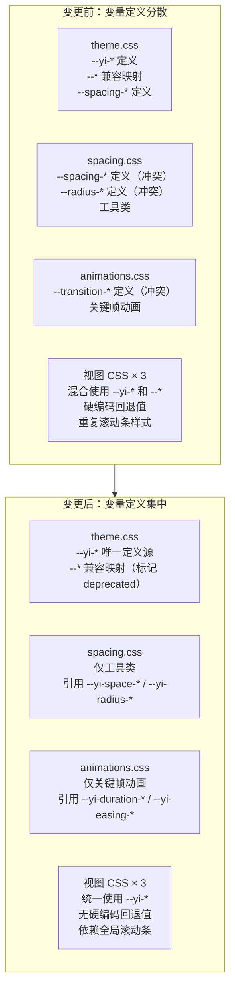

# YiWeb 技术评审

> 统一项目主题样式 — 技术方案

## §0 基线溯源

| 源文档 | 源章节 | 目标章节 |
|--------|--------|---------|
| YiWeb-故事任务.md | Story 1 - 合并消除重复变量 | §1 架构变更 |
| YiWeb-故事任务.md | Story 2 - 统一视图 CSS | §4 组件变更 |
| YiWeb-故事任务.md | Story 3 - 统一共享组件 | §4 组件变更 |
| YiWeb-故事任务.md | Story 4 - 清理旧版变量 | §1 架构变更 |
| YiWeb-使用场景.md | UC1–UC5 | §5 交互一致性 |

## §0.1 效果示意



## §1 架构变更

### 当前架构

```
cdn/styles/
├── index.css          → @import 所有子文件
├── theme.css          → :root 变量定义（--yi-* + --* 兼容）
├── utilities.css      → 工具类
├── utils.css          → 旧版通用组件样式
├── base/
│   ├── reset.css      → CSS 重置
│   ├── typography.css → 排版
│   ├── animations.css → 动画变量 + 关键帧
│   ├── spacing.css    → 间距变量 + 工具类
│   ├── layout.css     → 布局
│   └── display.css    → 显示/定位
└── components/
    ├── scrollbar.css  → 滚动条
    ├── tooltips.css   → 工具提示
    └── syntax-highlight.css → 语法高亮
```

### 目标架构

```
cdn/styles/
├── index.css          → @import 顺序调整
├── theme.css          → :root 唯一变量定义源（移除重复到 base/ 的变量定义）
├── utilities.css      → 清理旧版 fallback
├── utils.css          → 迁移硬编码颜色到 --yi-*
├── base/
│   ├── reset.css      → 不变
│   ├── typography.css → 不变
│   ├── animations.css → 仅保留关键帧 + 动画工具类（移除 :root 变量定义）
│   ├── spacing.css    → 仅保留工具类（移除 :root 变量定义）
│   ├── layout.css     → 不变
│   └── display.css    → 不变
└── components/
    ├── scrollbar.css  → 增强为全局统一滚动条
    ├── tooltips.css   → 迁移硬编码颜色
    └── syntax-highlight.css → 不变
```

### 关键变更点

| # | 文件 | 变更 |
|---|------|------|
| 1 | `theme.css` | 移除底部重复的 `--spacing-*`、`--radius-*`、`--transition-*`、`--font-*` 旧版变量定义（保留 `--*` 兼容映射区的必要映射） |
| 2 | `spacing.css` | 移除 `:root` 中的变量定义块，工具类引用改为 `--yi-space-*`、`--yi-radius-*` |
| 3 | `animations.css` | 移除 `:root` 中的变量定义块，过渡工具类引用改为 `--yi-duration-*`、`--yi-easing-*` |
| 4 | `utilities.css` | 移除工具类中的旧版 fallback 值 |
| 5 | `utils.css` | 硬编码颜色替换为 `rgba(var(--yi-*-rgb), ...)` 模式 |

## §2 变量迁移映射表

### 间距变量

| 旧变量（spacing.css 定义） | 新变量（theme.css 定义） | 值差异 |
|--------------------------|------------------------|--------|
| `--spacing-xs: 0.25rem` | `--yi-space-1: 4px` | 等价 |
| `--spacing-sm: 0.5rem` | `--yi-space-2: 8px` | 等价 |
| `--spacing-md: 1rem` | `--yi-space-4: 16px` | 等价 |
| `--spacing-lg: 1.5rem` | `--yi-space-6: 24px` | 等价 |
| `--spacing-xl: 2rem` | `--yi-space-8: 32px` | 等价 |
| `--spacing-2xl: 3rem` | `--yi-space-12: 48px` | 等价 |

### 圆角变量

| 旧变量（spacing.css 定义） | 新变量（theme.css 定义） | 值差异 |
|--------------------------|------------------------|--------|
| `--radius-sm: 8px` | `--yi-radius-sm: 4px` | **冲突** — 旧值 8px vs 新值 4px |
| `--radius-md: 12px` | `--yi-radius-md: 6px` | **冲突** — 旧值 12px vs 新值 6px |
| `--radius-lg: 16px` | `--yi-radius-lg: 8px` | **冲突** — 旧值 16px vs 新值 8px |
| `--radius-xl: 20px` | `--yi-radius-xl: 12px` | **冲突** — 旧值 20px vs 新值 12px |

> **决议**：以 `--yi-radius-*` 为准。`spacing.css` 移除 `--radius-*` 定义后，其工具类（如 `.radius-sm`）将引用 `--yi-radius-*`，视觉上圆角会变小。需验证视图是否有元素依赖旧的大圆角值。

### 动画变量

| 旧变量（animations.css 定义） | 新变量（theme.css 定义） | 值差异 |
|-----------------------------|------------------------|--------|
| `--transition-fast: 0.15s cubic-bezier(...)` | `--yi-duration-fast: 150ms` + `--yi-easing-default` | 值等价，但旧版是复合值，新版是分离值 |
| `--transition-normal: 0.3s ...` | `--yi-duration-normal: 200ms` + `--yi-easing-default` | **冲突** — 旧值 300ms vs 新值 200ms |
| `--transition-slow: 0.5s ...` | `--yi-duration-slow: 300ms` + `--yi-easing-default` | **冲突** — 旧值 500ms vs 新值 300ms |

> **决议**：以 `--yi-duration-*` 为准。`animations.css` 中动画工具类（`.transition-fast` 等）改为引用 `var(--yi-duration-fast) var(--yi-easing-default)`。`theme.css` 的 `--transition-fast` 映射保留以确保兼容。

## §3 视图级变量替换

### AICR 视图

| 当前引用 | 替换为 |
|---------|--------|
| `var(--spacing-lg)` | `var(--yi-space-6)` |
| `var(--spacing-md)` | `var(--yi-space-4)` |
| `var(--radius-lg)` | `var(--yi-radius-lg)` |
| `var(--yi-text, #F8FAFC)` | `var(--yi-text)` |
| `var(--yi-text-secondary, #CBD5E1)` | `var(--yi-text-secondary)` |
| `var(--yi-text-muted, #94A3B8)` | `var(--yi-text-muted)` |
| `var(--yi-bg, #0F172A)` | `var(--yi-bg)` |
| `var(--yi-border, rgba(255,255,255,0.1))` | `var(--yi-border)` |
| 硬编码 `transition: all 0.15s` | `transition: all var(--yi-duration-fast) var(--yi-easing-default)` |
| 硬编码 `transition: border-color 0.15s` | `transition: border-color var(--yi-duration-fast) var(--yi-easing-default)` |
| 重复滚动条样式 | 移除，依赖全局 `scrollbar.css` |

### Claude 视图

| 当前引用 | 替换为 |
|---------|--------|
| `var(--yi-text, #F8FAFC)` | `var(--yi-text)` |
| `var(--yi-text-secondary, #CBD5E1)` | `var(--yi-text-secondary)` |
| `var(--yi-text-muted, #94A3B8)` | `var(--yi-text-muted)` |
| `var(--yi-bg, #0F172A)` | `var(--yi-bg)` |
| `var(--yi-surface, #1E293B)` | `var(--yi-surface)` |
| `var(--yi-primary, #2563EB)` | `var(--yi-primary)` |
| `var(--yi-danger, #EF4444)` | `var(--yi-danger)` |
| `var(--yi-border, rgba(255,255,255,0.1))` | `var(--yi-border)` |
| `var(--yi-surface-hover, #334155)` | `var(--yi-surface-hover)` |
| `rgba(239, 68, 68, 0.1)` | `rgba(var(--yi-danger-rgb), 0.1)` |
| `#fff` | `var(--yi-text-on-primary)` |
| `rgba(0, 0, 0, 0.6)` | 保持不变（遮罩层使用固定黑色） |
| 重复滚动条样式 | 移除，依赖全局 `scrollbar.css` |

### Story 视图

| 当前引用 | 替换为 |
|---------|--------|
| 同 Claude 视图的所有 fallback 清理 | 同 Claude 视图 |
| `#A855F7` (self_improve 列) | `--yi-self-improve: #A855F7` 新增到 `theme.css` |
| `#1A2332` (不存在的回退值) | `var(--yi-surface-elevated)` |
| `#fff` | `var(--yi-text-on-primary)` |
| `rgba(239, 68, 68, 0.1)` | `rgba(var(--yi-danger-rgb), 0.1)` |

## §4 兼容性保障

| 保障项 | 说明 |
|--------|------|
| `theme.css` 旧版 `--*` 映射保留 | 标记 deprecated 但不删除，确保任何遗漏的旧版引用仍有值 |
| `spacing.css` 工具类类名不变 | `.m-*`、`.p-*`、`.gap-*` 类名不变，仅修改变量引用 |
| `animations.css` 工具类类名不变 | `.transition-*`、`.animate-*` 类名不变 |
| HTML 零修改 | 不修改任何 HTML 模板 |
| JS 零修改 | 不修改任何 JS 文件 |

## §5 视觉效果验证清单

| # | 验证点 | 视图 | 方法 |
|---|--------|------|------|
| 1 | 页面背景色 | 全部 | DevTools 检查 `background-color` computed value |
| 2 | 文字颜色层级（主/次/弱） | 全部 | 对比标题、正文、辅助文字颜色 |
| 3 | 边框颜色 | 全部 | 检查卡片、输入框、分割线边框 |
| 4 | 按钮主色/悬停色 | 全部 | 悬停按钮检查颜色过渡 |
| 5 | 输入框焦点环 | 全部 | 点击输入框检查 focus 样式 |
| 6 | 卡片/面板背景 | 全部 | 检查卡片和侧面板背景色 |
| 7 | 圆角大小 | 全部 | 对比按钮、卡片、输入框圆角 |
| 8 | 过渡动画速度 | 全部 | 悬停交互检查动画流畅度 |
| 9 | 滚动条样式 | 全部 | 滚动内容区检查滚动条 |
| 10 | 统计栏/筛选栏 | 全部 | 检查统计栏数字颜色、筛选标签样式 |

### 主要价值

- 📋 变更范围明确：4 个 Story，16 个 AC，逐步推进
- 🎯 变量映射清晰：每个旧变量有明确的新变量目标
- ⚡ 回退安全：旧版 `--*` 映射保留，HTML/JS 零修改
- 🔄 渐进式迁移：先合并定义 → 再迁移引用 → 最后清理

### 来源引用

- `cdn/styles/theme.css` — 设计系统令牌定义
- `cdn/styles/base/spacing.css` — 间距变量与工具类
- `cdn/styles/base/animations.css` — 动画变量与关键帧
- `cdn/styles/utilities.css` — 工具类
- `src/views/aicr/components/aicrPage/index.css` — AICR 视图样式
- `src/views/claude/components/claudePanelPage/index.css` — Claude 视图样式
- `src/views/story/components/storyPanelPage/index.css` — Story 视图样式

### 变更记录

| 日期 | 变更 | 作者 |
|------|------|------|
| 2026-05-22 | 初始生成 | Claude |
