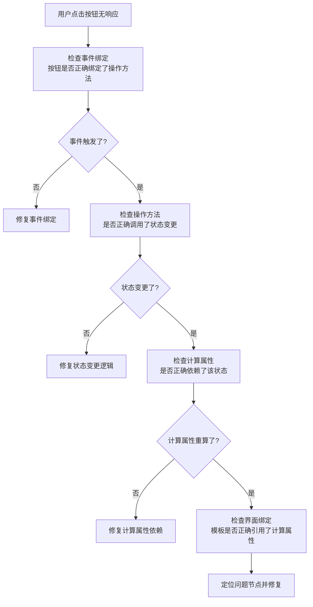
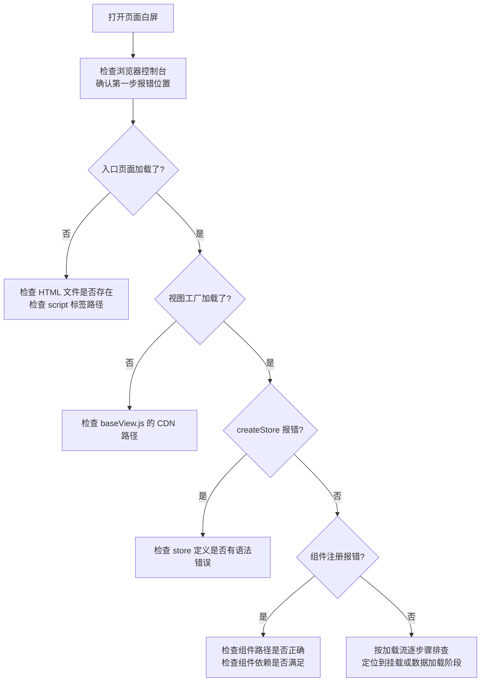
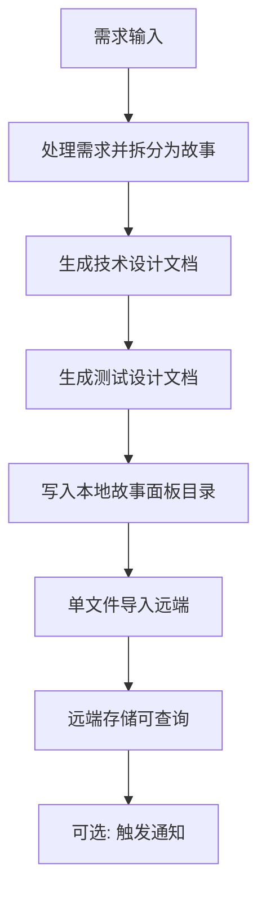
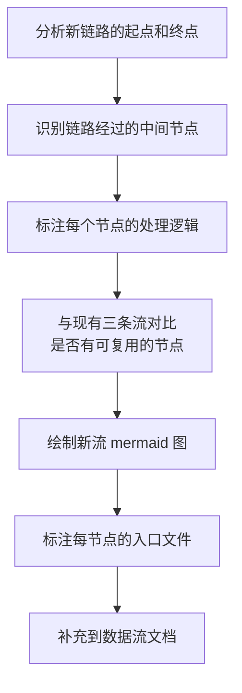

# YiWeb-系统架构-数据流 · 使用场景

> v1.0.0 | 2026-05-28 | deepseek-v4-pro | feat/yiweb-arch-sub-stories

> **导航**: [← 故事任务](./故事任务.md) · [→ 技术评审](./技术评审.md)

> [§1 角色](#sec1) · [§2 场景](#sec2)

### 主要价值

- 🐛 问题排查 — 按数据流节点快速定位异常发生位置
- 📖 理解请求生命周期 — 从用户点击到界面更新的完整过程
- 🏗️ 新人上手 — 掌握视图从加载到挂载的全部步骤
- 📄 了解文档管线 — 理解需求如何流转为远端存储的文档

## §1 角色

| 角色 | 职责 | 关注点 |
|------|------|--------|
| 问题排查者 | 定位异常发生在数据流的哪个环节 | 命令流的每一步处理节点 |
| 功能开发者 | 理解用户操作如何驱动界面更新 | 从事件到界面更新的完整链路 |
| 新加入的开发者 | 了解视图如何加载和挂载 | 视图加载流的全部步骤 |
| 文档维护者 | 理解文档从需求到远端的流转 | 文档管线流的每步处理 |

## §2 场景

### 场景 1: 排查用户操作无响应 — 追踪命令流

- **角色**: 收到 Bug 报告的问题排查者
- **前置**: 用户反馈点击按钮后界面无变化
- **操作流**:

- **后置**: 定位到命令流中的断点环节
- **异常**: 事件触发了但状态没变 → 检查操作方法中是否有条件判断阻断了变更

| 步骤 | 操作 | 参考 |
|------|------|------|
| 1 | 确认事件是否绑定到正确的操作方法 | 命令流图的事件节点 |
| 2 | 确认操作方法是否正确执行了状态变更 | 命令流图的状态变更节点 |
| 3 | 确认计算属性是否响应了状态变更 | 命令流图的计算属性节点 |
| 4 | 确认界面模板是否绑定了计算属性 | 命令流图的界面更新节点 |

### 场景 2: 视图加载失败 — 追踪加载流

- **角色**: 排查白屏问题的问题排查者
- **前置**: 用户反馈打开页面后白屏或报错
- **操作流**:

- **后置**: 定位到视图加载流中的失败步骤
- **异常**: 组件加载超时 → 检查组件路径是否可达，网络是否有问题

| 步骤 | 操作 | 参考 |
|------|------|------|
| 1 | 打开浏览器开发者工具查看控制台错误 | 浏览器控制台 |
| 2 | 检查 Network 面板确认所有脚本加载成功 | 浏览器网络面板 |
| 3 | 按加载流步骤从入口到挂载逐节点排查 | 视图加载流图 |
| 4 | 定位失败步骤并查看对应源码 | 加载流节点的入口文件标注 |

### 场景 3: 追踪文档生成 — 理解管线流

- **角色**: 需要了解文档如何生成和同步的文档维护者
- **前置**: 想知道一次文档变更经历了哪些步骤
- **操作流**:

- **后置**: 理解文档从需求到远端的完整链路
- **异常**: 导入远端失败 → 检查网络和认证配置，本地文档不受影响

| 步骤 | 操作 | 参考 |
|------|------|------|
| 1 | 理解管线各阶段职责 | 文档管线流图 |
| 2 | 确认每阶段的输入输出 | 管线流节点的标注 |
| 3 | 检查导入状态 | 导入脚本的输出日志 |

### 场景 4: 新增数据流 — 扩展系统链路

- **角色**: 需要新增一种数据处理链路的架构决策者
- **前置**: 现有三条数据流不足以覆盖新场景
- **操作流**:

- **后置**: 新数据流已文档化，与现有流不重复
- **异常**: 新流与现有流高度重叠 → 考虑在现有流基础上标注分支而非新建

| 步骤 | 操作 | 参考 |
|------|------|------|
| 1 | 明确新链路的业务场景和触发条件 | 业务需求 |
| 2 | 确定链路的起点（触发事件）和终点（最终效果） | 系统边界 |
| 3 | 追踪起点到终点的所有中间处理步骤 | 源码路径 |
| 4 | 绘制 mermaid 流程图并标注入口文件 | 现有数据流格式 |

---

> **变更记录**：v1.0.0 — 从父故事 yiweb-arch FP3 拆分创建（2026-05-28，`/rui update`）
