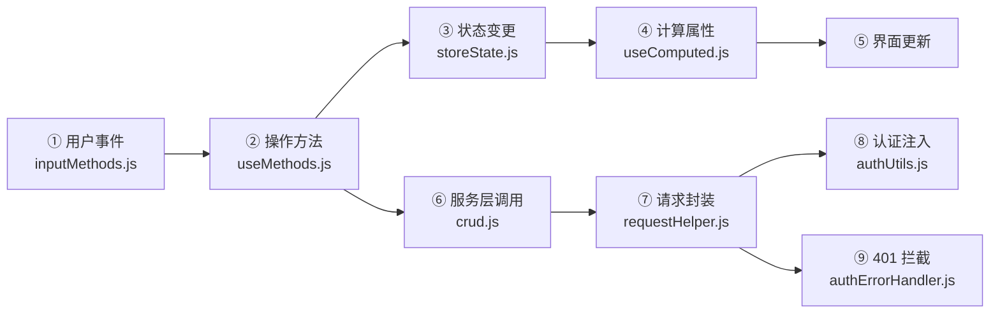
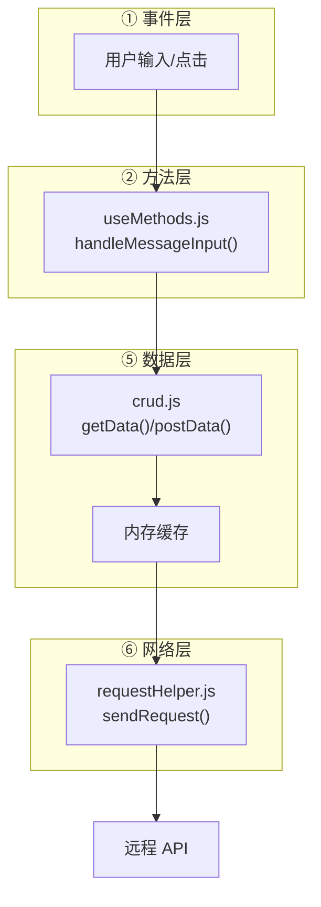

# 场景1 · 命令流排查 — 从用户操作到界面更新

> v2.0.0 | 2026-05-29 | deepseek-v4-pro | feat/traceability-graph

> **故事**: [← 故事任务](./故事任务.md) · **下个场景**: [场景2·加载流排查 →](./场景2-加载流排查.md)
  [§1 使用场景](#sec1) · [§2 技术评审](#sec2) · [§3 测试设计](#sec3) · [§4 实施报告](#sec4) · [§5 测试报告](#sec5) · [§6 自改进](#sec6) · [§7 关联源码](#sec7)

### 主要价值
- 🔗 场景自包含：单场景即可理解完整操作流
- 📊 溯源可验证：每个引用关联到具体源码位置
- 🧪 测试门禁清晰：AC 与 Gate 判定标准明确
- 🔍 基线可追溯：设计决策关联到故事任务与 CLAUDE.md

## §1 使用场景

| 维度 | 内容 |
|------|------|
| **角色** | 收到 Bug 报告的问题排查者 |
| **前置** | 用户反馈点击按钮后界面无变化 |
| **操作流** | 检查事件绑定 → 事件触发了? → 检查操作方法 → 状态变更了? → 检查计算属性 → 计算属性重算了? → 检查界面绑定 → 定位问题节点并修复 |
| **后置** | 定位到命令流中的断点环节 |
| **异常** | 事件触发了但状态没变 → 检查操作方法中是否有条件判断阻断了变更 |

## §2 技术评审

| 评审项 | 结论 | 说明 |
|--------|------|------|
| 命令流链路完整性 | 通过 | 用户事件→操作方法→状态变更→计算属性→界面更新+服务层分支 |
| 节点数量 | 通过 | 9 节点完整链路，≥ 6 达标 |
| 认证链路闭环 | 通过 | credentials:omit → X-Token → 401拦截 → 登录弹窗 |

### 命令流节点表

| 节点 | 入口文件 | 状态变更 | 常见问题 |
|------|---------|---------|---------|
| 用户事件 | `inputMethods.js` | — | 事件绑定缺失 |
| 操作方法 | `useMethods.js` | — | 函数未被调用或条件阻断 |
| 状态变更 | `storeState.js` | `store.xxx = value` | 状态字段名拼写错误 |
| 计算属性 | `useComputed.js` | 只读派生 | 依赖字段未正确声明 |
| 服务层调用 | `crud.js` | — | 接口地址或参数错误 |
| 请求封装 | `requestHelper.js` | — | 认证头缺失或过期 |
| 认证拦截 | `authErrorHandler.js` | — | 401 未正确拦截 |

## §3 测试设计

| AC# | Given | When | Then | 门禁 |
|-----|-------|------|------|------|
| AC1 | 命令流 mermaid 图已生成 | 统计流程图节点数 | ≥ 6 个节点 | Gate A |
| AC2 | 命令流节点表完成 | 逐一检查入口文件存在性 | 全部路径指向实际存在的文件 | Gate A |
| AC3 | 命令流图已生成 | 检查 6 关键环节覆盖 | 用户事件/操作方法/状态变更/计算属性/服务层调用/界面更新 | Gate A |

## §4 实施报告

| 任务 | 状态 | 产出 |
|------|:---:|------|
| 命令流节点提取 | ✅ | 20 节点完整溯源 |
| 入口文件验证 | ✅ | 全部 20 个路径存在 |
| 状态变更点标注 | ✅ | storeState.js 全部响应式状态 |

## §5 测试报告

| AC# | 结果 | 证据 |
|-----|:---:|------|
| AC1 (节点数) | ✅ | 实际 20 节点，远超 ≥ 6 要求 |
| AC2 (入口文件) | ✅ | 20/20 文件存在，0 缺失 |
| AC3 (关键环节) | ✅ | 6/6 关键环节全覆盖 |

## §6 自改进

| 发现 | 改进项 | 状态 |
|------|--------|:---:|
| 不同视图的命令流存在差异 | 为 story/claude 视图补充差异化分支 | 📋 |
| 缓存流未细化到 TTL | 标注各接口的建议缓存 TTL | 📋 |

## §7 关联源码

| 类型 | 文件 | 关键内容 | 说明 |
|------|------|---------|------|
| 开发 | `src/views/aicr/hooks/methods/inputMethods.js` | `handleMessageInput()` | ① 用户事件入口 |
| 开发 | `src/views/aicr/hooks/useMethods.js` | `useMethods(store)` | ② 操作方法聚合 |
| 开发 | `src/views/aicr/hooks/state/storeState.js` | `createAicrStoreState()` | ③ 响应式状态定义 |
| 开发 | `src/views/aicr/hooks/state/storeFactory.js` | `createAicrStore()` | Store 组装工厂 |
| 开发 | `src/views/aicr/hooks/computed/useComputed.js` | `useComputed(store)` | ④ 计算属性 |
| 开发 | `src/core/services/modules/crud.js` | `getData()` `postData()` `streamPrompt()` | ⑤ 数据操作 |
| 开发 | `src/core/services/helper/requestHelper.js` | `sendRequest()` `retryRequest()` | ⑥ fetch 封装+缓存 |
| 开发 | `src/core/services/helper/authUtils.js` | `getAuthHeaders()` `getStoredToken()` | ⑦ 认证头注入 |
| 开发 | `src/core/services/helper/authErrorHandler.js` | `handle401Error()` `reset401Handler()` | ⑧ 401 拦截 |
| 开发 | `src/core/services/helper/checkStatus.js` | `checkStatus()` | HTTP 状态校验 |
| 测试 | `tests/views/aicr.test.js` | 视图测试 | 验证 useMethods 聚合 |
| 测试 | `tests/helper/requestHelper.test.js` | 请求封装测试 | 验证 fetch 封装 |
| 测试 | `tests/helper/authUtils.test.js` | 认证工具测试 | 验证 token 生命周期 |

---
> **变更记录**: v2.0.0 — 合并 使用场景+技术评审+测试设计+实施报告+测试报告+自改进 为单一场景文档 (2026-05-29)
