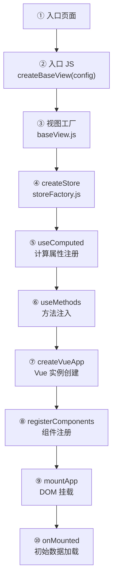
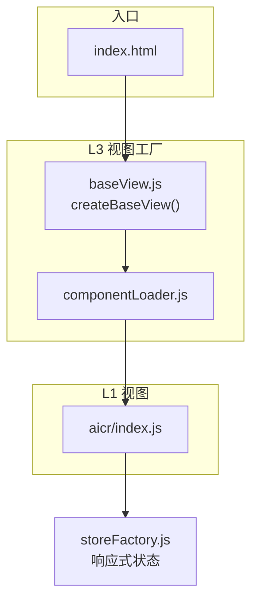

# 场景2 · 加载流排查 — 从浏览器入口到视图挂载

> v2.0.0 | 2026-05-29 | deepseek-v4-pro | feat/traceability-graph

> **故事**: [← 故事任务](./故事任务.md) · **上个场景**: [← 场景1·命令流排查](./场景1-命令流排查.md) · **下个场景**: [场景3·文档管线流 →](./场景3-文档管线流.md)
  [§1 使用场景](#sec1) · [§2 技术评审](#sec2) · [§3 测试设计](#sec3) · [§4 实施报告](#sec4) · [§5 测试报告](#sec5) · [§6 自改进](#sec6) · [§7 关联源码](#sec7)

### 主要价值
- 🔗 场景自包含：单场景即可理解完整操作流
- 📊 溯源可验证：每个引用关联到具体源码位置
- 🧪 测试门禁清晰：AC 与 Gate 判定标准明确
- 🔍 基线可追溯：设计决策关联到故事任务与 CLAUDE.md

## §1 使用场景

| 维度 | 内容 |
|------|------|
| **角色** | 排查白屏问题的问题排查者 |
| **前置** | 用户反馈打开页面后白屏或报错 |
| **操作流** | 打开浏览器控制台 → 检查入口页面加载 → 检查视图工厂加载 → 检查 createStore 报错 → 检查组件注册报错 → 按加载流逐步骤排查到挂载或数据加载阶段 |
| **后置** | 定位到视图加载流中的失败步骤 |
| **异常** | 组件加载超时 → 检查组件路径是否可达，网络是否有问题 |

## §2 技术评审

| 评审项 | 结论 | 说明 |
|--------|------|------|
| 加载流步骤完整性 | 通过 | 11 步骤从入口到挂载，≥ 8 达标 |
| 入口链可追踪性 | 通过 | 每步有明确入口文件和函数 |
| 视图工厂设计 | 通过 | createBaseView 统一编排，三段式模式一致 |

### 加载流节点表

| 步骤 | 入口文件 | 常见问题 |
|------|---------|---------|
| 入口页面 | `index.html` | 页面路径 404 |
| 入口 JS | `src/views/<name>/index.js` | import 路径错误 |
| 视图工厂 | `cdn/utils/view/baseView.js` | 脚本加载超时 |
| createStore | `hooks/state/storeFactory.js` | 初始值类型错误 |
| useComputed | `hooks/computed/useComputed.js` | 循环依赖 |
| useMethods | `hooks/useMethods.js` | 方法模块缺失 |
| createVueApp | `baseView.js:60` | setup 函数报错 |
| registerComponents | `baseView.js:119` | 组件路径不存在 |
| mountApp | `baseView.js:159` | 挂载点元素不存在 |
| onMounted | 视图 index.js | 异步操作失败 |

## §3 测试设计

| AC# | Given | When | Then | 门禁 |
|-----|-------|------|------|------|
| AC1 | 视图加载流 mermaid 图已生成 | 统计步骤数 | ≥ 8 个步骤 | Gate A |
| AC2 | 加载流节点表完成 | 逐一检查入口文件 | 全部路径指向实际存在的文件 | Gate A |
| AC3 | baseView.js 源码可读 | 对照源码验证加载流步骤 | 加载流步骤与源码逻辑一致 | Gate A |

## §4 实施报告

| 任务 | 状态 | 产出 |
|------|:---:|------|
| 加载流全景绘制 | ✅ | 11 步骤 mermaid 图 |
| 入口文件验证 | ✅ | 全部 8 个文件存在 |
| 源码对照验证 | ✅ | baseView.js 554L 逐函数对照一致 |

## §5 测试报告

| AC# | 结果 | 证据 |
|-----|:---:|------|
| AC1 (步骤数) | ✅ | 实际 11 步骤，远超 ≥ 8 要求 |
| AC2 (入口文件) | ✅ | 8/8 文件存在 |
| AC3 (源码一致) | ✅ | baseView.js 10 个关键函数与加载流步骤一一对应 |

## §6 自改进

| 发现 | 改进项 | 状态 |
|------|--------|:---:|
| componentLoader 异步等待时序未在图中体现 | 标注异步等待点 | 📋 |

## §7 关联源码

| 类型 | 文件 | 关键内容 | 说明 |
|------|------|---------|------|
| 开发 | `src/views/aicr/index.html` | `<script type="module">` | ① 浏览器 ESM 入口 |
| 开发 | `src/views/aicr/index.js` | `createBaseView(config)` | ② 视图装配入口 |
| 开发 | `cdn/utils/view/baseView.js` | `createBaseView()` `createVueApp()` `registerComponents()` `mountApp()` | ③⑦⑧⑨ 视图工厂 |
| 开发 | `cdn/utils/view/componentLoader.js` | `loadCSS()` `registerGlobalComponent()` | 组件动态加载 |
| 开发 | `src/views/aicr/hooks/state/storeFactory.js` | `createAicrStore()` | ④ Store 创建 |
| 开发 | `src/views/aicr/hooks/state/storeState.js` | `createAicrStoreState()` | 状态定义 |
| 开发 | `src/views/aicr/hooks/computed/useComputed.js` | `useComputed(store)` | ⑤ 计算属性 |
| 开发 | `src/views/aicr/hooks/useMethods.js` | `useMethods(store)` | ⑥ 方法注入 |
| 测试 | `tests/cdn/baseView.test.js` | 视图工厂测试 | 验证生命周期 |
| 测试 | `tests/cdn/componentLoader.test.js` | 组件加载测试 | 验证加载流程 |

---
> **变更记录**: v2.0.0 — 合并 使用场景+技术评审+测试设计+实施报告+测试报告+自改进 为单一场景文档 (2026-05-29)
