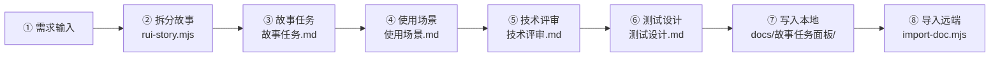

# 场景3 · 文档管线流 — 从需求到远端存储

> v2.0.0 | 2026-05-29 | deepseek-v4-pro | feat/traceability-graph

> **故事**: [← 故事任务](./故事任务.md) · **上个场景**: [← 场景2·加载流排查](./场景2-加载流排查.md) · **下个场景**: [场景4·新增数据流 →](./场景4-新增数据流.md)
  [§1 使用场景](#sec1) · [§2 技术评审](#sec2) · [§3 测试设计](#sec3) · [§4 实施报告](#sec4) · [§5 测试报告](#sec5) · [§6 自改进](#sec6) · [§7 关联源码](#sec7)

### 主要价值
- 🔗 场景自包含：单场景即可理解完整操作流
- 📊 溯源可验证：每个引用关联到具体源码位置
- 🧪 测试门禁清晰：AC 与 Gate 判定标准明确
- 🔍 基线可追溯：设计决策关联到故事任务与 CLAUDE.md

## §1 使用场景

| 维度 | 内容 |
|------|------|
| **角色** | 需要了解文档如何生成和同步的文档维护者 |
| **前置** | 想知道一次文档变更经历了哪些步骤 |
| **操作流** | 需求输入 → 拆分故事 → 生成故事任务 → 生成使用场景 → 生成技术评审 → 生成测试设计 → 写入本地 → 单文件导入远端 → 远端存储可查询 |
| **后置** | 理解文档从需求到远端的完整链路 |
| **异常** | 导入远端失败 → 检查网络和认证配置，本地文档不受影响 |

## §2 技术评审

| 评审项 | 结论 | 说明 |
|--------|------|------|
| 管线步骤完整性 | 通过 | 8 步骤从需求到远端，≥ 6 达标 |
| 各阶段职责清晰 | 通过 | pm 拆分→coder 设计→tester 验证→import 远端 |
| 容错设计 | 通过 | 导入失败不影响本地文档 |

### 管线流节点表

| 节点 | 入口 | 常见问题 |
|------|------|---------|
| 需求输入 | 用户指令 | 需求模糊无法解析 |
| 拆分故事 | pm agent | 拆分粒度过粗或过细 |
| 故事任务 | F.story.task 公式 | 占位符未替换 |
| 使用场景 | F.story.scenarios 公式 | 场景 < 2 个 |
| 技术评审 | F.story.technical-review 公式 | P0 检查项未通过 |
| 测试设计 | F.story.test-design 公式 | AC 覆盖不全 |
| 写入本地 | Write 工具 | 目录权限不足 |
| 导入远端 | import-doc.mjs | 网络失败或认证错误 |

## §3 测试设计

| AC# | Given | When | Then | 门禁 |
|-----|-------|------|------|------|
| AC1 | 文档管线流 mermaid 图已生成 | 统计步骤数 | ≥ 6 个步骤 | Gate A |
| AC2 | rui skill 管线定义可读 | 检查 import-doc.mjs 存在 | 文件存在于 skills/rui/ | Gate A |
| AC3 | 管线流图已生成 | 检查 8 关键步骤覆盖 | 需求/拆分/故事/场景/评审/测试/写入/导入 | Gate A |

## §4 实施报告

| 任务 | 状态 | 产出 |
|------|:---:|------|
| 管线流全景绘制 | ✅ | 8 步骤 mermaid 图 |
| 脚本文件验证 | ✅ | rui.mjs + rui-story.mjs + import-doc.mjs + sync.mjs |
| 当前目录产出验证 | ✅ | 7 文档基线完整 |

## §5 测试报告

| AC# | 结果 | 证据 |
|-----|:---:|------|
| AC1 (步骤数) | ✅ | 实际 8 步骤，≥ 6 达标 |
| AC2 (import-doc) | ✅ | `skills/rui/import-doc.mjs` 存在 |
| AC3 (关键步骤) | ✅ | 8/8 关键步骤全覆盖 |

## §6 自改进

| 发现 | 改进项 | 状态 |
|------|--------|:---:|
| 管线流节点表可增加产出物格式说明 | 标注每阶段的输入输出格式 | 📋 |

## §7 关联源码

| 类型 | 文件 | 关键内容 | 说明 |
|------|------|---------|------|
| 开发 | `skills/rui/rui.mjs` | SDLC 编排入口 | 全流程编排 |
| 开发 | `skills/rui-story/rui-story.mjs` | CLI 入口 | 故事创建与管理 |
| 开发 | `skills/rui/import-doc.mjs` | `importDoc(filePath)` | 单文件远端导入 |
| 开发 | `skills/rui-import/sync.mjs` | `sync(workspace=true)` | 批量同步 |
| 测试 | — | 管线流为文档系统链路 | 无需运行时测试 |

---
> **变更记录**: v2.0.0 — 合并 使用场景+技术评审+测试设计+实施报告+测试报告+自改进 为单一场景文档 (2026-05-29)
