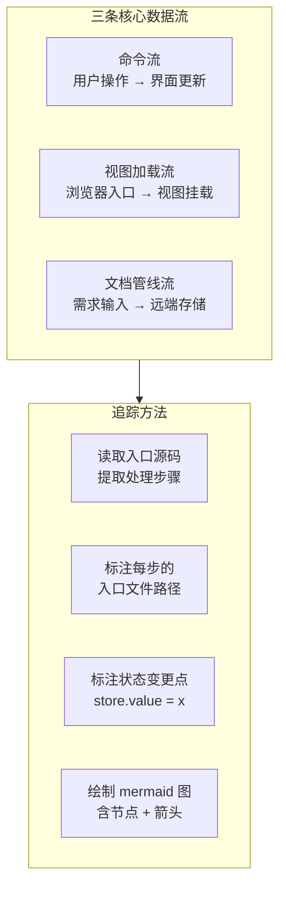
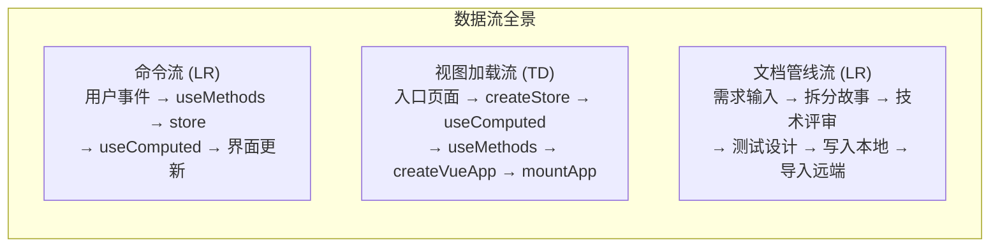
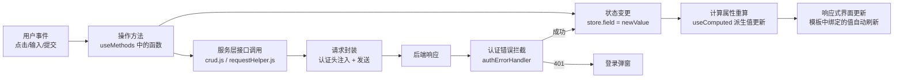
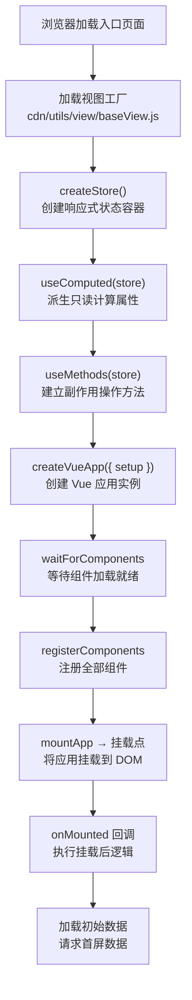
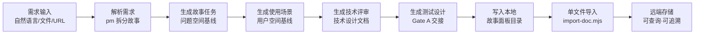

# YiWeb-系统架构-数据流 · 技术评审

> v1.0.0 | 2026-05-28 | deepseek-v4-pro | feat/yiweb-arch-sub-stories

> **导航**: [← 使用场景](./使用场景.md) · [→ 测试设计](./测试设计.md)

> [§0 基线溯源](#sec0) · [§1 系统架构](#sec1) · [§2 组件树](#sec2) · [§3 状态管理](#sec3) · [§4 交互流](#sec4) · [§5 信任边界](#sec5) · [§6 ADR](#sec6) · [§7 评审清单](#sec7)

### 主要价值

- 🔄 定义三条核心数据流的追踪方法论 — 起点→中间节点→终点
- 📐 建立数据流节点的标注规范 — 节点名 + 入口文件 + 状态变更点
- 🗺️ 输出三条 mermaid 流程图 — 命令流 / 视图加载流 / 文档管线流
- 📋 提供数据流断点排查手册 — 每节点的常见问题和检查方法

## §0 基线溯源

| 基线文件 | 关键条款 | 本次适用性 | 偏差 |
|---------|---------|-----------|------|
| 故事任务.md | FP3.1–FP3.5 数据流追踪、AC1–AC5 验收标准 | 全部适用 | 无 |
| 使用场景.md | 4 场景（命令流排查/加载流排查/文档流追踪/新增流） | 全部适用 | 无 |
| CLAUDE.md | 项目类型 frontend、视图工厂模式、零构建链 | 适用 — 加载流节点依据 | 无 |

## §1 系统架构

### 效果示意

### 布局线框

### 三条核心数据流概述

| 流 | 方向 | 起点 | 终点 | 经过层级 | 节点数 |
|----|------|------|------|---------|--------|
| 命令流 | 用户→界面 | 用户事件 | 界面更新 | L1 视图层 → L2 服务层 → L1 视图层 | ≥ 6 |
| 视图加载流 | 浏览器→视图 | 浏览器加载入口 | 挂载完成 | L0 展示层 → L3 基础设施层 → L1 视图层 | ≥ 8 |
| 文档管线流 | 需求→远端 | 需求描述 | 远端存储 | 文档系统 | ≥ 6 |

### 数据流节点标注规范

| 标注项 | 说明 | 示例 |
|--------|------|------|
| 节点名称 | 简洁描述该步处理逻辑 | "状态变更 (store)" |
| 入口文件 | 该步对应的源码文件路径 | `src/views/aicr/hooks/useMethods.js` |
| 状态变更点 | 该步是否涉及状态写入 | `store.sessions = data` |
| 分支条件 | 该步是否有条件分支 | "认证失败 → 登录弹窗" |

## §2 组件树

> 本故事聚焦数据流追踪，组件关系详见父故事 yiweb-arch 技术评审 §2。

数据流经过的组件节点（如 MarkdownView 渲染、YiModal 弹窗）在流程图中标注为处理节点，不展开组件内部逻辑。

## §3 状态管理

> 本故事中状态变更是数据流的核心节点。状态管理模式详见父故事 yiweb-arch 技术评审 §3。

数据流视角下的状态管理关键节点：
- **命令流**：useMethods 中的 `store.xxx = newValue` 是状态变更触发点
- **加载流**：createStore() 创建状态容器，useComputed() 建立响应式依赖
- **文档流**：不涉及运行时状态管理

## §4 交互流

### 命令流（用户操作 → 界面更新）

| 节点 | 入口文件 | 状态变更 | 常见问题 |
|------|---------|---------|---------|
| 用户事件 | 视图 HTML 模板 | — | 事件绑定缺失或绑定错误 |
| 操作方法 | `src/views/<name>/hooks/useMethods.js` | — | 函数未被调用或条件阻断 |
| 状态变更 | 同上 | `store.xxx = value` | 状态字段名拼写错误 |
| 计算属性重算 | `src/views/<name>/hooks/useComputed.js` | 只读派生 | 依赖字段未正确声明 |
| 服务层调用 | `src/core/services/modules/crud.js` | — | 接口地址或参数错误 |
| 请求封装 | `src/core/services/helper/requestHelper.js` | — | 认证头缺失或过期 |
| 认证拦截 | `src/core/services/helper/authErrorHandler.js` | — | 401 未正确拦截 |

### 视图加载流（浏览器入口 → 视图挂载）

| 节点 | 入口文件 | 常见问题 |
|------|---------|---------|
| 加载入口 | 根 HTML 文件 | 页面路径 404 |
| 加载视图工厂 | `cdn/utils/view/baseView.js` | 脚本路径错误或加载超时 |
| createStore | `src/views/<name>/hooks/store.js` | 初始值类型错误 |
| useComputed | `src/views/<name>/hooks/useComputed.js` | 计算属性循环依赖 |
| createVueApp | `src/views/<name>/index.js` | setup 函数报错 |
| waitForComponents | `cdn/utils/view/componentLoader.js` | 组件路径不存在 |
| mountApp | 同上 | 挂载点元素不存在 |
| onMounted | `src/views/<name>/index.js` | 回调中异步操作失败 |
| 加载初始数据 | `src/views/<name>/hooks/useMethods.js` | 接口返回异常数据 |

### 文档管线流（需求 → 远端存储）

| 节点 | 入口 | 常见问题 |
|------|------|---------|
| 需求输入 | 用户指令 | 需求模糊无法解析 |
| 拆分故事 | pm agent | 拆分粒度过粗或过细 |
| 故事任务 | F.story.task 公式 | 占位符未替换 |
| 使用场景 | F.story.scenarios 公式 | 场景 < 2 个或语言污染 |
| 技术评审 | F.story.technical-review 公式 | P0 检查项未通过 |
| 测试设计 | F.story.test-design 公式 | AC 覆盖不全 |
| 写入本地 | Write 工具 | 目录权限不足 |
| 导入远端 | import-doc.mjs | 网络失败或认证错误 |

## §5 信任边界

> 本故事聚焦数据流追踪，安全边界详见子故事 yiweb-arch-security。

数据流中的安全关键节点：
- 命令流：请求封装节点注入认证头 + credentials: 'omit'
- 命令流：认证错误拦截节点处理 401
- 文档流：导入远端节点使用认证 token

## §6 ADR

### ADR-FLOW-1: 三条流覆盖

| 字段 | 内容 |
|------|------|
| **状态** | 已采纳 |
| **决策** | 仅追踪三条核心数据流（命令流/视图加载流/文档管线流），不穷举所有数据路径 |
| **背景** | 三条流覆盖了系统运行的主要链路，足以支撑问题排查和理解系统行为 |
| **后果** | 特定视图的特殊交互流可能未覆盖；新增显著不同的数据路径时补充第四条流 |

### ADR-FLOW-2: 节点标注规范

| 字段 | 内容 |
|------|------|
| **状态** | 已采纳 |
| **决策** | 每个流程节点标注名称 + 入口文件 + 常见问题 |
| **背景** | 仅标注步骤不足以支撑排查，需要具体的文件路径和已知问题 |
| **后果** | 入口文件变更时需同步更新数据流标注；常见问题列表需持续积累 |

## §7 评审清单

| # | 检查项 | 状态 |
|---|--------|:---:|
| 1 | F.meta + F.nav + F.toc 三组件完整 | ✅ |
| 2 | 效果示意 mermaid ≥ 5 节点 | ✅ |
| 3 | 布局线框已含（前端必含） | ✅ |
| 4 | 三条流概述表完整 | ✅ |
| 5 | 命令流完整（≥ 6 节点 + 节点表） | ✅ |
| 6 | 视图加载流完整（≥ 8 节点 + 节点表） | ✅ |
| 7 | 文档管线流完整（≥ 6 节点 + 节点表） | ✅ |
| 8 | ADR 状态+背景+后果完整 | ✅ |
| 9 | §0 基线溯源覆盖故事任务+使用场景+CLAUDE.md | ✅ |
| 10 | 无 Level C/D 证据 | ✅ |

---

> **变更记录**：v1.0.0 — 从父故事 yiweb-arch FP3 拆分创建（2026-05-28，`/rui update`）
