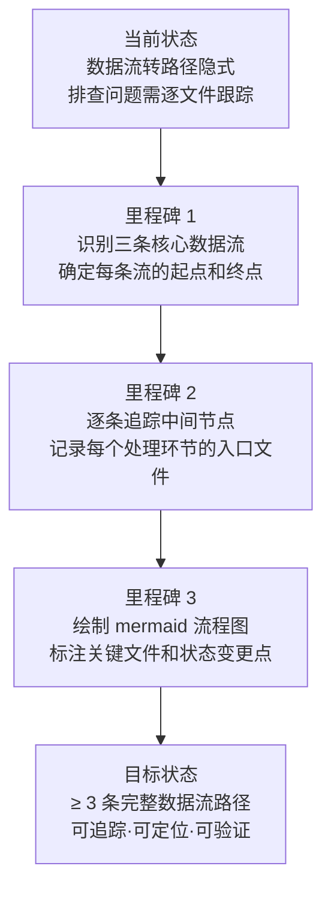

# YiWeb-系统架构-数据流 · 故事任务

> v1.0.0 | 2026-05-28 | deepseek-v4-pro | feat/yiweb-arch-sub-stories

> **父故事**: [← yiweb-arch](../yiweb-arch/故事任务.md) · **导航**: [→ 使用场景](./使用场景.md)

> [§1 需求概述](#sec1) · [§2 功能点](#sec2) · [§3 范围边界](#sec3) · [§4 任务拆分](#sec4) · [§5 验收标准](#sec5) · [§6 风险与假设](#sec6)

### 主要价值

- 🔄 追踪命令流 — 从用户操作到界面更新的完整链路
- 🏭 追踪视图加载流 — 从浏览器入口到视图挂载的全部步骤
- 📄 追踪文档管线流 — 从需求输入到远端存储的处理链路
- 🐛 支撑问题排查 — 按数据流节点快速定位断点或异常环节

## §1 需求概述

提取并绘制系统的主要数据流转路径，覆盖命令流（用户操作 → 界面更新）、视图加载流（浏览器入口 → 视图挂载）、文档管线流（需求 → 远端存储）三条核心链路，支撑问题排查和性能分析。

## §2 功能点

| FP# | 描述 | 输入 | 输出 | 错误行为 | 优先级 |
|-----|------|------|------|---------|--------|
| FP3.1 | 追踪命令流 — 从用户事件到界面更新的完整链路 | `src/views/<name>/hooks/useMethods.js` | mermaid flowchart LR 命令流图（用户事件 → useMethods → store 变更 → useComputed → 界面更新） | 链路中断或节点缺失时标「待确认」 | P1 |
| FP3.2 | 追踪视图加载流 — 从浏览器入口到视图挂载的全部步骤 | `src/views/<name>/index.js` + `cdn/utils/view/baseView.js` | mermaid flowchart TD 加载流图（入口页面 → createStore → useComputed → useMethods → createVueApp → registerComponents → mountApp → onMounted） | 关键步骤缺失时告警 | P1 |
| FP3.3 | 追踪文档管线流 — 从需求输入到远端存储 | rui skill 管线定义 + import-doc.mjs | mermaid flowchart LR 文档流图（需求输入 → pm 拆分 → coder 技术评审 → tester 测试设计 → 写入本地 → 单文件导入 → 远端存储） | 管线步骤缺失时告警 | P1 |
| FP3.4 | 标注每条流的节点入口文件 | 源码路径 + 文档路径 | 每个流程图节点附入口文件路径 | 入口文件不存在时标「待确认」 | P1 |
| FP3.5 | 标注每条流的关键状态变更点 | 流程节点 | 状态变更标注（store.value = x / computed 重算 / mountApp 挂载） | 遗漏关键状态变更时告警 | P2 |

## §3 范围边界

| # | 条目 | 包含/不包含 | 原因 |
|---|------|------------|------|
| 1 | 命令流（用户操作 → 界面更新） | 包含 | 最核心的交互链路 |
| 2 | 视图加载流（入口 → 挂载） | 包含 | 所有视图的启动路径 |
| 3 | 文档管线流（需求 → 远端） | 包含 | rui 管线的数据流动 |
| 4 | 后端服务内部的数据处理链路 | 不包含 | 不属于本系统边界 |
| 5 | CDN 资源的网络加载过程 | 不包含 | 浏览器网络层，非应用数据流 |
| 6 | 浏览器事件循环和渲染管线 | 不包含 | 运行时平台，非应用层逻辑 |

## §4 任务拆分

| # | 任务 | Agent | 门禁 | 交接信号 | 依赖 |
|---|------|-------|------|---------|------|
| 1 | 追踪命令流 — 读取 useMethods → store → useComputed 源码 | coder | 全链路节点 ≥ 6 个 | 命令流节点清单 + 入口文件 | — |
| 2 | 追踪视图加载流 — 读取 createBaseView → componentLoader → mount 源码 | coder | 全链路步骤 ≥ 8 个 | 加载流步骤清单 + 入口文件 | — |
| 3 | 追踪文档管线流 — 读取 rui skill 管线定义 + import-doc.mjs | coder | 全链路步骤 ≥ 6 个 | 文档流步骤清单 + 入口文件 | — |
| 4 | 绘制命令流 mermaid 图 | coder | 节点 ≥ 6 + 含状态变更标注 | mermaid flowchart LR | 任务 1 |
| 5 | 绘制视图加载流 mermaid 图 | coder | 节点 ≥ 8 + 含挂载点标注 | mermaid flowchart TD | 任务 2 |
| 6 | 绘制文档管线流 mermaid 图 | coder | 节点 ≥ 6 + 含远端标注 | mermaid flowchart LR | 任务 3 |

## §5 验收标准

| AC# | Given | When | Then | 门禁 |
|-----|-------|------|------|------|
| AC1 | useMethods / store / useComputed 源码可读 | 追踪命令流 | mermaid flowchart LR 含 ≥ 6 节点（用户事件 → useMethods → store 变更 → computed 重算 → 界面更新 + 服务层分支） | Gate A |
| AC2 | createBaseView / componentLoader 源码可读 | 追踪视图加载流 | mermaid flowchart TD 含 ≥ 8 步骤（入口页面 → createStore → useComputed → useMethods → createVueApp → registerComponents → mountApp → onMounted → 初始数据加载） | Gate A |
| AC3 | rui skill 管线定义可读 | 追踪文档管线流 | mermaid flowchart LR 含 ≥ 6 步骤（需求输入 → pm 拆分 → coder 技术评审 → tester 测试设计 → 写入本地 → 导入远端） | Gate A |
| AC4 | 三条流图全部完成 | 逐节点标注入口文件 | 每个 mermaid 节点附入口文件路径标注 | Gate B |
| AC5 | 命令流图完成 | 标注关键状态变更 | useMethods 中的 store.value 赋值点和 useComputed 中的 computed 派生点均已标注 | Gate B |

## §6 风险与假设

| # | 风险/假设 | 类型 | 可能性 | 影响 | 缓解/验证策略 | 关联 FP# |
|---|----------|------|--------|------|-------------|---------|
| 1 | 不同视图的命令流存在差异导致通用流图无法覆盖所有情况 | 风险 | M | M | 以 aicr 视图为模板绘制通用流，差异处以分支标注 | FP3.1 |
| 2 | 视图加载流中的 waitForComponents 步骤为异步，实际时序可能与静态追踪有偏差 | 风险 | M | L | 标注异步等待点，不展开内部实现 | FP3.2 |
| 3 | 文档管线流依赖 rui skill 的管线定义，skill 变更时流图需同步更新 | 风险 | M | L | 标注文档流版本号，变更时触发增量刷新 | FP3.3 |
| 4 | 三条核心数据流覆盖当前所有关键链路 | 假设 | — | — | 命令流 + 视图加载流 + 文档流 = 系统核心链路全集 | 全部 |
| 5 | 每个视图的命令流模式一致（store → computed → methods 三段式） | 假设 | — | — | 视图工厂约束保证一致性 | FP3.1 |

---

> **变更记录**：v1.0.0 — 从父故事 yiweb-arch FP3 拆分创建（2026-05-28，`/rui doc`）
