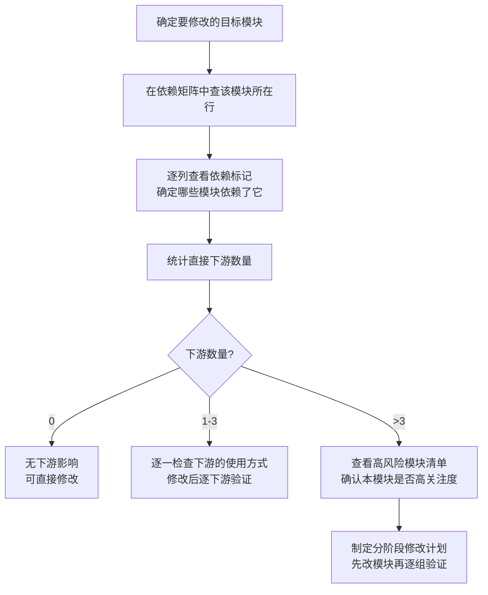
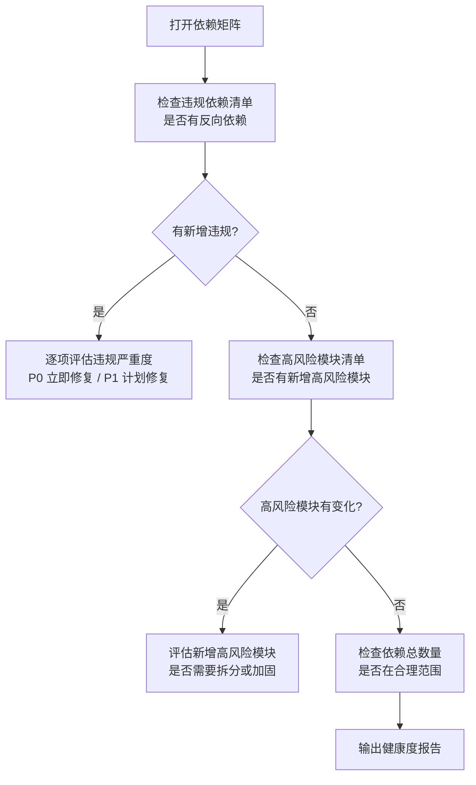
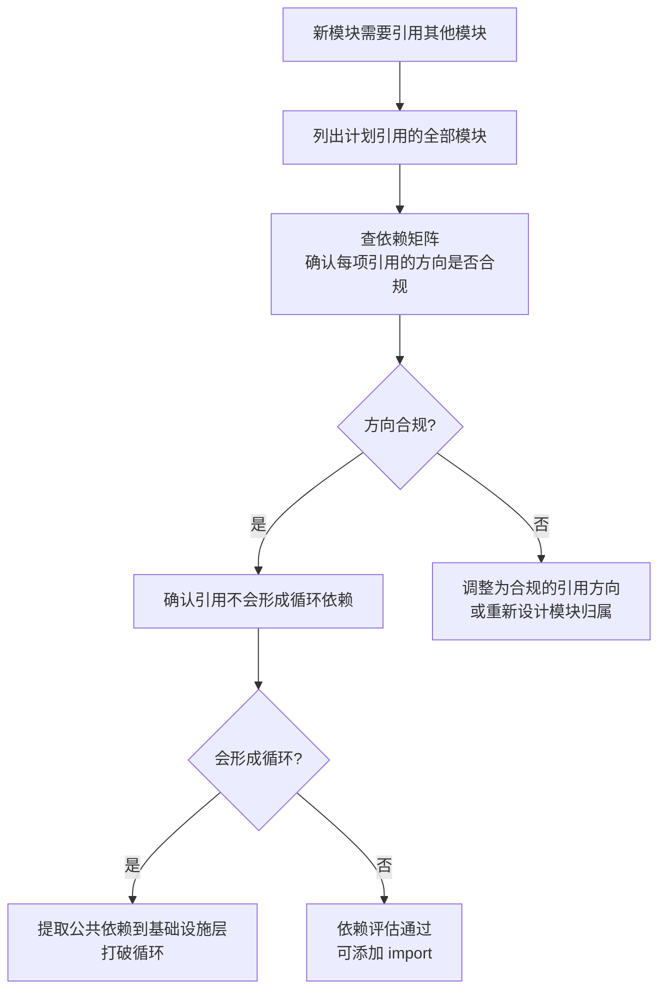
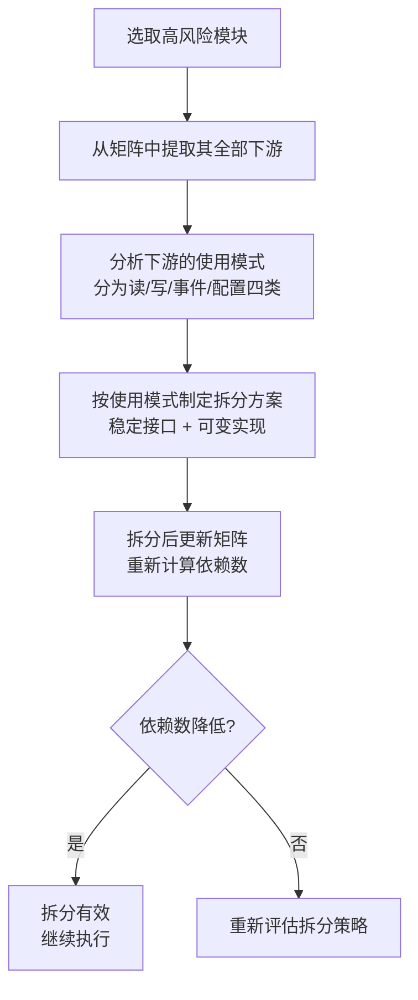

# YiWeb-系统架构-依赖矩阵 · 使用场景

> v1.0.0 | 2026-05-28 | deepseek-v4-pro | feat/yiweb-arch-sub-stories

> **导航**: [← 故事任务](./故事任务.md) · [→ 技术评审](./技术评审.md)

> [§1 角色](#sec1) · [§2 场景](#sec2)

### 主要价值

- 📊 变更影响评估 — 修改任意模块前查矩阵获取全部下游
- 🚦 高风险模块识别 — 被依赖最多的模块标记为高关注度
- 🔍 依赖方向可视化 — 矩阵直观展示依赖是否符合分层约束
- 📋 架构健康度监控 — 定期检查矩阵中的违规依赖和新增依赖

## §1 角色

| 角色 | 职责 | 关注点 |
|------|------|--------|
| 功能开发者 | 修改前评估影响范围 | 目标模块的全部下游列表 |
| 架构决策者 | 监控架构健康度和依赖方向 | 违规依赖、高风险模块 |
| 代码审查者 | 检查新增依赖是否合理 | 新增依赖的方向和强度 |
| 项目管理者 | 评估重构工作量 | 高风险模块的改动波及面 |

## §2 场景

### 场景 1: 修改前影响评估 — 查矩阵知全貌

- **角色**: 需要修改公共模块的功能开发者
- **前置**: 已确定要修改的目标模块
- **操作流**:

- **后置**: 明确全部下游模块和验证范围
- **异常**: 矩阵中无该模块记录 → 先在模块地图中查找，补充到矩阵

| 步骤 | 操作 | 参考 |
|------|------|------|
| 1 | 在矩阵行中找到目标模块 | 依赖矩阵的行标签 |
| 2 | 沿列方向查看所有标记格 | 矩阵交叉格 |
| 3 | 列出全部被标记的下游模块 | 矩阵的列标签 |
| 4 | 按高风险模块清单评估优先级 | 高风险模块表 |

### 场景 2: 架构健康度检查 — 定期扫描违规

- **角色**: 定期检查架构健康度的架构决策者
- **前置**: 依赖矩阵已生成且为最新版本
- **操作流**:

- **后置**: 架构健康度报告（违规项 + 高风险模块 + 依赖趋势）
- **异常**: 新增 P0 违规 → 立即要求修复，阻断裂并到 main

| 步骤 | 操作 | 参考 |
|------|------|------|
| 1 | 检查违规依赖清单 | 依赖方向违规清单 |
| 2 | 检查高风险模块清单变化 | 高风险模块表 |
| 3 | 检查依赖总数变化趋势 | 依赖矩阵的非空格计数 |
| 4 | 输出健康度评估 | 健康度报告模板 |

### 场景 3: 新增模块依赖评估 — 确定依赖合理性

- **角色**: 正在开发新模块的功能开发者
- **前置**: 新模块需要引用其他模块
- **操作流**:

- **后置**: 新增依赖均合规，无反向依赖和循环依赖
- **异常**: 无法避免反向依赖 → 重新审视模块分层归属

| 步骤 | 操作 | 参考 |
|------|------|------|
| 1 | 列出新模块的全部计划 import | 新模块源码 |
| 2 | 逐条对照依赖方向约束检查合规性 | 依赖方向约束表 |
| 3 | 在矩阵中模拟新增依赖后是否形成循环 | 依赖矩阵（含新行/列） |

### 场景 4: 重构规划 — 评估高风险模块拆分

- **角色**: 计划对高风险模块进行拆分的架构决策者
- **前置**: 依赖矩阵标记了被依赖 ≥ 5 次的高风险模块
- **操作流**:

- **后置**: 高风险模块依赖数降低，接口更清晰
- **异常**: 拆分后依赖数反增 → 重新评估拆分边界

| 步骤 | 操作 | 参考 |
|------|------|------|
| 1 | 从高风险模块清单选取目标 | 高风险模块表 |
| 2 | 提取全部下游及使用方式 | 依赖矩阵该模块的列 |
| 3 | 设计拆分后的接口边界 | 模块职责定义 |
| 4 | 更新矩阵验证拆分效果 | 新版依赖矩阵 |

---

> **变更记录**：v1.0.0 — 从父故事 yiweb-arch FP5 拆分创建（2026-05-28，`/rui update`）
