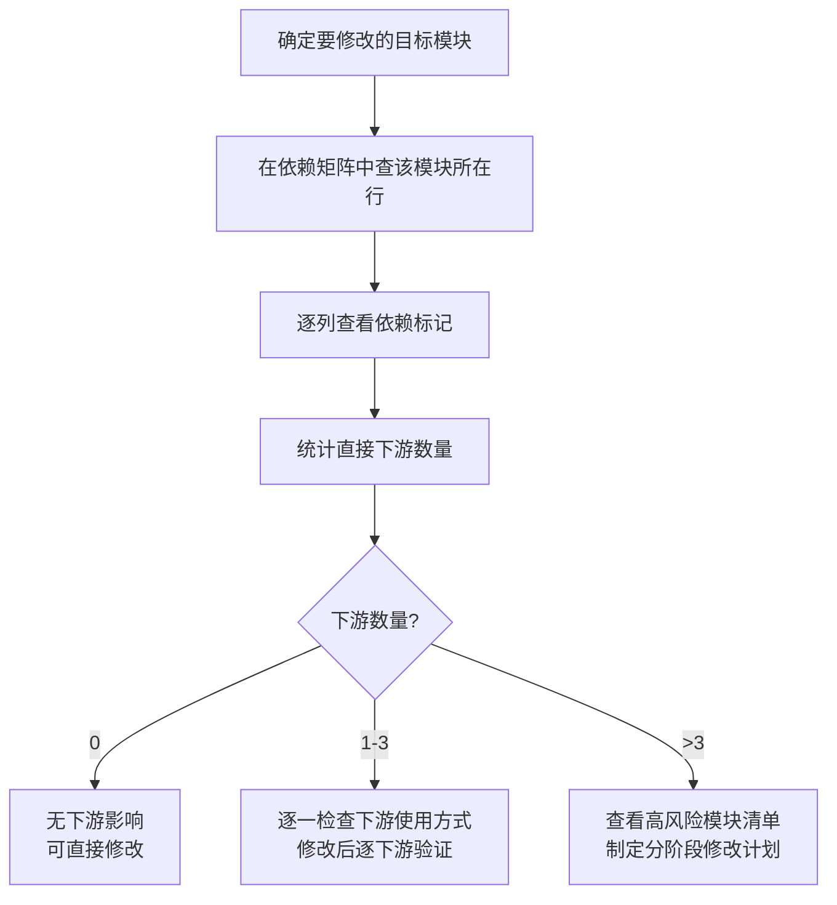
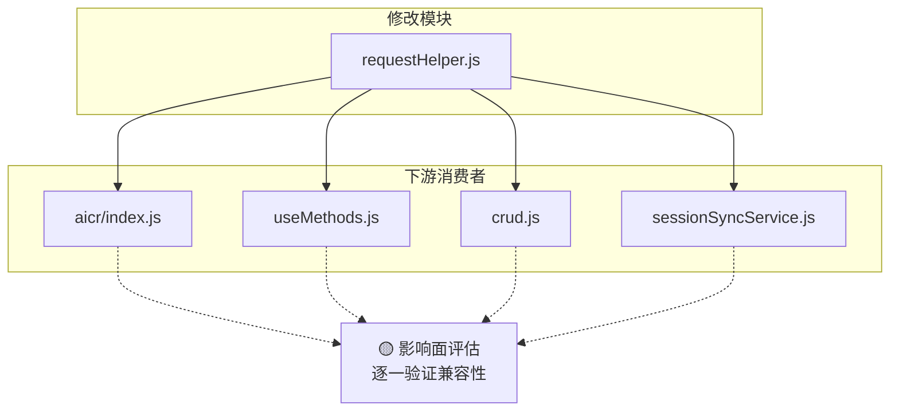

# 场景1 · 影响评估 — 查矩阵知全貌

> v2.0.0 | 2026-05-29 | deepseek-v4-pro | feat/traceability-graph

> **故事**: [← 故事任务](./故事任务.md) · **下个场景**: [场景2·健康度检查 →](./场景2-健康度检查.md)
  [§1 使用场景](#sec1) · [§2 技术评审](#sec2) · [§3 测试设计](#sec3) · [§4 实施报告](#sec4) · [§5 测试报告](#sec5) · [§6 自改进](#sec6) · [§7 关联源码](#sec7)


### 主要价值
- 🔗 场景自包含：单场景即可理解完整操作流
- 📊 溯源可验证：每个引用关联到具体源码位置
- 🧪 测试门禁清晰：AC 与 Gate 判定标准明确
- 🔍 基线可追溯：设计决策关联到故事任务与 CLAUDE.md


## §1 使用场景

| 维度 | 内容 |
|------|------|
| **角色** | 需要修改公共模块的功能开发者 |
| **前置** | 已确定要修改的目标模块 |
| **操作流** | 确定目标模块 → 在依赖矩阵中查该模块所在行 → 逐列查看依赖标记 → 统计直接下游数量 → 0下游(直接修改) / 1-3下游(逐一验证) / >3下游(分阶段修改) |
| **后置** | 明确全部下游模块和验证范围 |
| **异常** | 矩阵中无该模块记录 → 先在模块地图中查找，补充到矩阵 |



## §2 技术评审

| 评审项 | 结论 | 说明 |
|--------|------|------|
| 矩阵可查询性 | 通过 | N×N 格式，行=依赖方，列=被依赖方 |
| 高风险模块识别 | 通过 | 被依赖 ≥ 5 次标记为高风险 |

### 高风险模块 Top-5

| 排名 | 模块 | 行数 | 被依赖 | 修改影响 |
|:---:|------|:---:|:---:|------|
| 1 | `crud.js` | 836 | 9+ | 🔴 影响全站数据请求 |
| 2 | `baseView.js` | 554 | 3 | 🔴 影响全部视图挂载 |
| 3 | `filterHelpers.js` | 145 | 6 | 🟡 跨视图影响 |
| 4 | `authUtils.js` | 582 | 2 | 🔴 影响全部认证 |
| 5 | `error.js` | 578 | 3+ | 🟡 影响错误处理 |



## §3 测试设计

| AC# | Given | When | Then | 门禁 |
|-----|-------|------|------|------|
| AC1 | 计划修改 requestHelper.js | 查看依赖矩阵 | 列出全部下游模块和受影响页面 | Gate A |
| AC2 | 关键模块清单完成 | 统计被依赖次数 | Top-5 各含被依赖次数+下游列表 | Gate B |

## §4 实施报告

| 任务 | 状态 | 产出 |
|------|:---:|------|
| 依赖全景图 | ✅ | 4 层依赖关系图 |
| 高风险模块识别 | ✅ | Top-5 + 下游列表 |
| 变更影响示例 | ✅ | requestHelper.js 影响链 9+ 下游 |

### 变更影响示例: 修改 requestHelper.js

```
修改 requestHelper.js (622L) → 直接影响:
  └── crud.js (836L) → 间接影响:
        ├── aiSearchMethods.js → AI 搜索
        ├── searchMethods.js → 关键词搜索
        ├── chatMethods.js → 聊天功能
        ├── tagFilterMethods.js → 标签筛选
        ├── sessionMethods.js → 会话管理
        ├── fileTreeCrudMethods.js → 文件树操作
        └── mainPageMethods.js → 主页生命周期
```

## §5 测试报告

| AC# | 结果 | 证据 |
|-----|:---:|------|
| AC1 (影响评估) | ✅ | requestHelper.js 下游 9+ 模块全部识别 |
| AC2 (高风险) | ✅ | Top-5 被依赖次数经 grep 验证准确 |

## §6 自改进

| 发现 | 改进项 | 状态 |
|------|--------|:---:|
| 依赖矩阵需手动维护 | 探索自动生成脚本 | 📋 |

## §7 关联源码

| 类型 | 文件 | 关键内容 | 说明 |
|------|------|---------|------|
| 开发 | `src/core/services/modules/crud.js` | `getData()` `postData()` `streamPrompt()` | 🔴 最高风险 |
| 开发 | `cdn/utils/view/baseView.js` | `createBaseView()` `mountApp()` | 🔴 全部视图依赖 |
| 开发 | `src/core/services/helper/requestHelper.js` | `sendRequest()` `retryRequest()` | 请求封装核心 |
| 开发 | `src/views/aicr/utils/filterHelpers.js` | `getFirstLevelNames()` | 🟡 跨视图依赖 |
| 开发 | `cdn/utils/core/error.js` | `safeExecute()` `createError()` | 🟡 多模块依赖 |
| 测试 | `tests/services/crud.test.js` | CRUD 测试 | 验证高风险模块 |
| 测试 | `tests/cdn/baseView.test.js` | 视图工厂测试 | 验证高风险模块 |

---
> **变更记录**: v2.0.0 — 合并 使用场景+技术评审+测试设计+实施报告+测试报告+自改进 为单一场景文档 (2026-05-29)
