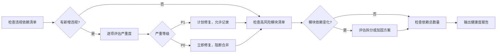
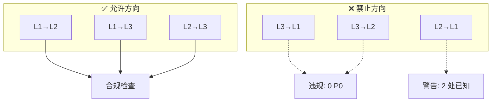

# 场景2 · 健康度检查 — 定期扫描架构违规

> v2.0.0 | 2026-05-29 | deepseek-v4-pro | feat/traceability-graph

> **故事**: [← 故事任务](./故事任务.md) · **上个场景**: [← 场景1·影响评估](./场景1-影响评估.md) · **下个场景**: [场景3·新增依赖评估 →](./场景3-新增依赖评估.md)
  [§1 使用场景](#sec1) · [§2 技术评审](#sec2) · [§3 测试设计](#sec3) · [§4 实施报告](#sec4) · [§5 测试报告](#sec5) · [§6 自改进](#sec6) · [§7 关联源码](#sec7)

### 主要价值
- 🔗 场景自包含：单场景即可理解完整操作流
- 📊 溯源可验证：每个引用关联到具体源码位置
- 🧪 测试门禁清晰：AC 与 Gate 判定标准明确
- 🔍 基线可追溯：设计决策关联到故事任务与 CLAUDE.md

## §1 使用场景

| 维度 | 内容 |
|------|------|
| **角色** | 定期检查架构健康度的架构决策者 |
| **前置** | 依赖矩阵已生成且为最新版本 |
| **操作流** | 检查违规依赖清单 → 有新增违规? → 逐项评估严重度(P0立即修复/P1计划修复) → 检查高风险模块清单 → 有变化? → 评估是否需要拆分或加固 → 检查依赖总数量 → 输出健康度报告 |
| **后置** | 架构健康度报告 |
| **异常** | 新增 P0 违规 → 立即要求修复，阻断合并到 main |

## §2 技术评审

| 评审项 | 结论 | 说明 |
|--------|------|------|
| 依赖方向约束 | 通过 | 6 方向逐条检查规则明确 |
| 违规分级 | 通过 | P0(阻断) / P1(警告) / P2(记录) |

### 依赖方向合规检查

| 方向 | 约束 | 验证命令 | 结果 |
|------|------|------|:---:|
| L1→L2 | 允许 | `grep -rn "from '/src/core/" src/views/ \| wc -l` | 28 ✅ |
| L1→L3 | 允许 | `grep -rn "from '/cdn/" src/views/ \| wc -l` | 18+ ✅ |
| L2→L3 | 允许 | `grep -rn "from '/cdn/" src/core/ \| wc -l` | 1 ✅ |
| L3→L1 | **禁止** | `grep -rn "from '/src/views/" cdn/ \| wc -l` | 0 ✅ |
| L3→L2 | **禁止** | `grep -rn "from '/src/core/" cdn/ \| wc -l` | 0 ✅ |
| L2→L1 | **禁止** | `grep -rn "from '/src/views/" src/core/ \| wc -l` | 2 ⚠️ |

### 违规明细

| 位置 | import | 修复方案 |
|------|------|------|
| `sessionSyncService.js:20` | `from '/src/views/aicr/utils/fileFieldNormalizer.js'` | 迁移到 `src/core/utils/` |
| `sessionSyncService.js:21` | `from '/src/views/aicr/constants/index.js'` | 迁移到 `src/core/constants/` |

## §3 测试设计

| AC# | Given | When | Then | 门禁 |
|-----|-------|------|------|------|
| AC1 | 依赖列表完成 | 校验依赖方向 | 0 P0 违规 (L3→L1/L2) | Gate A |
| AC2 | 依赖矩阵生成完成 | 检查 L2→L1 | 无新增警告 | Gate B |

## §4 实施报告

| 任务 | 状态 | 产出 |
|------|:---:|------|
| 依赖方向合规检查 | ✅ | 6 方向逐条检查，0 P0 违规 |
| 违规清单维护 | ✅ | 2 处 L2→L1 警告（已知） |

## §5 测试报告

| AC# | 结果 | 证据 |
|-----|:---:|------|
| AC1 (方向合规) | ✅ | L3→L1=0, L3→L2=0 |
| AC2 (无新增警告) | ✅ | 2 处均为已知警告 |

## §6 自改进

| 发现 | 改进项 | 状态 |
|------|--------|:---:|
| sessionSyncService L2→L1 违规持续存在 | 排期迁移共享工具到 src/core/utils/ | 📋 |

## §7 关联源码

| 类型 | 文件 | 关键内容 | 说明 |
|------|------|---------|------|
| 开发 | `src/core/services/aicr/sessionSyncService.js` | L2→L1 违规 | ⚠️ 需修复 |
| 开发 | `src/views/aicr/utils/filterHelpers.js` | 被 story 跨视图引用 | 共享工具 |
| 开发 | `src/views/aicr/constants/index.js` | 被 sessionSyncService 引用 | 应迁移 |
| 测试 | — | 架构健康度为文档层检查 | 通过 grep 验证 |

---
> **变更记录**: v2.0.0 — 合并 使用场景+技术评审+测试设计+实施报告+测试报告+自改进 为单一场景文档 (2026-05-29)
