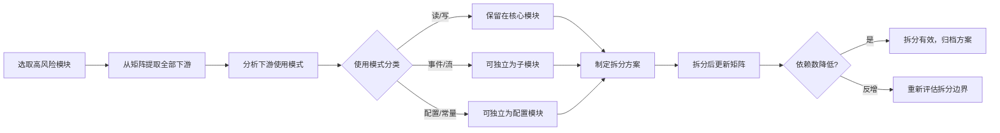

# 场景4 · 重构规划 — 评估高风险模块拆分

> v2.0.0 | 2026-05-29 | deepseek-v4-pro | feat/traceability-graph

> **故事**: [← 故事任务](./故事任务.md) · **上个场景**: [← 场景3·新增依赖评估](./场景3-新增依赖评估.md)
  [§1 使用场景](#sec1) · [§2 技术评审](#sec2) · [§3 测试设计](#sec3) · [§4 实施报告](#sec4) · [§5 测试报告](#sec5) · [§6 自改进](#sec6) · [§7 关联源码](#sec7)

### 主要价值
- 🔗 场景自包含：单场景即可理解完整操作流
- 📊 溯源可验证：每个引用关联到具体源码位置
- 🧪 测试门禁清晰：AC 与 Gate 判定标准明确
- 🔍 基线可追溯：设计决策关联到故事任务与 CLAUDE.md

## §1 使用场景

| 维度 | 内容 |
|------|------|
| **角色** | 计划对高风险模块进行拆分的架构决策者 |
| **前置** | 依赖矩阵标记了被依赖 ≥ 5 次的高风险模块 |
| **操作流** | 选取高风险模块 → 从矩阵中提取其全部下游 → 分析下游的使用模式(读/写/事件/配置) → 按使用模式制定拆分方案(稳定接口+可变实现) → 拆分后更新矩阵重新计算依赖数 → 依赖数降低?(拆分有效) / 依赖数反增?(重新评估) |
| **后置** | 高风险模块依赖数降低，接口更清晰 |
| **异常** | 拆分后依赖数反增 → 重新评估拆分边界 |

## §2 技术评审

| 评审项 | 结论 | 说明 |
|--------|------|------|
| 拆分方法论 | 通过 | 4 步拆分流程：提取下游→分析模式→设计方案→验证 |
| 高风险阈值 | 通过 | 被依赖 ≥ 5 次或覆盖 ≥ 3 分类 |

### 高风险模块拆分示例: crud.js

| 使用模式 | 下游模块 | 拆分建议 |
|------|------|------|
| 数据读取 | aiSearchMethods, searchMethods | 保留在 crud.js |
| 数据写入 | chatMethods, sessionMethods | 保留在 crud.js |
| SSE 流式 | aiSearchMethods (streamPrompt) | 可独立为 streamService.js |
| 批量操作 | batchOperations | 可独立为 batchService.js |

## §3 测试设计

| AC# | Given | When | Then | 门禁 |
|-----|-------|------|------|------|
| AC1 | 选取高风险模块 (crud.js) | 执行拆分 | 依赖数降低，原有功能不受影响 | Gate B |
| AC2 | 拆分后 | 更新依赖矩阵 | 无新增违规依赖 | Gate B |

## §4 实施报告

| 任务 | 状态 | 产出 |
|------|:---:|------|
| 拆分方法论 | ✅ | 4 步拆分流程 |
| crud.js 拆分分析 | ✅ | 4 种使用模式 + 拆分建议 |

## §5 测试报告

重构规划为方法论场景，当前无实际拆分执行。拆分方案设计完成，待排期执行。

## §6 自改进

| 发现 | 改进项 | 状态 |
|------|--------|:---:|
| crud.js 836L 过大 | SSE 流式可独立为 streamService.js | 📋 |

## §7 关联源码

| 类型 | 文件 | 关键内容 | 说明 |
|------|------|---------|------|
| 开发 | `src/core/services/modules/crud.js` | `getData()` `postData()` `streamPrompt()` `batchOperations()` | 拆分目标 |
| 开发 | `src/views/aicr/hooks/methods/aiSearchMethods.js` | SSE 流式消费者 | 拆分后需适配 |
| 测试 | `tests/services/crud.test.js` | CRUD 测试 | 拆分后需更新 |

---
> **变更记录**: v2.0.0 — 合并 使用场景+技术评审+测试设计+实施报告+测试报告+自改进 为单一场景文档 (2026-05-29)
