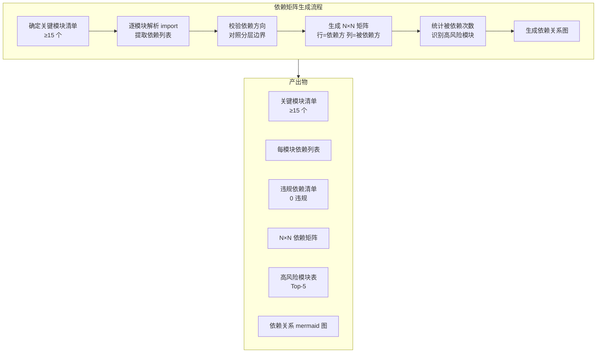
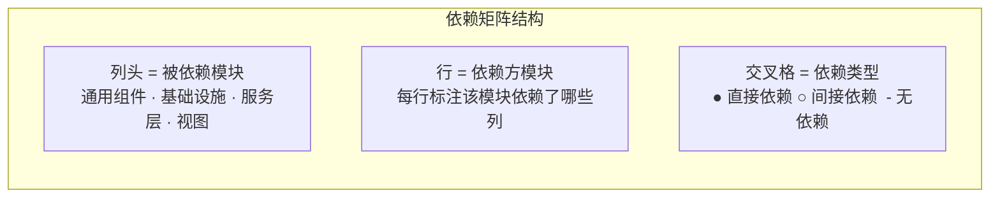
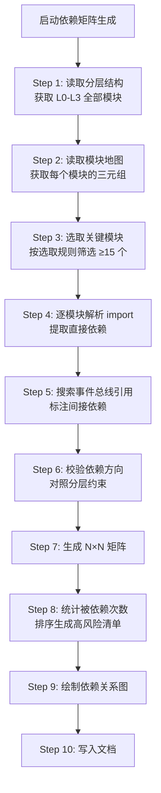

# YiWeb-系统架构-依赖矩阵 · 技术评审

> v1.0.0 | 2026-05-28 | deepseek-v4-pro | feat/yiweb-arch-sub-stories

> **导航**: [← 使用场景](./使用场景.md) · [→ 测试设计](./测试设计.md)

> [§0 基线溯源](#sec0) · [§1 系统架构](#sec1) · [§2 组件树](#sec2) · [§3 状态管理](#sec3) · [§4 交互流](#sec4) · [§5 信任边界](#sec5) · [§6 ADR](#sec6) · [§7 评审清单](#sec7)

### 主要价值

- 📊 N×N 依赖矩阵生成方法 — 模块→依赖→矩阵的完整流程
- 🚦 高风险模块识别规则 — 被依赖次数统计和排序
- 🔍 依赖方向校验自动化 — 对照分层边界检查违规
- 📋 依赖关系 mermaid 图 — 关键模块依赖可视化

## §0 基线溯源

| 基线文件 | 关键条款 | 本次适用性 | 偏差 |
|---------|---------|-----------|------|
| 故事任务.md | FP5.1–FP5.6、AC1–AC6 | 全部适用 | 无 |
| 使用场景.md | 4 场景（影响评估/健康度检查/新增评估/重构规划） | 全部适用 | 无 |
| CLAUDE.md | 项目类型 frontend、分层约束 | 适用 — 依赖方向判定依据 | 无 |
| yiweb-arch-layers 技术评审 | 四层拓扑模型、依赖方向约束 | 适用 — 分层边界校验依据 | 无 |
| yiweb-arch-modules 技术评审 | 模块三元组、五大分类 | 适用 — 关键模块清单来源 | 无 |

## §1 系统架构

### 效果示意

### 布局线框

### 关键模块选取规则

| 选取条件 | 数量 | 来源 |
|---------|------|------|
| 通用组件代表（YiModal/YiButton/YiTag/YiLoading/YiIcon/HeaderActions/MarkdownView） | ≥ 7 | yiweb-arch-modules 通用组件表 |
| 基础设施代表（baseView/log/error/http/storage/eventBus/MarkdownRenderer） | ≥ 7 | yiweb-arch-modules 基础设施表 |
| 服务层代表（config/crud/requestHelper/authUtils/authErrorHandler） | ≥ 5 | yiweb-arch-modules 服务层表 |
| 视图入口（aicr/claude/story） | 3 | yiweb-arch-modules 视图状态表 |
| **总计** | **≥ 15** | — |

### 依赖矩阵格式

| 依赖方 \ 被依赖方 | baseView | log | error | config | crud | requestHelper | YiModal | ... |
|-------------------|----------|-----|-------|--------|------|--------------|---------|-----|
| aicr 视图 | ● | ● | ● | ● | ● | — | ● | ... |
| claude 视图 | ● | ● | ● | ● | — | — | ● | ... |
| story 视图 | ● | ● | ● | ● | ● | — | ● | ... |
| YiModal | — | — | — | — | — | — | — | ... |
| MarkdownRenderer | — | — | ● | — | — | — | — | ... |
| requestHelper | — | ● | ● | ● | — | — | — | ... |
| ... | ... | ... | ... | ... | ... | ... | ... | ... |

- ● 直接依赖（import 语句直接引用）
- ○ 间接依赖（通过事件总线或其他模块间接引用）
- `-` 无依赖

### 高风险模块识别规则

| 指标 | 规则 | 阈值 |
|------|------|------|
| 被依赖次数 | 统计矩阵中该列 ● + ○ 的数量 | ≥ 5 → 高风险 |
| 依赖广度 | 依赖方覆盖的分类数量 | ≥ 3 分类 → 高关注 |
| 变更频率 | 模块近期修改次数（从 git log 获取） | ≥ 3 次/月 → 高波动 |

### 依赖方向校验

对照 yiweb-arch-layers 的分层约束，校验矩阵中的每个依赖：

| 依赖方层级 | 被依赖方层级 | 允许? | 违规等级 |
|-----------|-------------|-------|---------|
| L1 视图层 | L2 服务层 | ✅ | — |
| L1 视图层 | L3 基础设施层 | ✅ | — |
| L2 服务层 | L3 基础设施层 | ✅ | — |
| L3 基础设施层 | L1 视图层 | ❌ | P0 |
| L3 基础设施层 | L2 服务层 | ❌ | P0 |
| L2 服务层 | L1 视图层 | ❌ | P0 |

## §2 组件树

> 本故事聚焦依赖矩阵生成，组件关系详见父故事 yiweb-arch 技术评审 §2。

依赖矩阵中的通用组件作为列（被依赖方），视图入口作为行（依赖方），矩阵直观展示了组件被哪些视图使用。

## §3 状态管理

> 本故事聚焦依赖矩阵生成，状态管理详见父故事 yiweb-arch 技术评审 §3。

依赖矩阵不涉及运行时状态管理。矩阵本身是静态的架构文档。

## §4 交互流

### 矩阵生成流

| 步骤 | 输入 | 处理 | 产出 |
|------|------|------|------|
| 1–2 | yiweb-arch-layers + yiweb-arch-modules 产出 | 读取分层和模块数据 | 原始模块清单 |
| 3 | 原始模块清单 | 按选取规则筛选 | 关键模块清单（≥ 15） |
| 4 | 关键模块入口文件 | 解析 import 语句 | 每模块的直接依赖列表 |
| 5 | 关键模块源码 | grep eventBus.emit/on | 间接依赖标注 |
| 6 | 依赖列表 + 分层约束 | 逐条检查方向 | 违规清单 |
| 7 | 依赖列表 | 生成 N×N markdown 矩阵 | 依赖矩阵 |
| 8 | 依赖矩阵 | 统计被依赖次数并排序 | 高风险模块表（Top-5） |
| 9 | 依赖矩阵 | 绘制 mermaid flowchart | 依赖关系图 |

## §5 信任边界

> 本故事聚焦依赖矩阵生成，安全边界详见子故事 yiweb-arch-security。

依赖矩阵的安全价值：通过依赖方向校验（CDN→src 禁止）间接保障安全边界不被破坏。

## §6 ADR

### ADR-DEPS-1: 关键模块筛选

| 字段 | 内容 |
|------|------|
| **状态** | 已采纳 |
| **决策** | 依赖矩阵仅包含关键模块（≥ 15 且 ≤ 25），不全量覆盖 |
| **背景** | 全量 N×N 矩阵过大（50+ 模块）难以阅读和使用 |
| **后果** | 非关键模块的依赖关系需单独查询模块地图；新增关键模块时需更新矩阵 |

### ADR-DEPS-2: 高风险阈值

| 字段 | 内容 |
|------|------|
| **状态** | 已采纳 |
| **决策** | 被依赖 ≥ 5 次或覆盖 ≥ 3 分类的模块标记为高风险 |
| **背景** | 被依赖越多，修改影响越大，需重点关注和加固 |
| **后果** | 阈值可能需按项目规模调整；低于阈值的模块也可能在某些场景下风险较高 |

## §7 评审清单

| # | 检查项 | 状态 |
|---|--------|:---:|
| 1 | F.meta + F.nav + F.toc 三组件完整 | ✅ |
| 2 | 效果示意 mermaid ≥ 5 节点 | ✅ |
| 3 | 布局线框已含（前端必含） | ✅ |
| 4 | 关键模块选取规则表完整 | ✅ |
| 5 | 依赖矩阵格式定义完整（含 ●/○/- 说明） | ✅ |
| 6 | 高风险模块识别规则表完整 | ✅ |
| 7 | 依赖方向校验表完整（6 条规则） | ✅ |
| 8 | 矩阵生成流完整（≥ 10 步骤） | ✅ |
| 9 | ADR 状态+背景+后果完整（2 条） | ✅ |
| 10 | §0 基线溯源覆盖 5 个基线文件 | ✅ |
| 11 | 无 Level C/D 证据 | ✅ |

---

> **变更记录**：v1.0.0 — 从父故事 yiweb-arch FP5 拆分创建（2026-05-28，`/rui update`）
