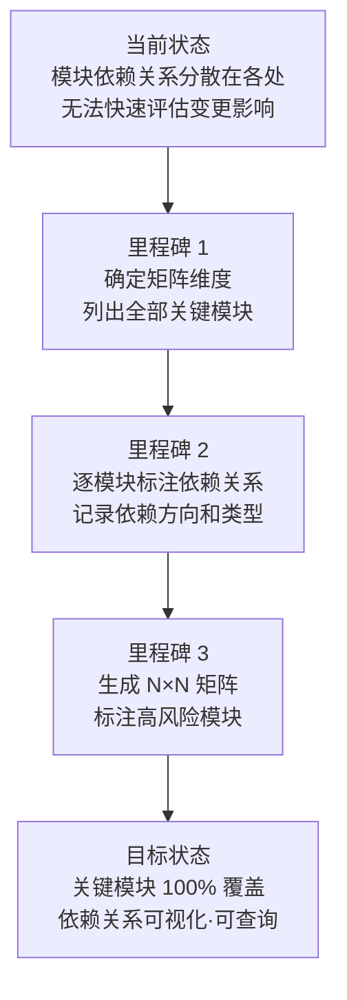

# YiWeb-系统架构-依赖矩阵 · 故事任务

> v1.0.0 | 2026-05-28 | deepseek-v4-pro | feat/yiweb-arch-sub-stories

> **父故事**: [← yiweb-arch](../yiweb-arch/故事任务.md) · **导航**: [→ 使用场景](./使用场景.md)

> [§1 需求概述](#sec1) · [§2 功能点](#sec2) · [§3 范围边界](#sec3) · [§4 任务拆分](#sec4) · [§5 验收标准](#sec5) · [§6 风险与假设](#sec6)

### 主要价值

- 📊 生成 N×N 依赖关系矩阵，关键模块间依赖一目了然
- 🔍 变更影响评估 — 修改任意模块时快速查找全部下游
- 🚦 识别高风险模块 — 被依赖最多的模块标记为高关注度
- 🧭 依赖方向校验 — 矩阵直观展示依赖方向是否符合分层约束

## §1 需求概述

基于模块关系图谱（yiweb-arch-modules），将模块间的依赖关系整理为 N×N 矩阵形式，标注依赖方向和强度，支撑变更影响评估和架构健康度监控。

## §2 功能点

| FP# | 描述 | 输入 | 输出 | 错误行为 | 优先级 |
|-----|------|------|------|---------|--------|
| FP5.1 | 确定矩阵包含的关键模块列表 — 从 L0–L3 四层中选取核心模块 | 分层结构（yiweb-arch-layers）+ 模块地图（yiweb-arch-modules） | 关键模块清单（≥ 15 个） | 关键模块 < 10 时告警 | P1 |
| FP5.2 | 逐模块标注依赖 — 搜索 import 语句，记录每个模块依赖了哪些其他模块 | 全部关键模块的入口文件 | 每模块的依赖列表 | import 解析失败时标「手动确认」 | P1 |
| FP5.3 | 校验依赖方向 — 标注违反分层约束的依赖（如 L3 基础设施层依赖 L1 视图层模块） | 依赖列表 + 分层边界 | 违规依赖清单 | 发现反向依赖时报 P0 违规 | P1 |
| FP5.4 | 生成 N×N 依赖矩阵表 — 行 = 依赖方，列 = 被依赖方，交叉格标注依赖类型（直接/间接/无） | 依赖列表 | markdown 格式 N×N 矩阵 | 矩阵维度 < N×N 时告警 | P1 |
| FP5.5 | 识别高风险模块 — 统计每个模块的被依赖次数，排序输出 Top-N | 依赖矩阵 | 高风险模块清单（被依赖次数 + 下游列表） | — | P2 |
| FP5.6 | 生成依赖关系 mermaid 图（精简版，仅含关键模块） | 依赖矩阵 | mermaid flowchart 依赖关系图 | 节点 < 10 时告警 | P2 |

## §3 范围边界

| # | 条目 | 包含/不包含 | 原因 |
|---|------|------------|------|
| 1 | L0–L3 四层中的关键模块（≥ 15 个） | 包含 | 关键模块覆盖可满足变更影响评估 |
| 2 | 模块间的直接 import 依赖 | 包含 | 直接依赖是影响评估的主要依据 |
| 3 | 模块间的事件总线间接依赖 | 包含 | 运行时隐式依赖，需单独标注 |
| 4 | 全部模块的完整依赖（非关键模块） | 不包含 | 矩阵过大难以阅读，非关键模块按需查询 |
| 5 | 运行时动态 import 依赖 | 不包含 | 动态加载路径无法静态分析 |
| 6 | 后端服务间的依赖关系 | 不包含 | 不属于本系统边界 |

## §4 任务拆分

| # | 任务 | Agent | 门禁 | 交接信号 | 依赖 |
|---|------|-------|------|---------|------|
| 1 | 确定关键模块清单 — 从分层结构和模块地图中选取 | coder | ≥ 15 个关键模块 | 关键模块清单 | yiweb-arch-layers + yiweb-arch-modules |
| 2 | 逐模块搜索 import 语句提取依赖 | coder | 全部关键模块覆盖 | 每模块的依赖列表 | 任务 1 |
| 3 | 校验依赖方向 — 对照分层边界检查违规 | coder | 0 反向依赖 | 违规清单（空 = 通过） | 任务 2 |
| 4 | 生成 N×N 依赖矩阵 | coder | 行 × 列 = N×N（N = 关键模块数） | markdown 矩阵表 | 任务 2, 3 |
| 5 | 统计被依赖次数，生成高风险模块清单 | coder | Top-5 高风险模块 | 高风险模块表（被依赖次数 + 下游列表） | 任务 4 |
| 6 | 生成依赖关系 mermaid 图 | coder | ≥ 10 节点 + 依赖箭头 | mermaid flowchart | 任务 4 |

## §5 验收标准

| AC# | Given | When | Then | 门禁 |
|-----|-------|------|------|------|
| AC1 | yiweb-arch-layers + yiweb-arch-modules 产出可用 | 确定关键模块清单 | ≥ 15 个模块，覆盖 L0–L3 全部四层，每层 ≥ 2 个代表 | Gate A |
| AC2 | 关键模块清单完成 | 逐模块搜索 import 提取依赖 | 每个关键模块有完整依赖列表（含依赖模块名 + import 路径） | Gate A |
| AC3 | 依赖列表完成 | 校验依赖方向 | 0 反向依赖（L3 → L1、L2 → L0 等），违规项 P0 阻断 | Gate A |
| AC4 | 依赖方向校验通过 | 生成 N×N 依赖矩阵 | 矩阵行列完整（N×N），交叉格标注依赖类型，关键模块 100% 覆盖 | Gate B |
| AC5 | 矩阵生成完成 | 统计被依赖次数 | Top-5 高风险模块含被依赖次数 + 完整下游列表 | Gate B |
| AC6 | 矩阵生成完成 | 绘制依赖关系图 | mermaid flowchart 含 ≥ 10 节点，依赖方向箭头清晰，高风险模块高亮 | Gate B |

## §6 风险与假设

| # | 风险/假设 | 类型 | 可能性 | 影响 | 缓解/验证策略 | 关联 FP# |
|---|----------|------|--------|------|-------------|---------|
| 1 | 模块间存在事件总线间接依赖，import 静态分析无法覆盖 | 风险 | M | M | 单独搜索 eventBus.emit/on 调用，标注间接依赖 | FP5.2 |
| 2 | 模块地图产出不完整时（yiweb-arch-modules 未完成），依赖矩阵无法生成 | 风险 | M | H | 任务依赖链保证：yiweb-arch-modules 完成后才启动本任务 | FP5.1 |
| 3 | N×N 矩阵随模块增加而膨胀，可读性下降 | 风险 | M | L | 只选取关键模块（≥ 15 且 ≤ 25），非关键模块按需查询 | FP5.4 |
| 4 | 新增模块或依赖变更时矩阵可能过时 | 风险 | M | L | 父故事 yiweb-arch 变更时触发增量刷新 | FP5.4 |
| 5 | 关键模块的 import 均为静态声明，无动态拼接路径 | 假设 | — | — | 源码为浏览器原生 ESM，静态 import 为规范要求 | FP5.2 |

---

> **变更记录**：v1.0.0 — 从父故事 yiweb-arch FP5 拆分创建（2026-05-28，`/rui doc`）
