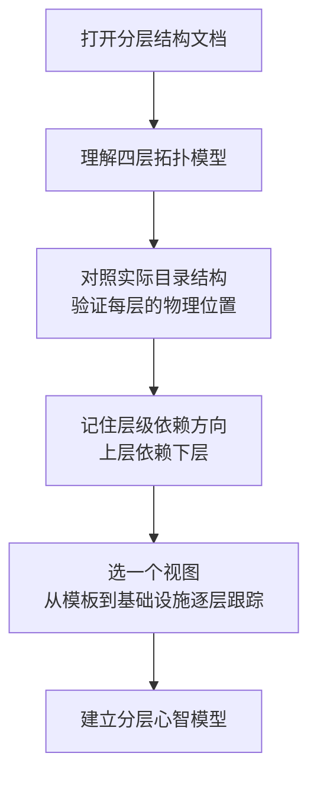
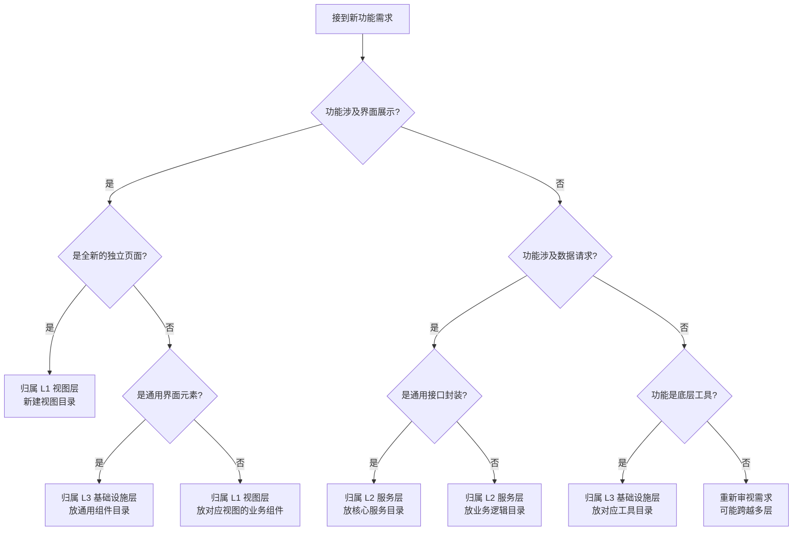
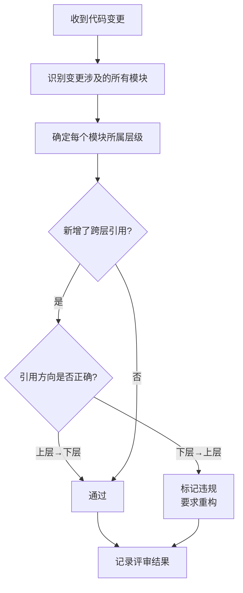
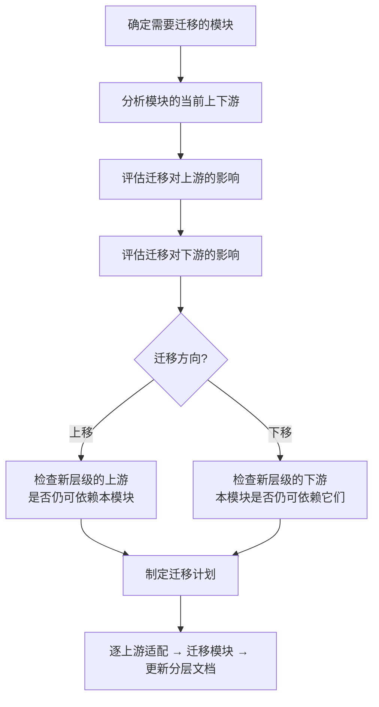

# YiWeb-系统架构-分层结构 · 使用场景

> v1.0.0 | 2026-05-28 | deepseek-v4-pro | feat/yiweb-arch-sub-stories

> **导航**: [← 故事任务](./故事任务.md) · [→ 技术评审](./技术评审.md)

> [§1 角色](#sec1) · [§2 场景](#sec2)

### 主要价值

- 🎯 新人快速建立系统分层认知，知道代码在哪一层
- 🔍 功能开发者精准判断新功能应归属哪一层
- 📐 架构师评估层级依赖方向是否符合约束
- 🐛 问题排查者按层级逐层定位异常根因

## §1 角色

| 角色 | 职责 | 关注点 |
|------|------|--------|
| 新加入的开发者 | 快速理解系统组织方式 | 有哪些层级、每层放什么代码 |
| 功能开发者 | 在正确的层级实现需求 | 功能归属层级、层级间调用规范 |
| 架构决策者 | 评估层级划分是否合理 | 层级边界清晰度、依赖方向正确性 |
| 问题排查者 | 定位异常发生在哪一层 | 数据经过的层级路径、每层的处理节点 |

## §2 场景

### 场景 1: 新人上手 — 建立分层认知

- **角色**: 新加入的开发者
- **前置**: 已获得代码访问权限，阅读过项目概览
- **操作流**:

- **后置**: 能在 15 分钟内说出四层名称、每层的典型模块、依赖方向
- **异常**: 文档与目录结构不一致 → 以实际目录为准，标记文档待更新

| 步骤 | 操作 | 参考 | 预计耗时 |
|------|------|------|---------|
| 1 | 阅读 L0 展示层定义 | 分层结构表的 L0 行 | 2 min |
| 2 | 阅读 L1 视图层定义 | 分层结构表的 L1 行 | 3 min |
| 3 | 阅读 L2 服务层定义 | 分层结构表的 L2 行 | 3 min |
| 4 | 阅读 L3 基础设施层定义 | 分层结构表的 L3 行 | 5 min |
| 5 | 跟踪一条完整调用链 | 从展示层模板 → 视图层入口 → 服务层接口 → 基础设施层工具 | 7 min |

### 场景 2: 功能归属 — 判断新功能放哪层

- **角色**: 接到开发任务的功能开发者
- **前置**: 已明确新功能的需求描述
- **操作流**:

- **后置**: 确定新功能的目标层级和目录位置
- **异常**: 功能跨越多层 → 按主要职责归属，跨层调用遵循依赖方向

| 步骤 | 操作 | 参考 |
|------|------|------|
| 1 | 判断功能的主要职责类型 | 四层职责定义 |
| 2 | 确认目标层级是否有类似功能可参考 | 分层结构表的模块清单 |
| 3 | 验证目标层级不违反依赖方向 | 层级依赖方向约束 |

### 场景 3: 架构评审 — 检查层级依赖方向

- **角色**: 评估代码质量的架构决策者
- **前置**: 有新增或修改的代码待评审
- **操作流**:

- **后置**: 所有跨层引用符合依赖方向约束
- **异常**: 发现反向依赖 → 标记为架构违规，要求调整模块归属或解除反向依赖

| 步骤 | 操作 | 参考 |
|------|------|------|
| 1 | 列出本次变更涉及的全部模块 | 代码变更清单 |
| 2 | 查分层结构表确定每模块层级 | 分层结构表 |
| 3 | 逐条检查跨层引用方向 | 依赖方向约束（L0→L1→L2→L3） |

### 场景 4: 层级变更 — 模块跨层迁移

- **角色**: 负责重构的架构决策者
- **前置**: 发现模块当前层级归属不当，需要迁移
- **操作流**:

- **后置**: 模块迁移完成，分层文档已更新，依赖方向无违规
- **异常**: 迁移导致循环依赖 → 拆分模块或引入中间层

| 步骤 | 操作 | 参考 |
|------|------|------|
| 1 | 确定模块当前层级和目标层级 | 分层结构表 |
| 2 | 列出模块的全部上游（谁依赖它） | 模块地图的下游消费者列 |
| 3 | 列出模块的全部下游（它依赖谁） | 模块地图的内部依赖列 |
| 4 | 逐上游适配导入路径 | 全局搜索替换 |

---

> **变更记录**：v1.0.0 — 从父故事 yiweb-arch FP1 拆分创建（2026-05-28，`/rui update`）
