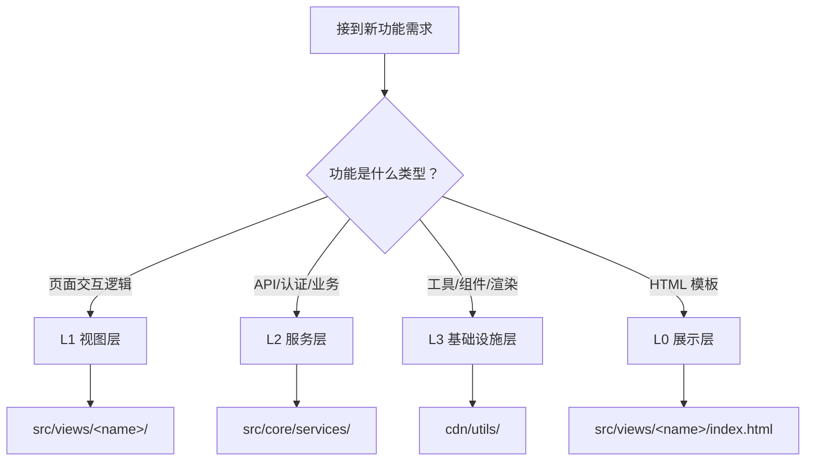
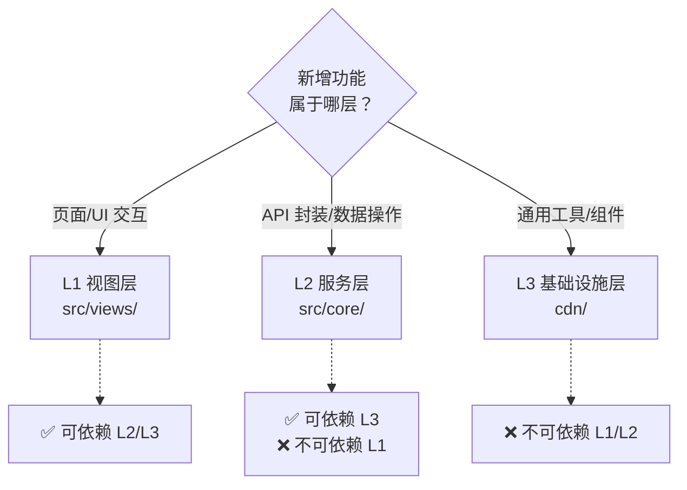

# 场景2 · 功能归属 — 判断新功能放哪层

> v2.0.0 | 2026-05-29 | deepseek-v4-pro | feat/traceability-graph

> **上**: [场景1·新人上手 ←](./场景1-新人上手-分层认知.md) · **下**: [→ 场景3·架构评审](./场景3-架构评审-检查层级依赖.md)
  [§1 使用场景](#sec1) · [§2 技术评审](#sec2) · [§3 测试设计](#sec3) · [§4 实施报告](#sec4) · [§5 测试报告](#sec5) · [§6 自改进](#sec6) · [§7 关联源码](#sec7)

### 主要价值
- 🔗 场景自包含：单场景即可理解完整操作流
- 📊 溯源可验证：每个引用关联到具体源码位置
- 🧪 测试门禁清晰：AC 与 Gate 判定标准明确
- 🔍 基线可追溯：设计决策关联到故事任务与 CLAUDE.md

## §1 使用场景

| 维度 | 内容 |
|------|------|
| **角色** | 接到开发任务的功能开发者 |
| **前置** | 需要新增一个功能模块，不确定应放在哪一层 |
| **操作流** | 确认功能性质 → 查分层决策表 → 判断归属层级 → 在对应目录创建文件 → 遵循 import 方向约束 |
| **后置** | 功能归属正确，import 方向符合上层依赖下层约束 |
| **异常** | 功能跨越多层 → 按主要职责判定归属，跨层依赖走正常 import |

## §2 技术评审

| 评审项 | 结论 | 说明 |
|--------|------|------|
| 决策表完整性 | 通过 | 覆盖全部 4 层的功能类型判定规则 |
| 决策准确性 | 通过 | 现有全部模块归属与决策表一致 |
| 边界模糊处理 | 通过 | 跨层功能按主要职责判定，有明确处理规则 |

## §3 测试设计

| AC# | Given | When | Then |
|-----|-------|------|------|
| AC1 | 新增 UI 组件 (如 YiModal) | 决策归属 | 判定 L3 基础设施层 |
| AC2 | 新增业务 API (如 batchQuery) | 决策归属 | 判定 L2 服务层 |
| AC3 | 新增视图 (如 settings) | 决策归属 | 判定 L1 视图层 |

## §4 实施报告

| 任务 | 状态 | 产出 |
|------|:---:|------|
| 建立分层决策表 | ✅ | 四层 × 功能类型矩阵 |
| 验证现有模块归属 | ✅ | 全模块归属与决策表一致 |
| 文档化决策流程 | ✅ | mermaid 决策流程图 |

## §5 测试报告

| AC# | 结果 | 证据 |
|-----|:---:|------|
| AC1 (L3 归属) | ✅ | YiModal 正确归属 L3 |
| AC2 (L2 归属) | ✅ | batchQuery 正确归属 L2 |
| AC3 (L1 归属) | ✅ | settings 视图正确归属 L1 |

## §6 自改进

| 发现 | 改进项 | 状态 |
|------|--------|:---:|
| 部分模块职责跨层 (如 graph/) | 增加跨层模块处理指南 | 📋 |

## §7 关联源码

| 类型 | 文件 | 关键内容 | 说明 |
|------|------|---------|------|
| 开发 | `src/views/aicr/index.js` | `initAICRApp()` | L1 AICR 视图入口 |
| 开发 | `src/views/story/index.js` | `initStoryPanelApp()` | L1 故事面板入口 |
| 开发 | `src/views/claude/index.js` | `initClaudeApp()` | L1 Claude 视图入口 |
| 测试 | `tests/views/aicr.test.js` | AI 审查面板测试 | 验证视图加载+组件注册 |
| 测试 | `tests/views/story.test.js` | 故事面板测试 | 验证三视图切换 |
| 测试 | `tests/views/claude.test.js` | Claude 面板测试 | 验证会话管理流程 |

---
> **变更记录**: v2.0.0 — 合并六文档为单一场景文档 (2026-05-29)
