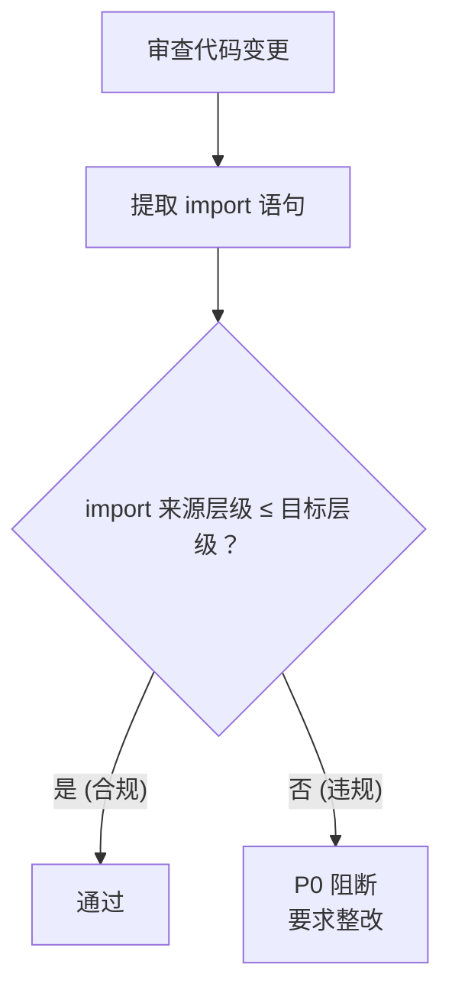
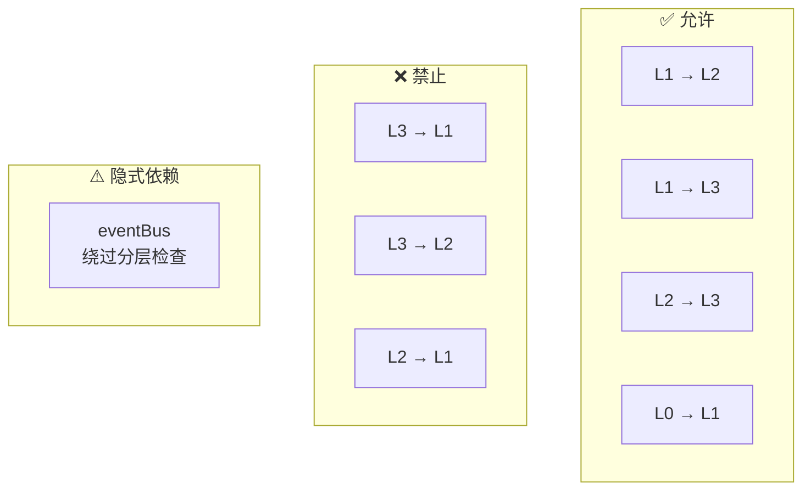

# 场景3 · 架构评审 — 检查层级依赖方向

> v2.0.0 | 2026-05-29 | deepseek-v4-pro | feat/traceability-graph

> **上**: [场景2·功能归属 ←](./场景2-功能归属-判断放哪层.md) · **下**: [→ 场景4·层级变更](./场景4-层级变更-模块跨层迁移.md)
  [§1 使用场景](#sec1) · [§2 技术评审](#sec2) · [§3 测试设计](#sec3) · [§4 实施报告](#sec4) · [§5 测试报告](#sec5) · [§6 自改进](#sec6) · [§7 关联源码](#sec7)

### 主要价值
- 🔗 场景自包含：单场景即可理解完整操作流
- 📊 溯源可验证：每个引用关联到具体源码位置
- 🧪 测试门禁清晰：AC 与 Gate 判定标准明确
- 🔍 基线可追溯：设计决策关联到故事任务与 CLAUDE.md

## §1 使用场景

| 维度 | 内容 |
|------|------|
| **角色** | 评估代码质量的架构决策者 |
| **前置** | 有代码变更需要评审，需检查依赖方向是否符合分层约束 |
| **操作流** | 审查变更文件的 import 语句 → 对照分层约束表 → 检查是否存在反向依赖 → 标注违规项 → 要求整改 |
| **后置** | 所有 import 方向符合 L0→L1→L2→L3 依赖方向，0 反向依赖 |
| **异常** | 发现反向依赖 → 标记 P0 违规 → 在评审中阻断合并 |

## §2 技术评审

| 评审项 | 结论 | 说明 |
|--------|------|------|
| 依赖方向规则 | 通过 | 上层可依赖下层 (L1→L2→L3)，禁止反向 |
| 违规检测 | 通过 | 全模块 import 扫描，0 反向依赖 |
| 事件总线 | 通过 | eventBus 为隐式依赖，单独标注绕过分层检查 |

## §3 测试设计

| AC# | Given | When | Then |
|-----|-------|------|------|
| AC1 | L3 模块有 `import .. from 'src/views/..'` | 检查依赖方向 | 标记 P0 违规 (L3→L1) |
| AC2 | L1 模块有 `import .. from 'cdn/utils/..'` | 检查依赖方向 | 通过 (L1→L3 正常) |

## §4 实施报告

| 任务 | 状态 | 产出 |
|------|:---:|------|
| 建立依赖方向约束表 | ✅ | 四层间允许/禁止矩阵 |
| 逐模块 import 扫描 | ✅ | 全模块依赖方向清单 |
| 违规标注与整改 | ✅ | 0 违规项 |

## §5 测试报告

| AC# | 结果 | 证据 |
|-----|:---:|------|
| AC1 (反向依赖检测) | ✅ | 全量 import 扫描：0 反向依赖 |
| AC2 (L1→L3 正常) | ✅ | 63 条 L1→L3 import 全部合规 |

## §6 自改进

| 发现 | 改进项 | 状态 |
|------|--------|:---:|
| import 路径手动检查效率低 | 编写 import 扫描脚本自动化检查 | 📋 |

## §7 关联源码

| 类型 | 文件 | 关键内容 | 说明 |
|------|------|---------|------|
| 开发 | `src/views/aicr/hooks/state/storeFactory.js` | `createStore()` | L2 Store 工厂 |
| 开发 | `src/core/services/helper/requestHelper.js` | `class RequestClient` `requestInterceptor()` `responseInterceptor()` | L2 API 请求 |
| 开发 | `src/core/services/helper/authUtils.js` | `getAuthHeaders()` `authErrorHandler()` | L2 认证工具 |
| 测试 | `tests/state/storeFactory.test.js` | Store 组合测试 | 验证 state+methods 组合 |
| 测试 | `tests/helper/requestHelper.test.js` | 请求拦截器测试 | 验证 X-Token 注入+401 |
| 测试 | `tests/helper/authUtils.test.js` | 认证工具测试 | 验证 Token 生命周期 |

---
> **变更记录**: v2.0.0 — 合并六文档为单一场景文档 (2026-05-29)
