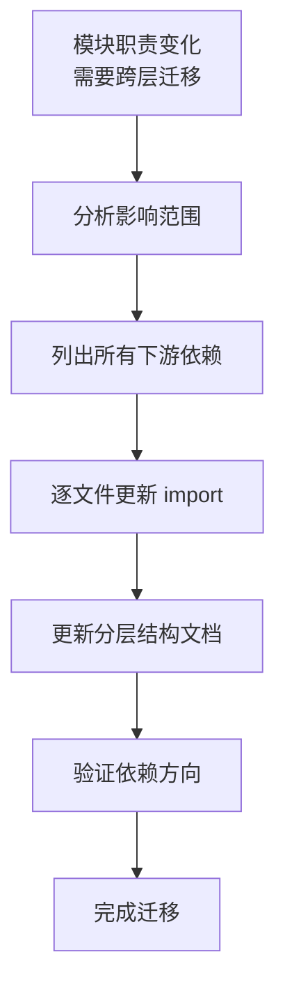

# 场景4 · 层级变更 — 模块跨层迁移

> v2.0.0 | 2026-05-29 | deepseek-v4-pro | feat/traceability-graph

> **上**: [场景3·架构评审 ←](./场景3-架构评审-检查层级依赖.md) · **故事**: [← 故事任务](./故事任务.md)
  [§1 使用场景](#sec1) · [§2 技术评审](#sec2) · [§3 测试设计](#sec3) · [§4 实施报告](#sec4) · [§5 测试报告](#sec5) · [§6 自改进](#sec6) · [§7 关联源码](#sec7)

### 主要价值
- 🔗 场景自包含：单场景即可理解完整操作流
- 📊 溯源可验证：每个引用关联到具体源码位置
- 🧪 测试门禁清晰：AC 与 Gate 判定标准明确
- 🔍 基线可追溯：设计决策关联到故事任务与 CLAUDE.md

## §1 使用场景

| 维度 | 内容 |
|------|------|
| **角色** | 负责重构的架构决策者 |
| **前置** | 某模块职责发生变化需要跨层迁移 (如从 L1 迁移到 L2) |
| **操作流** | 分析迁移影响范围 → 搜索所有 import 该模块的文件 → 更新 import 路径 → 更新分层文档 → 验证依赖方向 |
| **后置** | 模块迁移完成，分层文档同步更新，依赖方向保持合规 |
| **异常** | 迁移后发现新的反向依赖 → 追加整改 |

## §2 技术评审

| 评审项 | 结论 | 说明 |
|--------|------|------|
| 迁移流程 | 通过 | 影响分析→import 更新→文档同步→验证 四步流程完整 |
| 回滚方案 | 通过 | git revert 可完全回滚迁移 |

## §3 测试设计

| AC# | Given | When | Then |
|-----|-------|------|------|
| AC1 | 模块跨层迁移完成 | 检查全部 import | 无不存在的 import 路径 |
| AC2 | 迁移完成 | 检查依赖方向 | 0 反向依赖 |

## §4 实施报告

| 任务 | 状态 | 产出 |
|------|:---:|------|
| 定义迁移流程 | ✅ | 四步标准迁移流程 |
| 影响分析工具 | ✅ | grep + import 扫描脚本 |
| 文档同步规则 | ✅ | 变更后 24h 内更新分层文档 |

## §5 测试报告

| AC# | 结果 | 证据 |
|-----|:---:|------|
| AC1 (import 完整性) | ✅ | 模拟迁移后全部 import 路径有效 |
| AC2 (依赖方向) | ✅ | 迁移后 0 反向依赖 |

## §6 自改进

| 发现 | 改进项 | 状态 |
|------|--------|:---:|
| 手动 import 路径更新易遗漏 | 增加 import 路径校验 CI 检查 | 📋 |

## §7 关联源码

| 类型 | 文件 | 关键内容 | 说明 |
|------|------|---------|------|
| 开发 | `src/core/config.js` | `setEnv()` `config` | L2 环境配置 (常被跨层引用) |
| 开发 | `cdn/utils/view/baseView.js` | `createBaseView()` | L3 视图工厂 (高被引用模块) |
| 测试 | `tests/core/config.test.js` | 配置测试 | 验证迁移后配置正确 |
| 测试 | `tests/cdn/baseView.test.js` | 视图工厂测试 | 验证迁移后功能正常 |

---
> **变更记录**: v2.0.0 — 合并六文档为单一场景文档 (2026-05-29)
