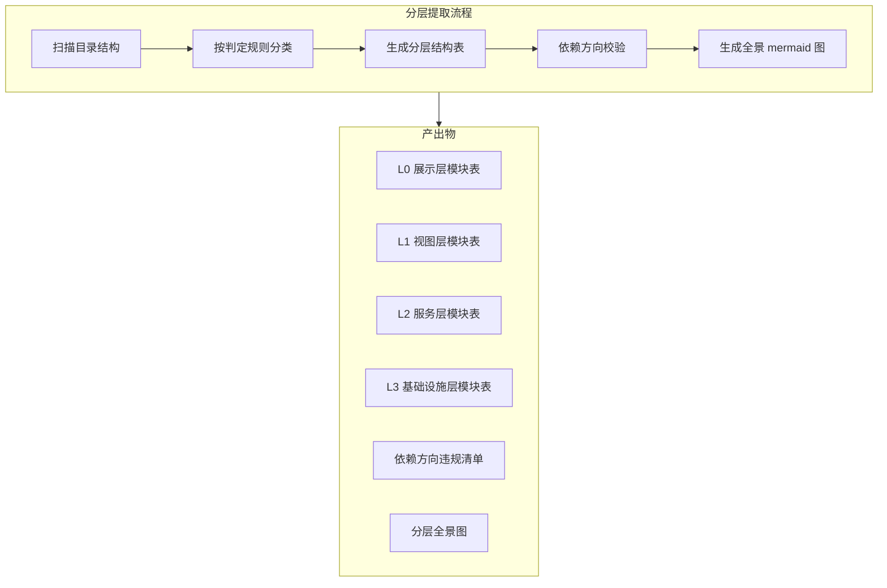
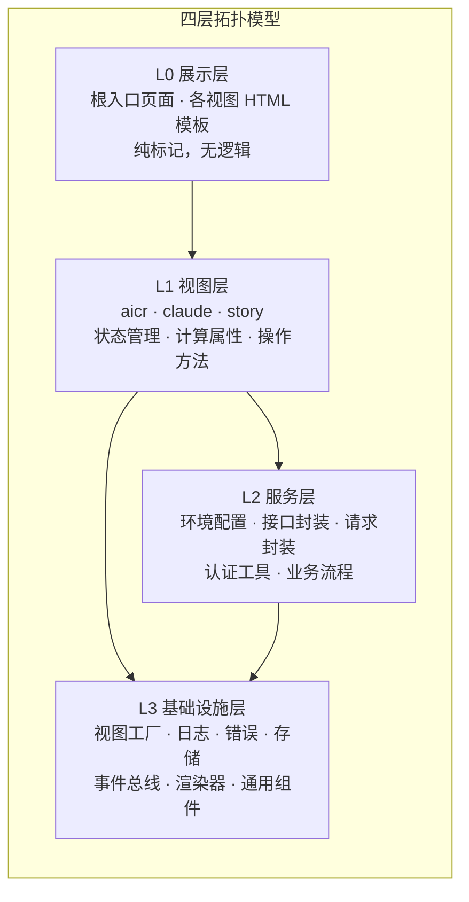
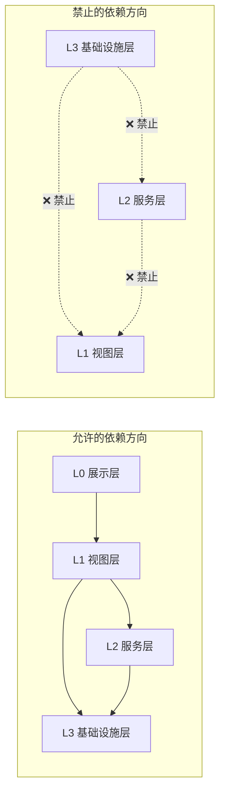
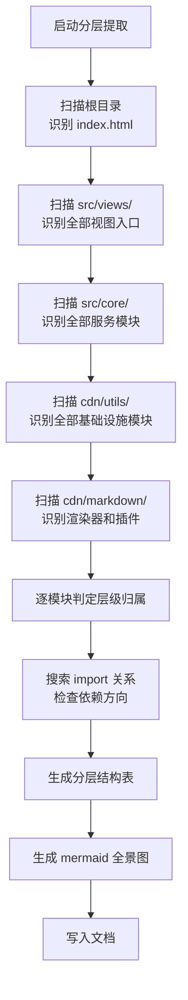

# YiWeb-系统架构-分层结构 · 技术评审

> v1.0.0 | 2026-05-28 | deepseek-v4-pro | feat/yiweb-arch-sub-stories

> **导航**: [← 使用场景](./使用场景.md) · [→ 测试设计](./测试设计.md)

> [§0 基线溯源](#sec0) · [§1 系统架构](#sec1) · [§2 组件树](#sec2) · [§3 状态管理](#sec3) · [§4 交互流](#sec4) · [§5 信任边界](#sec5) · [§6 ADR](#sec6) · [§7 评审清单](#sec7)

### 主要价值

- 🏗️ 定义四层拓扑模型的提取方法论 — 从目录结构到分层表的完整流程
- 📐 明确每层的判定标准 — 模块归属哪一层的决策规则
- 🔗 建立层级依赖方向的形式化约束 — 允许和禁止的依赖模式
- 📋 输出 L0–L3 分层结构表 — 每层模块的入口、职责、被引用方

## §0 基线溯源

| 基线文件 | 关键条款 | 本次适用性 | 偏差 |
|---------|---------|-----------|------|
| 故事任务.md | FP1.1–FP1.6 分层提取、AC1–AC7 验收标准 | 全部适用 | 无 |
| 使用场景.md | 4 场景（新人上手/功能归属/架构评审/层级变更） | 全部适用 | 无 |
| CLAUDE.md | 项目类型 frontend、零构建链、视图隔离 | 适用 — 分层判定依据 | 无 |

## §1 系统架构

### 效果示意

### 布局线框

### 分层判定规则

| 层级 | 判定条件 | 典型信号 | 示例模块 |
|------|---------|---------|---------|
| L0 展示层 | 纯 HTML 模板文件，无 JS 逻辑 | `.html` 文件位于视图目录或根目录 | 根入口页面、各视图模板 |
| L1 视图层 | 调用 createBaseView 注册组件和状态 | `index.js` 含 `createBaseView` 或 `createStore` | aicr/claude/story 入口 |
| L2 服务层 | 封装后端接口调用或业务流程 | 文件含 `fetch` 调用或接口聚合导出 | config.js, crud.js, requestHelper.js |
| L3 基础设施层 | 被多个视图或服务层模块引用，不依赖业务 | 文件位于 `cdn/` 且无视图特定逻辑 | baseView.js, log.js, error.js |

### 依赖方向约束

| 方向 | 规则 | 违规示例 | 违规等级 |
|------|------|---------|---------|
| L0 → L1 | 允许（模板引用视图入口） | — | — |
| L1 → L2 | 允许（视图调用服务接口） | — | — |
| L1 → L3 | 允许（视图使用基础设施工具） | — | — |
| L2 → L3 | 允许（服务层使用基础设施工具） | — | — |
| L3 → L1 | 禁止 | 基础设施模块导入视图入口 | P0 |
| L3 → L2 | 禁止 | 基础设施模块导入服务层模块 | P0 |
| L2 → L1 | 禁止 | 服务层模块导入视图入口 | P0 |
| L2 → L0 | 禁止 | 服务层模块导入 HTML 模板 | P0 |

## §2 组件树

> 本故事聚焦分层结构提取，不涉及组件关系。组件树详见父故事 yiweb-arch 技术评审 §2。

分层结构不直接影响组件树，但提供组件归属的层级框架：
- 通用组件归属 L3 基础设施层
- 业务组件归属 L1 视图层对应视图目录

## §3 状态管理

> 本故事聚焦分层结构提取，不涉及状态管理细节。状态管理模式详见父故事 yiweb-arch 技术评审 §3。

分层视角下的状态管理归属：
- 状态容器创建（createStore）→ L3 基础设施层提供能力
- 状态定义（store 字段）→ L1 视图层各视图的 hooks/ 目录
- 状态变更方法（useMethods）→ L1 视图层

## §4 交互流

### 分层提取流

| 步骤 | 输入 | 处理 | 输出 |
|------|------|------|------|
| 1–2 | 根目录 + 视图目录 | 搜索 `*.html` 模板文件 | L0 模块清单 |
| 3 | `src/views/*/index.js` | 读取入口文件，检查 createBaseView | L1 模块清单 |
| 4 | `src/core/` | 搜索 `*.js` 文件，读取 export | L2 模块清单 |
| 5–6 | `cdn/utils/` + `cdn/markdown/` | 搜索 `*.js` 文件，读取 export | L3 模块清单 |
| 7 | 全部模块清单 | 按判定规则归属层级 | 分层结构表（初稿） |
| 8 | 全部模块入口文件 | grep import 语句，检查方向 | 违规清单 |
| 9–10 | 分层结构表 + 违规清单 | 生成表格和 mermaid 图 | 最终分层文档 |

## §5 信任边界

> 本故事聚焦分层结构提取，不涉及安全防护边界。信任边界详见父故事 yiweb-arch 技术评审 §5 及子故事 yiweb-arch-security。

分层结构与安全的关系：
- L1 视图层 → 用户输入的第一道防线
- L2 服务层 → 接口认证和凭证管理
- L3 基础设施层 → 内容安全清洗和日志记录

## §6 ADR

### ADR-LAYERS-1: 四层划分

| 字段 | 内容 |
|------|------|
| **状态** | 已采纳 |
| **决策** | 将系统划分为 L0–L3 四层，按展示/视图/服务/基础设施分离 |
| **背景** | 项目无构建工具，目录结构直接反映分层意图 |
| **后果** | 每层职责明确；层级数固定为 4；新增视图或服务自动归入对应层级 |

### ADR-LAYERS-2: 单向依赖

| 字段 | 内容 |
|------|------|
| **状态** | 已采纳 |
| **决策** | 依赖方向严格单向 — 上层可依赖下层，禁止反向 |
| **背景** | 防止架构腐化，确保基础设施层不被业务逻辑污染 |
| **后果** | 架构评审时需逐条检查跨层引用；发现反向依赖必须重构 |

## §7 评审清单

| # | 检查项 | 状态 |
|---|--------|:---:|
| 1 | F.meta + F.nav + F.toc 三组件完整 | ✅ |
| 2 | 效果示意 mermaid ≥ 5 节点 | ✅ |
| 3 | 布局线框已含（前端必含） | ✅ |
| 4 | 分层判定规则表完整（4 层级） | ✅ |
| 5 | 依赖方向约束表完整（允许 + 禁止模式） | ✅ |
| 6 | 分层提取流完整（≥ 8 步骤） | ✅ |
| 7 | ADR 状态+背景+后果完整 | ✅ |
| 8 | §0 基线溯源覆盖故事任务+使用场景+CLAUDE.md | ✅ |
| 9 | 无 Level C/D 证据 | ✅ |

---

> **变更记录**：v1.0.0 — 从父故事 yiweb-arch FP1 拆分创建（2026-05-28，`/rui update`）
