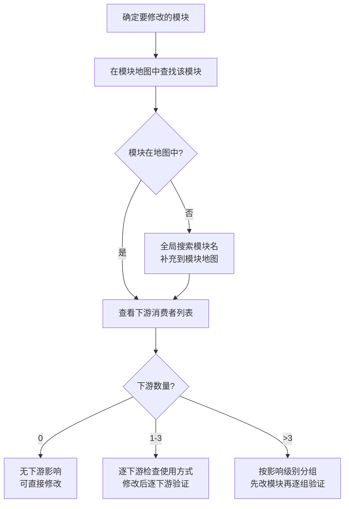
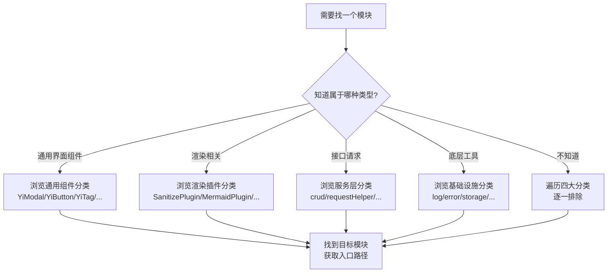
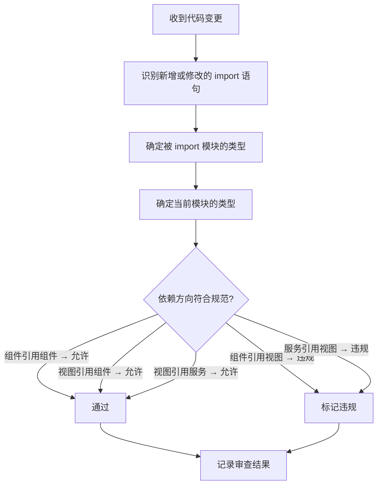
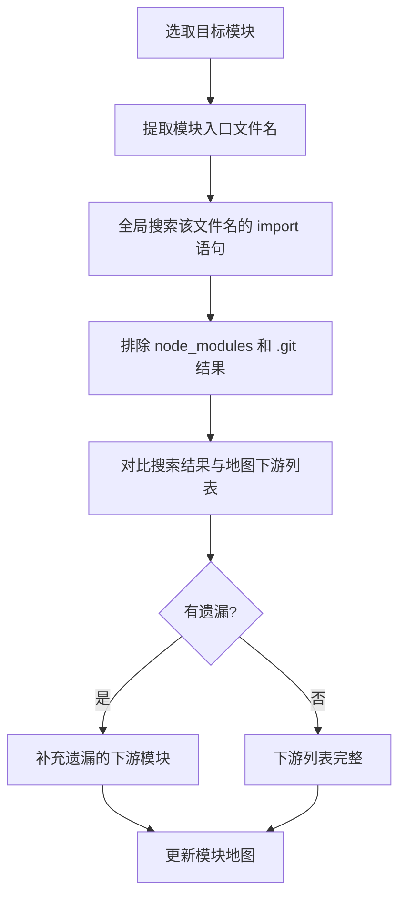

# YiWeb-系统架构-模块地图 · 使用场景

> v1.0.0 | 2026-05-28 | deepseek-v4-pro | feat/yiweb-arch-sub-stories

> **导航**: [← 故事任务](./故事任务.md) · [→ 技术评审](./技术评审.md)

> [§1 角色](#sec1) · [§2 场景](#sec2)

### 主要价值

- 🗺️ 快速定位 — 按关键词找到目标模块的入口文件
- 🔗 影响评估 — 修改模块前查看全部下游消费者
- 📋 模块分类索引 — 按类型（通用组件/业务组件/服务/基础设施/插件）浏览
- 🧭 新人导航 — 从模块地图建立系统全貌认知

## §1 角色

| 角色 | 职责 | 关注点 |
|------|------|--------|
| 功能开发者 | 找到要修改的模块位置 | 模块入口路径、文件位置 |
| 影响评估者 | 评估变更的影响范围 | 模块的下游消费者列表 |
| 代码审查者 | 检查新增模块是否符合规范 | 模块的依赖方向和内部依赖 |
| 新加入的开发者 | 理解系统由哪些模块组成 | 模块分类索引和整体结构 |

## §2 场景

### 场景 1: 修改前查下游 — 评估变更影响

- **角色**: 需要修改公共模块的功能开发者
- **前置**: 已确定要修改的目标模块
- **操作流**:

- **后置**: 明确变更影响范围，知道需要验证哪些下游
- **异常**: 模块在地图中但下游列表不完整 → 全局搜索 import 语句补充

| 步骤 | 操作 | 参考 |
|------|------|------|
| 1 | 在模块地图中定位目标模块 | 模块地图总表 |
| 2 | 读取该模块的下游消费者列 | 模块三元组的第三元 |
| 3 | 按下游列表逐项检查使用方式 | 下游模块的入口文件 |

### 场景 2: 按分类浏览 — 找到特定类型的模块

- **角色**: 需要找某个通用组件或工具的新人
- **前置**: 知道要找的模块类型但不知道具体文件路径
- **操作流**:

- **后置**: 找到目标模块的入口文件路径
- **异常**: 四大分类均未找到 → 可能是新模块需求，按项目规范新建

| 步骤 | 操作 | 参考 |
|------|------|------|
| 1 | 确定模块所属类型 | 五大分类定义 |
| 2 | 浏览该分类下的全部模块 | 模块地图对应分类表 |
| 3 | 匹配模块名称和职责描述 | 模块的职责列 |

### 场景 3: 依赖方向校验 — 审查代码合规性

- **角色**: 代码审查者
- **前置**: 有新增或修改的模块代码
- **操作流**:

- **后置**: 所有跨模块引用通过方向校验
- **异常**: 发现组件引用视图 → 标记为架构违规，要求调整

| 步骤 | 操作 | 参考 |
|------|------|------|
| 1 | 列出本次变更的全部新增 import | 代码变更 diff |
| 2 | 确定每个 import 的来源模块类型 | 模块地图的分类列 |
| 3 | 检查 cdn/ 模块是否 import 了 src/ 模块 | 依赖方向约束 |

### 场景 4: 全局搜索补充下游 — 完善模块地图

- **角色**: 维护模块地图的架构决策者
- **前置**: 怀疑某些模块的下游列表不完整
- **操作流**:

- **后置**: 目标模块的下游列表与全局搜索结果一致
- **异常**: 搜索结果包含不属于本仓库的路径 → 标记为外部消费者

| 步骤 | 操作 | 参考 |
|------|------|------|
| 1 | 提取模块入口文件的相对路径 | 模块地图的入口列 |
| 2 | 全局搜索该路径的引用 | grep -r "路径" --include="*.js" |
| 3 | 对比并补充遗漏项 | 模块地图的下游消费者列 |

---

> **变更记录**：v1.0.0 — 从父故事 yiweb-arch FP2 拆分创建（2026-05-28，`/rui update`）
