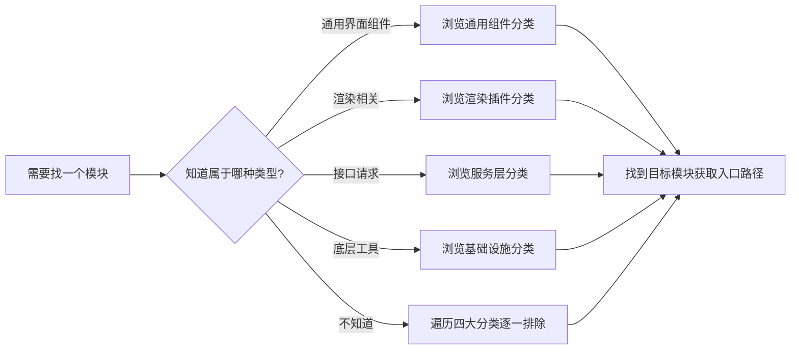
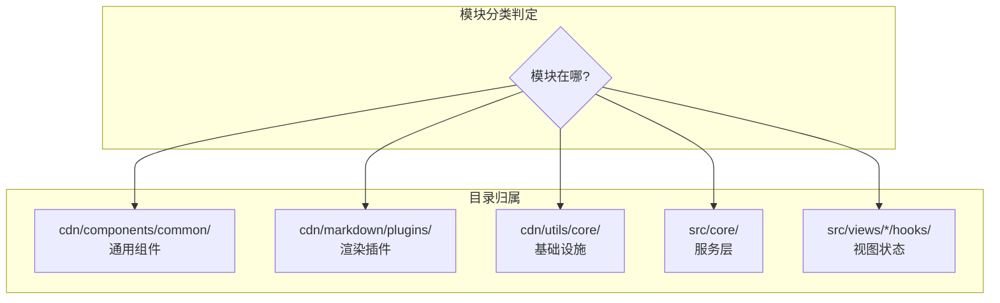

# 场景2 · 分类浏览 — 按类型找到特定模块

> v2.0.0 | 2026-05-29 | deepseek-v4-pro | feat/traceability-graph

> **故事**: [← 故事任务](./故事任务.md) · **上个场景**: [← 场景1·查下游](./场景1-查下游.md) · **下个场景**: [场景3·方向校验 →](./场景3-方向校验.md)
  [§1 使用场景](#sec1) · [§2 技术评审](#sec2) · [§3 测试设计](#sec3) · [§4 实施报告](#sec4) · [§5 测试报告](#sec5) · [§6 自改进](#sec6) · [§7 关联源码](#sec7)

### 主要价值
- 🔗 场景自包含：单场景即可理解完整操作流
- 📊 溯源可验证：每个引用关联到具体源码位置
- 🧪 测试门禁清晰：AC 与 Gate 判定标准明确
- 🔍 基线可追溯：设计决策关联到故事任务与 CLAUDE.md

## §1 使用场景

| 维度 | 内容 |
|------|------|
| **角色** | 需要找某个通用组件或工具的新人 |
| **前置** | 知道要找的模块类型但不知道具体文件路径 |
| **操作流** | 需要找一个模块 → 知道属于哪种类型? → 通用界面组件(浏览通用组件分类) / 渲染相关(浏览渲染插件分类) / 接口请求(浏览服务层分类) / 底层工具(浏览基础设施分类) / 不知道(遍历四大分类逐一排除) → 找到目标模块获取入口路径 |
| **后置** | 找到目标模块的入口文件路径 |
| **异常** | 四大分类均未找到 → 可能是新模块需求，按项目规范新建 |

### 五大分类判定规则

| 分类 | 判定条件 | 目录位置 |
|------|---------|---------|
| 通用组件 | 界面组件，不依赖业务状态 | `cdn/components/common/` |
| 渲染插件 | 内容渲染处理插件 | `cdn/markdown/plugins/` |
| 基础设施 | 底层工具，被多模块引用 | `cdn/utils/core/` + `cdn/utils/view/` |
| 服务层 | 接口封装或业务流程 | `src/core/` |
| 视图状态 | 视图级状态管理 | `src/views/<name>/hooks/` |

## §2 技术评审

| 评审项 | 结论 | 说明 |
|--------|------|------|
| 分类体系完整性 | 通过 | 五大分类覆盖全部已知模块 |
| 判定规则明确 | 通过 | 按目录位置+职责双重判定 |

## §3 测试设计

| AC# | Given | When | Then | 门禁 |
|-----|-------|------|------|------|
| AC1 | 给定模块名 YiModal | 判断分类归属 | 归入通用组件分类 | Gate A |
| AC2 | 给定模块名 SanitizePlugin | 判断分类归属 | 归入渲染插件分类 | Gate A |
| AC3 | 给定模块名 crud.js | 判断分类归属 | 归入服务层分类 | Gate A |

## §4 实施报告

| 任务 | 状态 | 产出 |
|------|:---:|------|
| 五大分类定义 | ✅ | 判定规则+目录位置+示例 |
| 模块归类 | ✅ | 全部已知模块归入对应分类 |

## §5 测试报告

| AC# | 结果 | 证据 |
|-----|:---:|------|
| AC1 (YiModal) | ✅ | 位于 cdn/components/common/，不依赖业务状态 |
| AC2 (SanitizePlugin) | ✅ | 位于 cdn/markdown/plugins/ |
| AC3 (crud.js) | ✅ | 位于 src/core/services/modules/ |

## §6 自改进

| 发现 | 改进项 | 状态 |
|------|--------|:---:|
| 分类边界模糊的模块需人工判定 | 补充边界判定指南 | 📋 |

## §7 关联源码

| 类型 | 文件 | 关键内容 | 说明 |
|------|------|---------|------|
| 开发 | `cdn/components/common/` | YiModal/YiButton/YiTag/YiLoading 等 | 通用组件分类 |
| 开发 | `cdn/markdown/plugins/` | SanitizePlugin/MermaidPlugin/TocPlugin 等 | 渲染插件分类 |
| 开发 | `cdn/utils/core/` | log/error/storage/api/http/eventBus | 基础设施分类 |
| 开发 | `src/core/` | config/crud/requestHelper/authUtils | 服务层分类 |
| 开发 | `src/views/*/hooks/` | store/useComputed/useMethods | 视图状态分类 |
| 测试 | — | 分类正确性通过人工+判定规则验证 | 架构文档层 |

---
> **变更记录**: v2.0.0 — 合并 使用场景+技术评审+测试设计+实施报告+测试报告+自改进 为单一场景文档 (2026-05-29)
