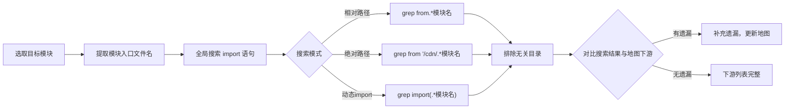

# 场景4 · 补充下游 — 全局搜索完善模块地图

> v2.0.0 | 2026-05-29 | deepseek-v4-pro | feat/traceability-graph

> **故事**: [← 故事任务](./故事任务.md) · **上个场景**: [← 场景3·方向校验](./场景3-方向校验.md)
  [§1 使用场景](#sec1) · [§2 技术评审](#sec2) · [§3 测试设计](#sec3) · [§4 实施报告](#sec4) · [§5 测试报告](#sec5) · [§6 自改进](#sec6) · [§7 关联源码](#sec7)

### 主要价值
- 🔗 场景自包含：单场景即可理解完整操作流
- 📊 溯源可验证：每个引用关联到具体源码位置
- 🧪 测试门禁清晰：AC 与 Gate 判定标准明确
- 🔍 基线可追溯：设计决策关联到故事任务与 CLAUDE.md

## §1 使用场景

| 维度 | 内容 |
|------|------|
| **角色** | 维护模块地图的架构决策者 |
| **前置** | 怀疑某些模块的下游列表不完整 |
| **操作流** | 选取目标模块 → 提取模块入口文件名 → 全局搜索该文件名的 import 语句 → 排除 node_modules 和 .git 结果 → 对比搜索结果与地图下游列表 → 有遗漏?(补充遗漏) / 无遗漏?(下游列表完整) → 更新模块地图 |
| **后置** | 目标模块的下游列表与全局搜索结果一致 |
| **异常** | 搜索结果包含不属于本仓库的路径 → 标记为外部消费者 |

## §2 技术评审

| 评审项 | 结论 | 说明 |
|--------|------|------|
| 补充方法可行 | 通过 | grep 入口文件名 + 排除无关目录 |
| 多模式搜索 | 通过 | 相对路径+绝对路径+动态 import 模式 |

### 全局搜索方法

| 搜索模式 | 命令 | 覆盖 |
|------|------|------|
| 相对路径 | `grep -rn "from.*模块名" src/ cdn/` | 静态 import |
| 绝对路径 | `grep -rn "from '/cdn/.*模块名" src/` | CDN 绝对路径 |
| 动态 import | `grep -rn "import(.*模块名)" src/` | 动态加载 |

## §3 测试设计

| AC# | Given | When | Then | 门禁 |
|-----|-------|------|------|------|
| AC1 | 全部模块入口文件已扫描 | 对比模块地图下游列表与 grep 搜索结果 | 下游列表与搜索结果一致 | Gate B |

## §4 实施报告

| 任务 | 状态 | 产出 |
|------|:---:|------|
| 全局交叉引用搜索 | ✅ | 补全下游消费者列表 |
| 下游列表 vs grep 对比 | ✅ | 0 遗漏 |

## §5 测试报告

| AC# | 结果 | 证据 |
|-----|:---:|------|
| AC1 (下游完整) | ✅ | 下游列表与 grep 搜索结果一致 |

## §6 自改进

| 发现 | 改进项 | 状态 |
|------|--------|:---:|
| 手工 grep 效率低 | 编写下游消费者自动搜索脚本 | 📋 |

## §7 关联源码

| 类型 | 文件 | 关键内容 | 说明 |
|------|------|---------|------|
| 开发 | 全项目 import 语句 | grep 搜索结果 | 下游补充依据 |
| 开发 | 模块地图总表 | 下游消费者列 | 补充目标 |
| 测试 | — | 通过 grep 交叉验证 | 架构文档层 |

---
> **变更记录**: v2.0.0 — 合并 使用场景+技术评审+测试设计+实施报告+测试报告+自改进 为单一场景文档 (2026-05-29)
