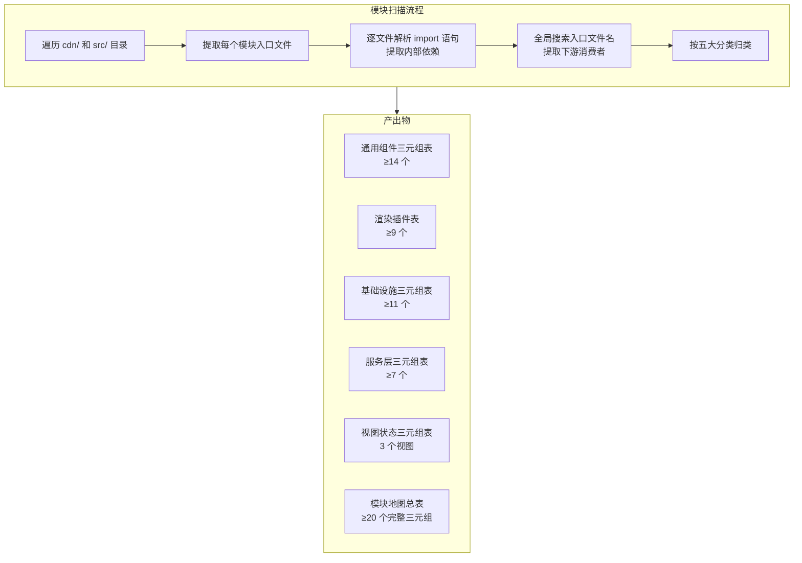
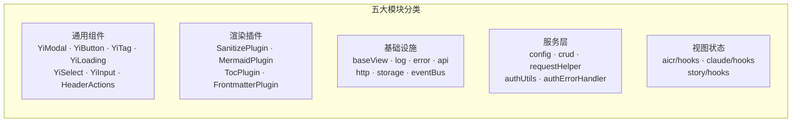
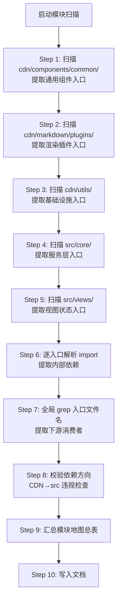

# YiWeb-系统架构-模块地图 · 技术评审

> v1.0.0 | 2026-05-28 | deepseek-v4-pro | feat/yiweb-arch-sub-stories

> **导航**: [← 使用场景](./使用场景.md) · [→ 测试设计](./测试设计.md)

> [§0 基线溯源](#sec0) · [§1 系统架构](#sec1) · [§2 组件树](#sec2) · [§3 状态管理](#sec3) · [§4 交互流](#sec4) · [§5 信任边界](#sec5) · [§6 ADR](#sec6) · [§7 评审清单](#sec7)

### 主要价值

- 🗺️ 定义模块三元组提取方法论 — 入口定位 + import 分析 + 全局引用搜索
- 📋 建立五大模块分类体系 — 通用组件 / 业务组件 / 服务模块 / 基础设施 / 渲染插件
- 🔗 形式化依赖方向约束 — CDN 不依赖 src，通用组件不依赖业务逻辑
- 📊 输出模块地图总表 — ≥ 20 个模块各含完整三元组

## §0 基线溯源

| 基线文件 | 关键条款 | 本次适用性 | 偏差 |
|---------|---------|-----------|------|
| 故事任务.md | FP2.1–FP2.7 模块提取、AC1–AC8 验收标准 | 全部适用 | 无 |
| 使用场景.md | 4 场景（查下游/分类浏览/方向校验/补充下游） | 全部适用 | 无 |
| CLAUDE.md | 项目类型 frontend、CDN 托管通用组件 | 适用 — 组件分类依据 | 无 |

## §1 系统架构

### 效果示意

### 布局线框

### 模块三元组提取方法

| 元 | 含义 | 提取方法 | 示例 |
|----|------|---------|------|
| 入口 | 模块的主入口文件路径 | 读取目录下的 index.js 或主文件 | `cdn/utils/core/log.js` |
| 内部依赖 | 本模块 import 的其他模块 | 解析入口文件中的 import 语句 | `import { EventBus } from '../eventBus.js'` |
| 下游消费者 | import 本模块的其他模块 | 全局 grep 入口文件名 | aicr/index.js, claude/index.js, story/index.js |

### 五大分类判定规则

| 分类 | 判定条件 | 目录位置 | 示例 |
|------|---------|---------|------|
| 通用组件 | 界面组件，不依赖业务状态 | `cdn/components/common/` | YiModal, YiButton, YiTag |
| 渲染插件 | 内容渲染处理插件 | `cdn/markdown/plugins/` | SanitizePlugin, MermaidPlugin |
| 基础设施 | 底层工具，被多模块引用 | `cdn/utils/core/` + `cdn/utils/view/` | log.js, error.js, baseView.js |
| 服务层 | 接口封装或业务流程 | `src/core/` | crud.js, requestHelper.js |
| 视图状态 | 视图级状态管理 | `src/views/<name>/hooks/` | store.js, useComputed.js |

### 依赖方向约束

| 方向 | 规则 | 违规示例 |
|------|------|---------|
| 通用组件 → 通用组件 | 允许 | YiIconButton → YiIcon |
| 通用组件 → 业务状态 | 禁止 | YiModal → aicr store |
| 基础设施 → 视图 | 禁止 | log.js → aicr/index.js |
| 基础设施 → 服务层 | 允许（仅限工具类引用） | http.js 无 src/ import |
| 渲染插件 → 通用组件 | 允许 | — |

## §2 组件树

> 本故事聚焦模块关系提取，组件三元组详见父故事 yiweb-arch 技术评审 §2。

模块地图产出覆盖全部通用组件（≥14 个）和业务组件（由各视图自行管理），每个组件的入口 + 内部依赖 + 下游消费者均记录在模块地图总表中。

## §3 状态管理

> 本故事聚焦模块关系提取，状态管理详见父故事 yiweb-arch 技术评审 §3。

模块地图覆盖三个视图的状态管理三元组（入口 + 依赖 + 下游），不涉及状态变更流程。

## §4 交互流

### 模块扫描流

| 步骤 | 扫描目录 | 产出 | 目标数量 |
|------|---------|------|---------|
| 1 | `cdn/components/common/` | 通用组件三元组 | ≥ 14 |
| 2 | `cdn/markdown/plugins/` | 渲染插件表 | ≥ 9 |
| 3 | `cdn/utils/` | 基础设施三元组 | ≥ 11 |
| 4 | `src/core/` | 服务层三元组 | ≥ 7 |
| 5 | `src/views/*/hooks/` | 视图状态三元组 | 3 视图 |
| 6–7 | 全量入口文件 | 内部依赖 + 下游消费者 | — |
| 8 | 全量 import | 违规清单 | 0 违规 |
| 9 | 步骤 1–8 产出 | 模块地图总表 | ≥ 20 完整三元组 |

## §5 信任边界

> 本故事聚焦模块关系提取，安全边界详见子故事 yiweb-arch-security。

模块地图中的依赖方向约束（CDN 不依赖 src）是安全边界的基础保障：确保通用组件不被业务逻辑污染，渲染插件不被视图状态影响。

## §6 ADR

### ADR-MOD-1: 三元组记录

| 字段 | 内容 |
|------|------|
| **状态** | 已采纳 |
| **决策** | 每个模块记录三元组（入口 + 内部依赖 + 下游消费者） |
| **背景** | 模块间隐式依赖导致变更风险不可控 |
| **后果** | 模块地图维护成本随模块增加线性增长；增量更新时只刷新变更模块 |

### ADR-MOD-2: 五大分类

| 字段 | 内容 |
|------|------|
| **状态** | 已采纳 |
| **决策** | 将系统模块划分为五大分类：通用组件 / 渲染插件 / 基础设施 / 服务层 / 视图状态 |
| **背景** | 项目目录结构已反映分类意图 |
| **后果** | 新增模块时按分类判定规则归入对应类别；分类边界模糊时取主要职责 |

## §7 评审清单

| # | 检查项 | 状态 |
|---|--------|:---:|
| 1 | F.meta + F.nav + F.toc 三组件完整 | ✅ |
| 2 | 效果示意 mermaid ≥ 5 节点 | ✅ |
| 3 | 布局线框已含（前端必含） | ✅ |
| 4 | 模块三元组提取方法表完整 | ✅ |
| 5 | 五大分类判定规则表完整 | ✅ |
| 6 | 模块扫描流完整（≥ 10 步骤） | ✅ |
| 7 | ADR 状态+背景+后果完整 | ✅ |
| 8 | §0 基线溯源覆盖故事任务+使用场景+CLAUDE.md | ✅ |
| 9 | 无 Level C/D 证据 | ✅ |

---

> **变更记录**：v1.0.0 — 从父故事 yiweb-arch FP2 拆分创建（2026-05-28，`/rui update`）
