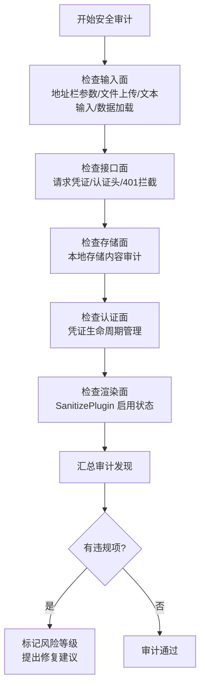
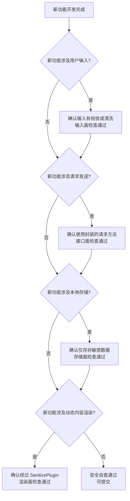
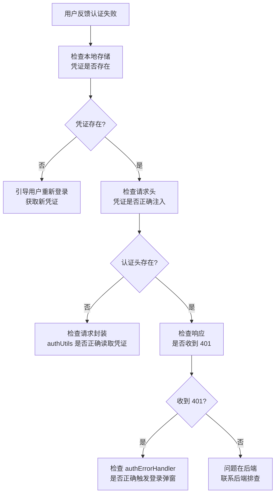
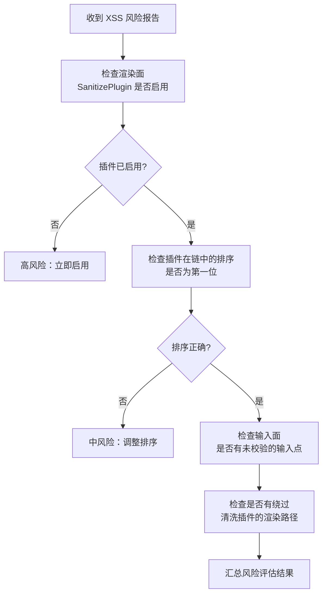

# YiWeb-系统架构-安全边界 · 使用场景

> v1.0.0 | 2026-05-28 | deepseek-v4-pro | feat/yiweb-arch-sub-stories

> **导航**: [← 故事任务](./故事任务.md) · [→ 技术评审](./技术评审.md)

> [§1 角色](#sec1) · [§2 场景](#sec2)

### 主要价值

- 🛡️ 安全审计 — 按五类信任面逐项检查防护措施
- 🔒 合规检查 — 确认认证和凭证管理符合安全要求
- 🚨 事件响应 — 安全事件发生时快速定位受影响面
- 📋 新功能安全自查 — 开发新功能前按清单逐项自检

## §1 角色

| 角色 | 职责 | 关注点 |
|------|------|--------|
| 安全审查者 | 验证防护措施完整性 | 五类信任面的防护机制和关键文件 |
| 功能开发者 | 新功能上线前安全自查 | 新功能涉及的信任面和防护要求 |
| 合规审计者 | 检查系统是否符合安全规范 | 凭证管理、内容清洗、请求安全 |
| 应急响应者 | 安全事件发生后定位问题 | 受影响信任面的入口点和防护弱点 |

## §2 场景

### 场景 1: 安全审计 — 逐面检查防护措施

- **角色**: 定期执行安全审查的安全审查者
- **前置**: 已获取安全边界文档和源码访问权限
- **操作流**:

- **后置**: 五类信任面全部检查完成，违规项有风险评级和修复建议
- **异常**: 发现敏感数据存储在本地存储 → 标记为高风险，立即修复

| 步骤 | 操作 | 参考 |
|------|------|------|
| 1 | 打开安全边界文档 | 技术评审 §5 信任边界 |
| 2 | 按信任面逐项对照源码验证 | 防护表中的关键文件列 |
| 3 | 记录不一致项和缺失项 | 审计报告模板 |
| 4 | 对违规项标记风险等级 | 高/中/低 |

### 场景 2: 新功能安全自查 — 上线前自我检查

- **角色**: 即将提交新功能的功能开发者
- **前置**: 新功能开发完成，准备提交
- **操作流**:

- **后置**: 涉及的全部信任面自查通过
- **异常**: 某项不通过 → 按防护要求修改代码后重新自查

| 步骤 | 操作 | 参考 |
|------|------|------|
| 1 | 确定新功能涉及哪些信任面 | 五类信任面定义 |
| 2 | 逐面对照防护要求检查代码 | 防护表中的防护机制列 |
| 3 | 不通过项修改后重新检查 | 源码修改 → 重新自查 |

### 场景 3: 认证失败排查 — 追踪凭证链路

- **角色**: 处理用户反馈认证失败的问题排查者
- **前置**: 用户反馈操作时提示未授权或被踢出
- **操作流**:

- **后置**: 定位认证失败的具体环节
- **异常**: 凭证存在但认证头未注入 → 检查请求封装代码是否被绕过

| 步骤 | 操作 | 参考 |
|------|------|------|
| 1 | 检查浏览器本地存储中凭证是否存在 | 存储面 — 本地存储键名 |
| 2 | 检查发出的请求是否带认证头 | 接口面 — 请求封装 |
| 3 | 检查 401 响应是否正确拦截和处理 | 认证面 — authErrorHandler |
| 4 | 确认登录弹窗是否正常弹出 | 认证面 — 认证错误处理 |

### 场景 4: XSS 风险评估 — 检查内容清洗

- **角色**: 收到 XSS 漏洞报告的安全审查者
- **前置**: 有潜在跨站脚本攻击的报告
- **操作流**:

- **后置**: 确认所有动态内容的渲染路径均经过安全清洗
- **异常**: 发现绕过清洗插件的渲染路径 → 标记为高风险，立即封堵

| 步骤 | 操作 | 参考 |
|------|------|------|
| 1 | 确认 SanitizePlugin 在渲染器插件列表中 | 渲染面 — PluginSystem 配置 |
| 2 | 确认插件排序为第一位 | 渲染面 — 插件注册顺序 |
| 3 | 搜索是否有直接操作 DOM 的代码 | 全局搜索 innerHTML 调用 |
| 4 | 检查用户输入是否在渲染前经过清洗 | 输入面 → 渲染面的链路 |

---

> **变更记录**：v1.0.0 — 从父故事 yiweb-arch FP4 拆分创建（2026-05-28，`/rui update`）
