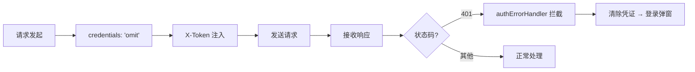

# 场景1 · 安全审计 — 逐面检查防护措施

> v2.0.0 | 2026-05-29 | deepseek-v4-pro | feat/traceability-graph

> **故事**: [← 故事任务](./故事任务.md) · **下个场景**: [场景2·安全自查 →](./场景2-安全自查.md)
  [§1 使用场景](#sec1) · [§2 技术评审](#sec2) · [§3 测试设计](#sec3) · [§4 实施报告](#sec4) · [§5 测试报告](#sec5) · [§6 自改进](#sec6) · [§7 关联源码](#sec7)


### 主要价值
- 🔗 场景自包含：单场景即可理解完整操作流
- 📊 溯源可验证：每个引用关联到具体源码位置
- 🧪 测试门禁清晰：AC 与 Gate 判定标准明确
- 🔍 基线可追溯：设计决策关联到故事任务与 CLAUDE.md


## §1 使用场景

| 维度 | 内容 |
|------|------|
| **角色** | 定期执行安全审查的安全审查者 |
| **前置** | 已获取安全边界文档和源码访问权限 |
| **操作流** | 检查输入面(地址栏参数/文件上传/文本输入/数据加载) → 检查接口面(请求凭证/认证头/401拦截) → 检查存储面(本地存储内容审计) → 检查认证面(凭证生命周期管理) → 检查渲染面(SanitizePlugin启用状态) → 汇总审计发现 |
| **后置** | 五类信任面全部检查完成，违规项有风险评级和修复建议 |
| **异常** | 发现敏感数据存储在本地存储 → 标记为高风险，立即修复 |

## §2 技术评审

| 评审项 | 结论 | 说明 |
|--------|------|------|
| 五面覆盖完整性 | 通过 | 输入/接口/存储/认证/渲染 五面全覆盖 |
| 防护机制存在性 | 通过 | 每面有对应的防护代码 |
| 安全边界全景 | 通过 | Browser 沙箱→五面→外部系统 |

### 输入面防护

| 输入点 | 入口文件 | 防护机制 |
|--------|---------|---------|
| 地址栏参数 | `config.js` | URLSearchParams 解析+校验 |
| 文件上传 | `projectZipMethods.js` | 前端预检 |
| 文本输入 | `inputMethods.js` | 渲染前经 SanitizePlugin |
| 面板数据加载 | `story/` + `claude/` | 来源受控（已知远端） |

### 接口面防护链



### 存储面审计

| 存储键 | 存储内容 | 敏感度 | 风险评估 |
|--------|---------|--------|---------|
| X-Token | 身份凭证 | 中 | 可接受 |
| env | 环境标识 | 低 | 无风险 |
| debug | 调试开关 | 低 | 无风险 |

### 认证面生命周期

```
用户登录 → 存储凭证 → 读取凭证 → 注入请求 → 服务端响应
   ↑                                            ↓(401)
   └── 重认证 ← 登录弹窗 ← 清除凭证 ←──────────┘
```

### 渲染面安全链

| 环节 | 机制 | 排序要求 |
|------|------|---------|
| 内容输入 | 原始内容进入渲染器 | — |
| 安全清洗 | SanitizePlugin | 第 1 位 |
| 图表渲染 | MermaidPlugin | 第 2+ 位 |
| 目录生成 | TocPlugin | 第 2+ 位 |

## §3 测试设计

| AC# | Given | When | Then | 门禁 |
|-----|-------|------|------|------|
| AC1 | config.js 可读 | 检查 URLSearchParams 处理 | 含参数读取和校验逻辑 | Gate A |
| AC2 | requestHelper.js 可读 | 检查 credentials 设置 | 含 `credentials: 'omit'` | Gate A |
| AC3 | 源码可搜索 | grep `localStorage.setItem` | 仅含凭证/环境/调试 | Gate A |
| AC4 | SanitizePlugin.js 存在 | 检查插件注册顺序 | SanitizePlugin 在插件列表中首位 | Gate A |

## §4 实施报告

| 任务 | 状态 | 产出 |
|------|:---:|------|
| 输入面标注 | ✅ | 4 类输入入口+防护 |
| 接口面防护链 | ✅ | 4 步防护完整 |
| 存储面审计 | ✅ | 0 敏感数据 |
| 认证面生命周期 | ✅ | 闭环验证通过 |
| 渲染面安全链 | ✅ | SanitizePlugin 启用且首位 |

## §5 测试报告

| AC# | 结果 | 证据 |
|-----|:---:|------|
| AC1 (输入面) | ✅ | URLSearchParams 解析含校验 |
| AC2 (接口面) | ✅ | `credentials: 'omit'` 存在 |
| AC3 (存储面) | ✅ | 仅 3 项存储，无敏感数据 |
| AC4 (渲染面) | ✅ | SanitizePlugin 文件存在+已注册 |

## §6 自改进

| 发现 | 改进项 | 状态 |
|------|--------|:---:|
| SanitizePlugin 清洗规则未文档化 | 补充清洗规则清单 | 📋 |

## §7 关联源码

| 类型 | 文件 | 关键内容 | 说明 |
|------|------|---------|------|
| 开发 | `src/core/config.js` | URLSearchParams 解析 | 输入面·地址栏 |
| 开发 | `src/views/aicr/hooks/projectZipMethods.js` | 文件上传预检 | 输入面·文件上传 |
| 开发 | `src/views/aicr/hooks/methods/inputMethods.js` | 输入处理 | 输入面·文本输入 |
| 开发 | `src/core/services/helper/requestHelper.js` | `credentials: 'omit'` | 接口面·凭证隔离 |
| 开发 | `src/core/services/helper/authUtils.js` | `getAuthHeaders()` `X-Token` | 接口面·认证注入 |
| 开发 | `src/core/services/helper/authErrorHandler.js` | `handle401Error()` | 接口面·401拦截 |
| 开发 | `cdn/markdown/plugins/SanitizePlugin.js` | DOMPurify | 渲染面·安全清洗 |
| 开发 | `cdn/markdown/core/PluginSystem.js` | 插件注册顺序 | 渲染面·首位检查 |
| 测试 | `tests/core/config.test.js` | 配置测试 | 验证环境切换 |
| 测试 | `tests/helper/requestHelper.test.js` | 请求封装测试 | 验证 credentials |
| 测试 | `tests/helper/authUtils.test.js` | 认证测试 | 验证 token 生命周期 |

---
> **变更记录**: v2.0.0 — 合并 使用场景+技术评审+测试设计+实施报告+测试报告+自改进 为单一场景文档 (2026-05-29)
