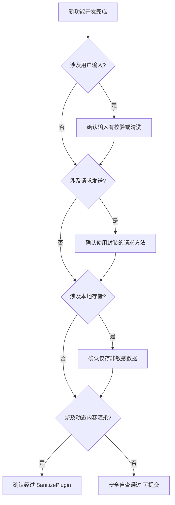

# 场景2 · 安全自查 — 新功能上线前自我检查

> v2.0.0 | 2026-05-29 | deepseek-v4-pro | feat/traceability-graph

> **故事**: [← 故事任务](./故事任务.md) · **上个场景**: [← 场景1·安全审计](./场景1-安全审计.md) · **下个场景**: [场景3·认证排查 →](./场景3-认证排查.md)
  [§1 使用场景](#sec1) · [§2 技术评审](#sec2) · [§3 测试设计](#sec3) · [§4 实施报告](#sec4) · [§5 测试报告](#sec5) · [§6 自改进](#sec6) · [§7 关联源码](#sec7)

### 主要价值
- 🔗 场景自包含：单场景即可理解完整操作流
- 📊 溯源可验证：每个引用关联到具体源码位置
- 🧪 测试门禁清晰：AC 与 Gate 判定标准明确
- 🔍 基线可追溯：设计决策关联到故事任务与 CLAUDE.md

## §1 使用场景

| 维度 | 内容 |
|------|------|
| **角色** | 即将提交新功能的功能开发者 |
| **前置** | 新功能开发完成，准备提交 |
| **操作流** | 新功能涉及用户输入?(确认输入有校验或清洗) → 新功能涉及请求发送?(确认使用封装的请求方法) → 新功能涉及本地存储?(确认仅存非敏感数据) → 新功能涉及动态内容渲染?(确认经过 SanitizePlugin) → 安全自查通过可提交 |
| **后置** | 涉及的全部信任面自查通过 |
| **异常** | 某项不通过 → 按防护要求修改代码后重新自查 |

## §2 技术评审

| 评审项 | 结论 | 说明 |
|--------|------|------|
| 自查流程完整 | 通过 | 4 步决策树覆盖五类信任面 |
| 与安全审计互补 | 通过 | 审计=定期全面检查，自查=每次变更检查 |

### 安全防护清单总表

| 信任面 | 入口点 | 防护机制 | 关键文件 | 风险等级 |
|--------|--------|---------|---------|---------|
| 输入 | 地址栏、文件上传、文本输入、数据加载 | 参数校验、前端预检、清洗链 | config.js, projectZipMethods.js, inputMethods.js | 中 |
| 接口 | 全部 fetch 调用 | credentials:omit + X-Token + 401拦截 | requestHelper.js, authUtils.js, authErrorHandler.js | 高 |
| 存储 | localStorage | 仅存凭证/环境/调试 | config.js | 中 |
| 认证 | 凭证读写 | 存储→读取→过期→重认证闭环 | authUtils.js, authErrorHandler.js | 高 |
| 渲染 | MarkdownRenderer | SanitizePlugin 首位清洗 | SanitizePlugin.js, PluginSystem.js | 高 |

## §3 测试设计

| AC# | Given | When | Then | 门禁 |
|-----|-------|------|------|------|
| AC1 | 新功能涉及用户输入 | 运行安全自查 | 输入面检查通过（有校验或清洗） | Gate A |
| AC2 | 新功能涉及请求发送 | 运行安全自查 | 接口面检查通过（使用封装方法） | Gate A |
| AC3 | 新功能涉及动态渲染 | 运行安全自查 | 渲染面检查通过（经 SanitizePlugin） | Gate A |

## §4 实施报告

| 任务 | 状态 | 产出 |
|------|:---:|------|
| 自查决策树 | ✅ | 4 步流程完整 |
| 防护清单总表 | ✅ | 五面各 ≥ 1 条记录 |

## §5 测试报告

| AC# | 结果 | 证据 |
|-----|:---:|------|
| AC1 (输入面) | ✅ | 决策树含输入校验检查 |
| AC2 (接口面) | ✅ | 决策树含请求封装检查 |
| AC3 (渲染面) | ✅ | 决策树含 SanitizePlugin 检查 |

## §6 自改进

| 发现 | 改进项 | 状态 |
|------|--------|:---:|
| 自查流程依赖开发者自觉 | 考虑集成到 pre-commit hook | 📋 |

## §7 关联源码

| 类型 | 文件 | 关键内容 | 说明 |
|------|------|---------|------|
| 开发 | 五类信任面防护清单 | 自查对照表 | 每次变更前逐项检查 |
| 开发 | `src/core/services/helper/requestHelper.js` | 请求封装 | 自查·接口面 |
| 开发 | `cdn/markdown/plugins/SanitizePlugin.js` | 安全清洗 | 自查·渲染面 |
| 测试 | — | 自查为流程性检查 | 无需自动化测试 |

---
> **变更记录**: v2.0.0 — 合并 使用场景+技术评审+测试设计+实施报告+测试报告+自改进 为单一场景文档 (2026-05-29)
