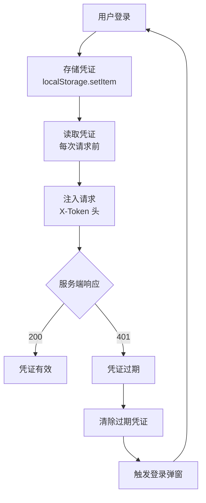

# 场景3 · 认证排查 — 追踪凭证链路

> v2.0.0 | 2026-05-29 | deepseek-v4-pro | feat/traceability-graph

> **故事**: [← 故事任务](./故事任务.md) · **上个场景**: [← 场景2·安全自查](./场景2-安全自查.md) · **下个场景**: [场景4·XSS评估 →](./场景4-XSS评估.md)
  [§1 使用场景](#sec1) · [§2 技术评审](#sec2) · [§3 测试设计](#sec3) · [§4 实施报告](#sec4) · [§5 测试报告](#sec5) · [§6 自改进](#sec6) · [§7 关联源码](#sec7)

### 主要价值
- 🔗 场景自包含：单场景即可理解完整操作流
- 📊 溯源可验证：每个引用关联到具体源码位置
- 🧪 测试门禁清晰：AC 与 Gate 判定标准明确
- 🔍 基线可追溯：设计决策关联到故事任务与 CLAUDE.md

## §1 使用场景

| 维度 | 内容 |
|------|------|
| **角色** | 处理用户反馈认证失败的问题排查者 |
| **前置** | 用户反馈操作时提示未授权或被踢出 |
| **操作流** | 检查本地存储凭证是否存在 → 凭证存在? → 检查请求头凭证是否正确注入 → 认证头存在? → 检查响应是否收到 401 → 收到 401? → 检查 authErrorHandler 是否触发登录弹窗 / 问题在后端联系后端排查 |
| **后置** | 定位认证失败的具体环节 |
| **异常** | 凭证存在但认证头未注入 → 检查请求封装代码是否被绕过 |

## §2 技术评审

| 评审项 | 结论 | 说明 |
|--------|------|------|
| 认证链路闭环 | 通过 | 存储→读取→注入→过期→清除→重认证 全闭环 |
| 每步可定位 | 通过 | 每步有明确的入口文件和函数 |

### 认证全链路 8 节点

| # | 认证节点 | 文件 | 函数 |
|:---:|------|------|------|
| ① | 凭证读取 | `authUtils.js` | `getStoredToken()` |
| ② | 凭证存储 | `authUtils.js` | `saveToken()` |
| ③ | 认证头注入 | `authUtils.js` | `getAuthHeaders()` → `X-Token` |
| ④ | credentials:omit | `requestHelper.js` | `sendRequest()` |
| ⑤ | 401 拦截 | `authErrorHandler.js` | `handle401Error()` |
| ⑥ | 2s 冷却 | `authErrorHandler.js` | `reset401Handler()` |
| ⑦ | 凭证清除 | `authUtils.js` | `clearToken()` |
| ⑧ | 重认证 | `authUtils.js` | `openAuth()` |

### 认证生命周期

## §3 测试设计

| AC# | Given | When | Then | 门禁 |
|-----|-------|------|------|------|
| AC1 | authUtils.js 可读 | 检查凭证读取逻辑 | 含 `localStorage.getItem` 调用 | Gate A |
| AC2 | authErrorHandler.js 可读 | 检查 401 响应检测 | 含响应状态码检查 | Gate A |
| AC3 | authUtils.js + authErrorHandler.js | 追踪存储→读取→注入→过期→清除→重认证 | 6 步均有对应代码，形成闭环 | Gate A |

## §4 实施报告

| 任务 | 状态 | 产出 |
|------|:---:|------|
| 认证链路追踪 | ✅ | 8 节点逐条验证通过 |
| 生命周期闭环 | ✅ | 6 步闭环验证通过 |

## §5 测试报告

| AC# | 结果 | 证据 |
|-----|:---:|------|
| AC1 (凭证读取) | ✅ | `authUtils.js` 含 `getStoredToken` → `localStorage.getItem` |
| AC2 (401检测) | ✅ | `authErrorHandler.js` 含 `handle401Error` |
| AC3 (闭环) | ✅ | 6 步全部有对应代码 |

## §6 自改进

| 发现 | 改进项 | 状态 |
|------|--------|:---:|
| 认证失败日志不够详细 | 增加每步的状态日志输出 | 📋 |

## §7 关联源码

| 类型 | 文件 | 关键内容 | 说明 |
|------|------|---------|------|
| 开发 | `src/core/services/helper/authUtils.js` | `getStoredToken()` `saveToken()` `getAuthHeaders()` `clearToken()` `openAuth()` | ①②③⑦⑧ |
| 开发 | `src/core/services/helper/authErrorHandler.js` | `handle401Error()` `reset401Handler()` | ⑤⑥ |
| 开发 | `src/core/services/helper/requestHelper.js` | `sendRequest()` credentials:omit | ④ |
| 测试 | `tests/helper/authUtils.test.js` | 认证工具测试 | 验证 token 生命周期 |
| 测试 | `tests/helper/requestHelper.test.js` | 请求封装测试 | 验证 credentials |

---
> **变更记录**: v2.0.0 — 合并 使用场景+技术评审+测试设计+实施报告+测试报告+自改进 为单一场景文档 (2026-05-29)
