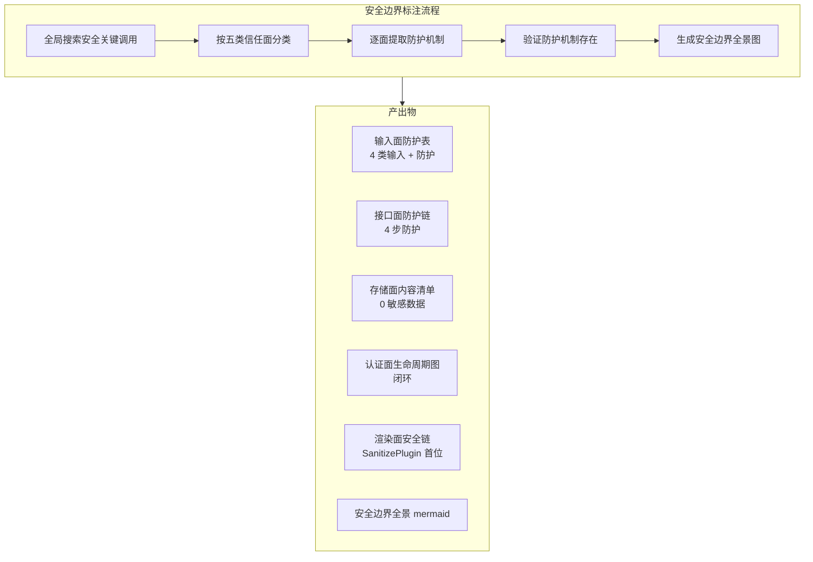
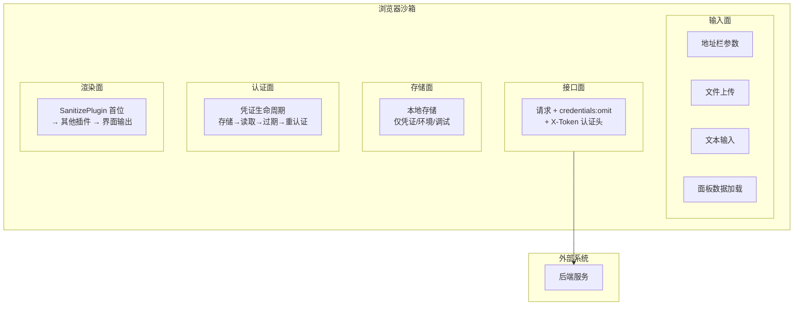
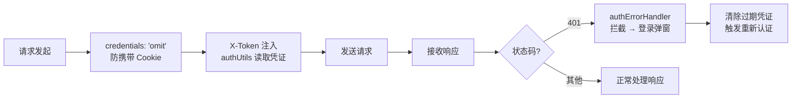
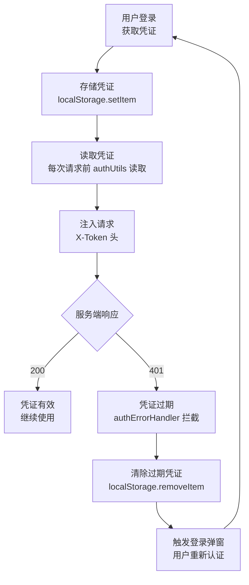
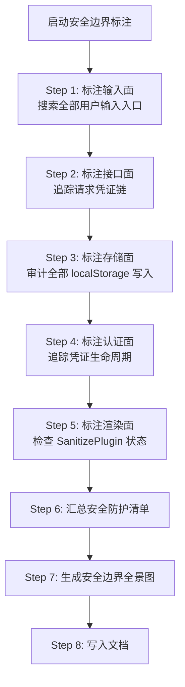

# YiWeb-系统架构-安全边界 · 技术评审

> v1.0.0 | 2026-05-28 | deepseek-v4-pro | feat/yiweb-arch-sub-stories

> **导航**: [← 使用场景](./使用场景.md) · [→ 测试设计](./测试设计.md)

> [§0 基线溯源](#sec0) · [§1 系统架构](#sec1) · [§2 组件树](#sec2) · [§3 状态管理](#sec3) · [§4 交互流](#sec4) · [§5 信任边界](#sec5) · [§6 ADR](#sec6) · [§7 评审清单](#sec7)

### 主要价值

- 🛡️ 五类信任面全覆盖 — 输入面 / 接口面 / 存储面 / 认证面 / 渲染面
- 🔒 每面标注入口点 + 防护机制 + 关键文件 — 可审计可追溯
- 🗺️ 安全边界全景 mermaid 图 — Browser 沙箱 → 五面 → 外部系统
- 📋 安全防护清单总表 — 五面各 ≥ 1 条防护记录

## §0 基线溯源

| 基线文件 | 关键条款 | 本次适用性 | 偏差 |
|---------|---------|-----------|------|
| 故事任务.md | FP4.1–FP4.6 安全边界、AC1–AC7 验收标准 | 全部适用 | 无 |
| 使用场景.md | 4 场景（安全审计/新功能自查/认证排查/XSS评估） | 全部适用 | 无 |
| CLAUDE.md | 安全面定义（输入/API/存储/认证/第三方） | 全部适用 — 安全边界分类依据 | 无 |
| 父故事 yiweb-arch 技术评审 | §5 信任边界基础版 | 适用 — 在此基础上细化 | 无 |

## §1 系统架构

### 效果示意

### 布局线框

### 五类信任面详细标注

#### 输入面

| 输入点 | 入口文件 | 数据类型 | 防护机制 | 验证方式 |
|--------|---------|---------|---------|---------|
| 地址栏参数 | `src/core/config.js` | URLSearchParams | 参数校验、枚举限制 | grep URLSearchParams 调用 |
| 文件上传 | `src/views/aicr/hooks/projectZipMethods.js` | ZIP 文件 | 前端预检 | 读取文件处理逻辑 |
| 文本输入 | `src/views/aicr/hooks/methods/inputMethods.js` | 用户文本 | 渲染前经 SanitizePlugin 清洗 | 读取输入处理逻辑 |
| 面板数据加载 | `src/views/story/` + `src/views/claude/` | 结构化数据 | 来源受控（已知远端） | 读取数据加载逻辑 |

#### 接口面

| 步骤 | 机制 | 关键文件 | 强制度 |
|------|------|---------|--------|
| 凭证隔离 | credentials: 'omit' | `requestHelper.js` | 必须 — 无例外 |
| 认证头注入 | X-Token 头 | `authUtils.js` | 必须 — 每个请求 |
| 401 拦截 | 响应状态码检查 | `authErrorHandler.js` | 必须 — 自动触发 |
| 登录弹窗 | 认证失败 UI 反馈 | `authErrorHandler.js` | 必须 — 用户可见 |

#### 存储面

| 存储键 | 存储内容 | 敏感度 | 存储位置 | 风险评估 |
|--------|---------|--------|---------|---------|
| X-Token | 身份凭证 | 中（需配合 HTTPS） | localStorage | 可接受 — 浏览器安全模型保护 |
| env | 环境标识 | 低 | localStorage | 无风险 |
| debug | 调试开关 | 低 | localStorage | 无风险 |

**审计方法**：全局搜索 `localStorage.setItem` 调用，逐项审查存储内容。

#### 认证面

#### 渲染面

| 环节 | 机制 | 关键文件 | 排序要求 |
|------|------|---------|---------|
| 内容输入 | 原始内容进入渲染器 | `MarkdownRenderer.js` | — |
| 安全清洗 | SanitizePlugin 过滤恶意标签 | `SanitizePlugin.js` | 第 1 位 |
| 图表渲染 | MermaidPlugin 处理图表 | `MermaidPlugin.js` | 第 2+ 位 |
| 目录生成 | TocPlugin 生成目录 | `TocPlugin.js` | 第 2+ 位 |
| 界面输出 | 清洗后的内容渲染到 DOM | `MarkdownRenderer.js` | — |

## §2 组件树

> 本故事聚焦安全边界标注，组件关系详见父故事 yiweb-arch 技术评审 §2。

安全相关的组件节点：
- 渲染面通过 SanitizePlugin（MarkdownRenderer 的插件）防护
- 认证面通过 authErrorHandler 弹出的登录弹窗（YiModal）实现

## §3 状态管理

> 本故事聚焦安全边界标注，状态管理详见父故事 yiweb-arch 技术评审 §3。

安全相关的状态：
- 认证面：store 中可能存储当前用户认证状态
- 输入面：store 中的用户输入数据在渲染前需经 SanitizePlugin

## §4 交互流

### 安全标注流

| 步骤 | 扫描方法 | 产出 | 门禁 |
|------|---------|------|------|
| 1 | grep URLSearchParams + 文件上传逻辑 + 输入处理函数 | 输入面防护表 | 4 类输入全覆盖 |
| 2 | 读取 requestHelper.js + authUtils.js + authErrorHandler.js | 接口面防护链 | 4 步防护完整 |
| 3 | grep `localStorage.setItem` | 存储面内容清单 | 0 敏感数据 |
| 4 | 读取 authUtils.js + authErrorHandler.js 生命周期逻辑 | 凭证生命周期图 | 闭环 |
| 5 | 读取 PluginSystem.js 插件注册顺序 | 渲染面安全链 | SanitizePlugin 首位 |
| 6–7 | 步骤 1–5 产出汇总 | 安全防护清单 + 全景图 | 五面各 ≥ 1 条 |

## §5 信任边界

> 本节为本故事核心内容，五类信任面的详细标注见上文 §1。

**信任边界总表**：

| 信任面 | 入口点 | 防护机制 | 关键文件 | 风险等级 |
|--------|--------|---------|---------|---------|
| 输入 | 地址栏、文件上传、文本输入、数据加载 | 参数校验、前端预检、清洗链 | config.js, projectZipMethods.js, inputMethods.js | 中 |
| 接口 | 全部 fetch 调用 | credentials:omit + X-Token + 401拦截 | requestHelper.js, authUtils.js, authErrorHandler.js | 高 |
| 存储 | localStorage | 仅存凭证/环境/调试 | config.js | 中 |
| 认证 | 凭证读写 | 存储→读取→过期→重认证闭环 | authUtils.js, authErrorHandler.js | 高 |
| 渲染 | MarkdownRenderer | SanitizePlugin 首位清洗 | SanitizePlugin.js, PluginSystem.js | 高 |

## §6 ADR

### ADR-SEC-1: 请求凭证隔离

| 字段 | 内容 |
|------|------|
| **状态** | 已采纳 |
| **决策** | 所有请求显式设置 credentials: 'omit'，通过 X-Token 头传递认证凭证 |
| **背景** | 防止浏览器自动携带 Cookie 导致 CSRF 风险 |
| **后果** | 无法使用 Cookie-based 认证；所有需要认证的接口必须支持 X-Token 头 |

### ADR-SEC-2: 渲染安全清洗

| 字段 | 内容 |
|------|------|
| **状态** | 已采纳 |
| **决策** | 所有动态内容渲染前经 SanitizePlugin 清洗，插件排序强制第一位 |
| **背景** | 用户输入和远端内容可能含恶意脚本，渲染前必须清洗 |
| **后果** | SanitizePlugin 清洗规则需持续更新；性能影响可忽略（客户端单次清洗） |

### ADR-SEC-3: 本地存储最小化

| 字段 | 内容 |
|------|------|
| **状态** | 已采纳 |
| **决策** | 本地存储仅存放身份凭证、环境标识、调试开关，不存放敏感业务数据 |
| **背景** | 浏览器本地存储可被用户和扩展访问，不适合存放敏感数据 |
| **后果** | 需要敏感数据时从服务端实时获取；离线能力受限 |

## §7 评审清单

| # | 检查项 | 状态 |
|---|--------|:---:|
| 1 | F.meta + F.nav + F.toc 三组件完整 | ✅ |
| 2 | 效果示意 mermaid ≥ 5 节点 | ✅ |
| 3 | 布局线框已含（前端必含） | ✅ |
| 4 | 五类信任面详细标注完整（各 ≥ 1 条） | ✅ |
| 5 | 接口面防护链 mermaid 完整（≥ 6 节点） | ✅ |
| 6 | 认证面生命周期 mermaid 闭环 | ✅ |
| 7 | 渲染面安全链排序标注 | ✅ |
| 8 | 安全标注流完整（≥ 8 步骤） | ✅ |
| 9 | ADR 状态+背景+后果完整（3 条） | ✅ |
| 10 | §0 基线溯源覆盖故事任务+使用场景+CLAUDE.md+父技术评审 | ✅ |
| 11 | 无 Level C/D 证据 | ✅ |

---

> **变更记录**：v1.0.0 — 从父故事 yiweb-arch FP4 拆分创建（2026-05-28，`/rui update`）
