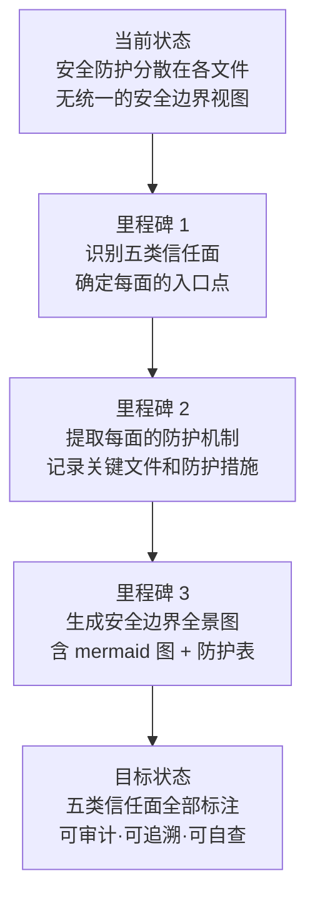

# YiWeb-系统架构-安全边界 · 故事任务

> v1.0.0 | 2026-05-28 | deepseek-v4-pro | feat/yiweb-arch-sub-stories

> **父故事**: [← yiweb-arch](../yiweb-arch/故事任务.md) · **导航**: [→ 使用场景](./使用场景.md)

> [§1 需求概述](#sec1) · [§2 功能点](#sec2) · [§3 范围边界](#sec3) · [§4 任务拆分](#sec4) · [§5 验收标准](#sec5) · [§6 风险与假设](#sec6)

### 主要价值

- 🛡️ 五类信任面全覆盖 — 输入面 / 接口面 / 存储面 / 认证面 / 渲染面
- 🔒 记录每面的防护机制与关键文件，支撑安全审计与合规检查
- 📋 提供安全防护清单，新增功能时可按清单逐项自查
- 🚨 标注信任边界入口点，出现安全事件时快速定位受影响面

## §1 需求概述

从源码中提取并标注系统的全部安全防护边界，覆盖输入面（地址栏参数 / 文件上传 / 文本输入 / 面板数据加载）、接口面（请求凭证模式 + 认证头）、存储面（本地存储内容）、认证面（凭证生命周期）、渲染面（内容安全清洗），建立可审计的安全防护文档。

## §2 功能点

| FP# | 描述 | 输入 | 输出 | 错误行为 | 优先级 |
|-----|------|------|------|---------|--------|
| FP4.1 | 标注输入面 — 地址栏参数校验、文件上传预检、文本输入清洗入口、面板数据加载入口 | `src/core/config.js` + `projectZipMethods.js` + `inputMethods.js` | 输入面入口点 + 防护机制 + 关键文件 | 入口文件缺失时阻断 | P0 |
| FP4.2 | 标注接口面 — 请求凭证模式（credentials: 'omit'）+ 认证头注入（X-Token）+ 401 拦截重定向 | `requestHelper.js` + `authUtils.js` + `authErrorHandler.js` | 接口面防护链（凭证模式 → 认证头 → 错误拦截 → 登录弹窗） | 防护链断裂时阻断 | P0 |
| FP4.3 | 标注存储面 — 本地存储内容审查（仅凭证 + 环境 + 调试标识，不存敏感业务数据） | `config.js` + 全局 localStorage 调用 | 存储面内容清单 + 敏感数据检查结果 | 发现敏感数据存储时报 P0 违规 | P0 |
| FP4.4 | 标注认证面 — 凭证生命周期管理（存储 → 读取 → 过期处理 → 重新认证） | `authUtils.js` + `authErrorHandler.js` | 凭证生命周期状态图 | 生命周期不完整时告警 | P0 |
| FP4.5 | 标注渲染面 — 内容安全清洗（SanitizePlugin）+ 渲染器插件链中的安全插件位置 | `SanitizePlugin.js` + `MarkdownRenderer.js` + `PluginSystem.js` | 渲染面安全链（内容输入 → SanitizePlugin 清洗 → 其他插件处理 → 界面输出） | SanitizePlugin 未启用或排序非首位时阻断 | P0 |
| FP4.6 | 生成安全边界全景 mermaid 图 | 五面分析结果 | mermaid flowchart TB（Browser 沙箱 → 五面 → 外部系统） | 信任面 < 5 时告警 | P0 |

## §3 范围边界

| # | 条目 | 包含/不包含 | 原因 |
|---|------|------------|------|
| 1 | 输入面 — 浏览器端所有用户输入入口 | 包含 | 安全第一道防线 |
| 2 | 接口面 — 所有 HTTP 请求的凭证与认证 | 包含 | 防 CSRF / 凭证泄露 |
| 3 | 存储面 — 浏览器本地存储内容审计 | 包含 | 防敏感数据客户端泄露 |
| 4 | 认证面 — 凭证生命周期管理 | 包含 | 防未授权访问 |
| 5 | 渲染面 — 动态内容安全清洗 | 包含 | 防跨站脚本攻击 |
| 6 | 后端服务的认证与授权逻辑 | 不包含 | 不属于本系统边界 |
| 7 | 网络传输层安全（HTTPS/TLS） | 不包含 | 传输层，非应用层防护 |
| 8 | 服务器端输入校验与清洗 | 不包含 | 后端防护，非本系统职责 |

## §4 任务拆分

| # | 任务 | Agent | 门禁 | 交接信号 | 依赖 |
|---|------|-------|------|---------|------|
| 1 | 标注输入面 — 搜索全部用户输入入口 + 防护机制 | coder | 4 类输入入口全覆盖 | 输入面防护表 | — |
| 2 | 标注接口面 — 追踪请求凭证链（credentials → X-Token → 401 → 登录弹窗） | coder | 4 步防护链完整 | 接口面防护链 | — |
| 3 | 标注存储面 — 搜索全部 localStorage.setItem 调用 + 内容审计 | coder | 无敏感数据存储 | 存储面内容清单 | — |
| 4 | 标注认证面 — 追踪凭证生命周期（存储 → 读取 → 过期 → 重认证） | coder | 生命周期闭环 | 凭证生命周期图 | — |
| 5 | 标注渲染面 — 检查 SanitizePlugin 启用状态 + 插件排序 | coder | SanitizePlugin 启用且排序首位 | 渲染面安全链 | — |
| 6 | 生成安全边界全景 mermaid 图 | coder | 5 个 subgraph 全覆盖 | mermaid flowchart TB | 任务 1–5 |
| 7 | 汇总生成安全防护清单表 | coder | 五面各 ≥ 1 条防护记录 | 安全防护清单总表 | 任务 1–6 |

## §5 验收标准

| AC# | Given | When | Then | 门禁 |
|-----|-------|------|------|------|
| AC1 | config.js + 各视图入口可读 | 标注输入面 | 4 类输入（URL 参数 / 文件上传 / 文本输入 / 面板数据加载）各含入口点 + 防护机制 + 关键文件 | Gate A |
| AC2 | requestHelper.js + authUtils.js + authErrorHandler.js 可读 | 标注接口面 | 完整防护链：credentials: 'omit' → X-Token 注入 → 401 拦截 → 登录弹窗，每步含入口文件 | Gate A |
| AC3 | 全局搜索 localStorage.setItem 完成 | 标注存储面 | 仅存储凭证 + 环境 + 调试标识，0 敏感业务数据 | Gate A |
| AC4 | authUtils.js + authErrorHandler.js 可读 | 标注认证面 | 凭证生命周期闭环（存储 → 读取 → 过期检测 → 清除 → 重新认证），每步含入口文件 | Gate A |
| AC5 | SanitizePlugin.js + MarkdownRenderer.js 可读 | 标注渲染面 | SanitizePlugin 在插件列表中启用且排序首位，内容渲染前经过安全清洗 | Gate A |
| AC6 | 五面分析全部完成 | 生成安全边界全景图 | mermaid flowchart TB 含 Browser 沙箱（五面 subgraph）+ External 外部系统，箭头标注信任方向 | Gate B |
| AC7 | 全景图完成 | 汇总安全防护清单 | 五面各 ≥ 1 条防护记录，每条含信任面 + 入口点 + 防护机制 + 关键文件 | Gate B |

## §6 风险与假设

| # | 风险/假设 | 类型 | 可能性 | 影响 | 缓解/验证策略 | 关联 FP# |
|---|----------|------|--------|------|-------------|---------|
| 1 | credentials: 'omit' 未在全部请求调用中统一设置（部分调用绕过封装） | 风险 | L | H | 全局搜索 fetch 调用，逐一检查凭证设置 | FP4.2 |
| 2 | 新增本地存储调用时可能引入敏感数据存储 | 风险 | M | M | 存储面审计纳入自改进扫描（D5 诊断） | FP4.3 |
| 3 | SanitizePlugin 的清洗规则可能不覆盖新型 XSS 向量 | 风险 | L | M | 标注清洗插件版本，安全审计时人工复查 | FP4.5 |
| 4 | 所有请求调用均通过封装的请求辅助函数发出 | 假设 | — | — | Grep 验证无裸 fetch 调用 | FP4.2 |
| 5 | 本地存储当前仅含凭证/环境/调试三项，无历史遗留敏感数据 | 假设 | — | — | 全局搜索 setItem 验证 | FP4.3 |

---

> **变更记录**：v1.0.0 — 从父故事 yiweb-arch FP4 拆分创建（2026-05-28，`/rui doc`）
