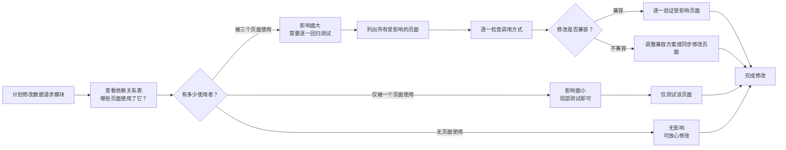

# 使用场景

> v1.1.0 | 2026-05-28 | deepseek-v4-pro | feat/yiweb-arch

> **导航**: [← 故事任务](./故事任务.md) · [→ 技术评审](./技术评审.md) · **子故事场景**: [layers](../yiweb-arch-layers/使用场景.md) · [modules](../yiweb-arch-modules/使用场景.md) · [dataflow](../yiweb-arch-dataflow/使用场景.md) · [security](../yiweb-arch-security/使用场景.md) · [deps](../yiweb-arch-deps/使用场景.md)

> **来源引用**：基于 [故事任务](./故事任务.md) §1 Story 1–2。

---

### 主要价值

- 🔍 模块定位参考 — 功能出问题时，快速找到负责的功能区，缩小排查范围
- 🔗 数据流追踪指南 — 从页面操作到服务端响应，完整链路有图可循
- 🚀 新人上手路径 — 从项目全景到具体功能区，一小时内建立认知
- ⚠️ 变更影响评估 — 修改底层功能前预估影响范围，降低连锁出错风险
- 📖 纯业务语言 — 不含开发术语，非技术背景的项目管理者也能理解

---

## 场景覆盖矩阵

| 场景 | 覆盖 FP# | 正常路径 | 空状态 | 错误恢复 |
|------|---------|:--:|:--:|:--:|
| S1 模块定位 | FP7 | ✅ | ✅ | ✅ |
| S2 数据流追踪 | FP3 | ✅ | — | ✅ |
| S3 新人上手 | FP7, FP8 | ✅ | ✅ | — |
| S4 依赖变更影响 | FP8 | ✅ | — | ✅ |

---

## S1: 模块定位

> 开发者需要修改页面上的某个功能，但不知道这个功能由哪个功能区负责。

### 正常路径

```mermaid
flowchart LR
    A["发现页面功能异常"]:::start --> B["查看功能分类表"]
    B --> C{"在哪个页面？"}
    C -->|"代码审查页面"| D["查看审查面板的功能清单"]
    C -->|"项目管理页面"| E["查看项目面板的功能清单"]
    C -->|"故事任务页面"| F["查看任务面板的功能清单"]
    C -->|"出现在多个页面"| G["查看公共组件清单"]
    D --> H["找到对应的功能文件"]
    E --> H
    F --> H
    G --> H
    H --> I["理解修改范围"]:::end
```

| 步骤 | 操作 | 预期结果 |
|------|------|---------|
| 1 | 确认异常出现在哪个页面 | 定位到"代码审查""项目管理""故事任务"三个页面之一 |
| 2 | 根据功能类型缩小范围 | 文件浏览、智能问答、筛选过滤、数据展示——每种功能归属明确的责任区 |
| 3 | 查看该功能区的职责说明 | 确认该功能区是否确实负责这个功能 |
| 4 | 找到对应的代码文件 | 从功能区的组织目录中找到目标代码 |

### 空状态：未知功能

```mermaid
flowchart LR
    A["功能不在已有清单中"]:::start --> B["查看完整的目录结构"]:::action
    B --> C["按功能关键词匹配"]:::action
    C --> D{"找到匹配项？"}:::decision
    D -->|"是"| E["确认功能归属"]:::end
    D -->|"否"| F["标记为新增功能区<br/>需要新建目录和文件"]:::end
```

### 错误恢复：功能归属不清

```mermaid
flowchart LR
    A["功能描述模糊不清"]:::start --> B["查看页面入口的逻辑"]:::action
    B --> C["追踪它引用了哪些功能模块"]:::action
    C --> D["确认功能区的边界"]:::action
    D --> E["补充功能清单中的描述"]:::end
```

---

## S2: 数据流追踪

> 开发者发现页面上显示的数据不对，想知道数据从哪里来、经过了哪些环节。

### 正常路径

```mermaid
flowchart LR
    A["用户点击或输入"]:::start --> B["触发对应的处理逻辑"]:::action
    B --> C["更新本页面的数据状态"]:::action
    C --> D["根据新状态刷新页面显示"]:::action
    D --> E{"需要请求远程数据？"}
    E -->|"是"| F["发送网络请求"]
    E -->|"否"| D
    F --> G["检查本地缓存"]
    G --> H{"缓存中有有效数据？"}
    H -->|"是"| I["直接使用缓存"]
    H -->|"否"| J["向服务端发起请求"]
    J --> K["服务端返回数据"]
    K --> L["存入缓存"]
    I --> M["更新页面数据状态"]
    L --> M
    M --> N["刷新页面显示"]:::end
```

| 步骤 | 操作 | 预期结果 |
|------|------|---------|
| 1 | 确认数据异常的触发方式 | 是用户点击触发，还是页面自动加载 |
| 2 | 找到发起请求的代码位置 | 确认请求从哪里发出，携带了什么参数 |
| 3 | 检查缓存环节 | 确认数据是否来自缓存，还是直接请求了服务端 |
| 4 | 检查服务端返回的数据 | 确认返回的数据是否符合预期格式 |
| 5 | 追踪数据到页面展示 | 确认从服务端数据到用户看到的页面内容之间经过了哪些转换 |

### 错误恢复：权限过期

```mermaid
flowchart LR
    A["服务端返回权限过期"]:::start --> B["触发权限过期处理"]:::action
    B --> C["清除本地保存的凭证"]:::action
    C --> D["弹出凭证输入框"]:::action
    D --> E["用户输入新凭证"]:::action
    E --> F["保存凭证并重试请求"]:::action
    F --> G{"重试成功？"}:::decision
    G -->|"是"| H["继续正常流程"]:::end
    G -->|"否"| I["显示连接失败提示<br/>请用户检查网络"]:::end
```

---

## S3: 新人上手

> 新加入项目的开发者需要快速建立对项目的整体认知。

### 正常路径

```mermaid
flowchart LR
    A["新人首次接触项目"]:::start --> B["阅读项目说明<br/>项目画像 + 技术约束"]:::action
    B --> C["阅读架构设计文档<br/>了解分层结构 + 数据流"]:::action
    C --> D["查看目录结构<br/>了解文件组织方式"]:::action
    D --> E["查看各功能区说明<br/>每个功能区做什么"]:::action
    E --> F["追踪一个完整流程<br/>如：搜索→请求→展示"]:::action
    F --> G["可以开始贡献代码"]:::end
```

| 步骤 | 操作 | 预期结果 |
|------|------|---------|
| 1 | 阅读项目说明 | 理解项目类型（纯前端单页应用）、技术约束（无构建工具、无第三方包管理） |
| 2 | 理解四层结构 | 看清页面层、数据请求层、公共组件、公共工具的分工和依赖方向 |
| 3 | 明确自己的工作范围 | 写页面功能 → 页面层；写数据获取 → 数据请求层；写通用组件 → 公共组件库 |
| 4 | 找到同类型参考 | 选中一个相似的页面，查看它的组织方式（入口文件、子组件、数据获取方式） |
| 5 | 按照开发规范开始编码 | 新建页面需要三个文件（逻辑、界面、样式）；新建组件也是同样的规则 |

### 空状态：项目文档不完整

```mermaid
flowchart LR
    A["文档基线不完整"]:::start --> B["运行文档初始化命令"]:::action
    B --> C["生成项目说明文件"]:::action
    C --> D["运行代码文档生成命令"]:::action
    D --> E["生成全部功能区的基线文档"]:::action
    E --> F["回到正常上手路径"]:::end
```

---

## S4: 依赖变更影响

> 开发者需要修改一个底层数据服务，想评估会影响哪些页面。

### 正常路径



| 步骤 | 操作 | 预期结果 |
|------|------|---------|
| 1 | 查看依赖关系 | 确认要修改的模块被哪些上层页面引用 |
| 2 | 查看引用方式 | 确认是直接引用还是间接引用，是一次性加载还是用到时才加载 |
| 3 | 评估影响面 | 若被多个页面引用，需全部回归；若仅一个引用，局部测试即可 |
| 4 | 检查兼容性 | 判断修改是否"向后兼容"——调用方式不变则兼容，改变则需同步更新调用方 |
| 5 | 执行修改并测试 | 按影响面大小制定测试计划，逐一页面验证 |

### 错误恢复：依赖分析遗漏

```mermaid
flowchart LR
    A["修改后其他页面出现异常"]:::start --> B["搜索被修改功能的所有引用位置"]:::action
    B --> C["补充遗漏的受影响页面"]:::action
    C --> D["修复异常"]:::action
    D --> E["更新依赖关系表<br/>避免下次遗漏"]:::end
```

---

> **变更记录**
> | 日期 | 变更 | 触发 | 证据 |
> |------|------|------|------|
> | 2026-05-28 | v1.1.0 — 新增子故事使用场景导航链接 | /rui update | 5 子故事使用场景文档 |
> | 2026-05-26 | 基线化 — 4 个架构参考场景（纯用户语言） | /rui code | 故事任务 FP# + CLAUDE.md |
