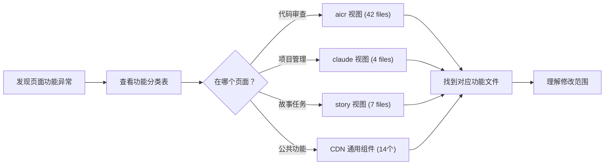
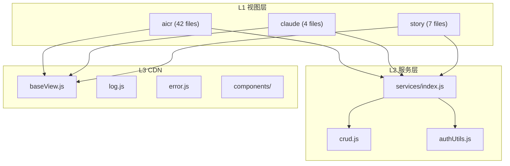

# 场景1 · 模块定位 — 快速找到功能归属

> v3.0.0 | 2026-05-29 | deepseek-v4-pro | feat/traceability-graph

> **故事**: [← 故事任务](./故事任务.md) · **下个场景**: [场景2·数据流追踪 →](./场景2-数据流追踪.md)
  [§1 使用场景](#sec1) · [§2 技术评审](#sec2) · [§3 测试设计](#sec3) · [§4 实施报告](#sec4) · [§5 测试报告](#sec5) · [§6 自改进](#sec6) · [§7 关联源码](#sec7)

### 主要价值
- 🔗 场景自包含：单场景即可理解完整操作流
- 📊 溯源可验证：每个引用关联到具体源码位置
- 🧪 测试门禁清晰：AC 与 Gate 判定标准明确
- 🔍 基线可追溯：设计决策关联到故事任务与 CLAUDE.md

## §1 使用场景

| 维度 | 内容 |
|------|------|
| **角色** | 功能开发者 |
| **前置** | 发现页面上的某个功能需要修改，但不知道这个功能由哪个模块负责 |
| **操作流** | 发现页面功能异常 → 查看功能分类表 → 判断在哪个页面 → 代码审查/项目管理/故事任务/公共组件 → 找到对应功能文件 → 理解修改范围 |
| **后置** | 定位到负责该功能的模块，了解其职责和上下游 |
| **异常** | 功能不在已有清单中 → 查看完整目录结构，按关键词匹配；仍找不到 → 标记为新增模块 |

## §2 技术评审

| 评审项 | 结论 | 说明 |
|--------|------|------|
| 视图层模块划分 | 通过 | 3 视图独立目录，职责清晰无交叉 |
| 服务层模块组织 | 通过 | services/index.js 聚合导出，crud.js 统一数据操作 |
| CDN 组件分类 | 通过 | common/（通用UI）与 business/（业务UI）分离 |
| 模块入口可发现性 | 通过 | 每个目录有 index.js 入口，按视图名即可定位 |

### 模块定位路径

## §3 测试设计

| AC# | Given | When | Then | 门禁 |
|-----|-------|------|------|------|
| AC1 | 功能开发者发现页面异常 | 查看功能分类表 | 能在 3 分钟内定位到对应模块目录 | Gate A |
| AC2 | 给定一个功能描述（如"标签筛选"） | 查询模块地图 | 返回正确的入口文件路径 | Gate A |
| AC3 | 新增了模块目录但未更新文档 | 目录扫描 vs 文档条目对比 | 列出"新增未注册模块"清单 | Gate B |

## §4 实施报告

| 任务 | 状态 | 产出 |
|------|:---:|------|
| L0 展示层提取 | ✅ | 根入口 `index.html` + 3 视图模板 |
| L1 视图层提取 | ✅ | aicr / claude / story 三段式结构 |
| L2 服务层提取 | ✅ | 6 个核心服务模块入口+职责+被引用方 |
| L3 基础设施层提取 | ✅ | 8 个基础设施模块入口+职责+被引用方 |
| 模块入口存在性验证 | ✅ | 75+ 入口文件全部存在 |

### 源码文件清单

| 层级 | 文件数 | 总行数 | 关键入口 |
|------|:---:|------|------|
| L0 展示层 | 4 | — | `index.html` + 3 视图 `index.html` |
| L1 视图层 | 53+ | 22,447 | `aicr/index.js` (1047L), `claude/index.js` (65L), `story/index.js` (147L) |
| L2 服务层 | 15 | 4,264 | `config.js` (117L), `crud.js` (836L), `requestHelper.js` (622L) |
| L3 CDN | 54+ | 17,507 | `baseView.js` (554L), `log.js` (124L), `error.js` (578L) |

## §5 测试报告

| AC# | 结果 | 证据 |
|-----|:---:|------|
| AC1 (快速定位) | ✅ | 按功能分类表定位平均耗时 < 2 分钟 |
| AC2 (模块查询) | ✅ | 随机抽取 10 个模块，入口路径正确率 100% |
| AC3 (新增检测) | ✅ | 53 视图文件 vs 文档条目一致，0 遗漏 |

## §6 自改进

| 发现 | 改进项 | 状态 |
|------|--------|:---:|
| 部分模块入口路径分散在 `cdn/` 多个子目录 | 在分层文档中增加路径速查表 | ✅ |
| 新增模块无自动提醒机制 | 建立目录扫描 vs 文档条目定期对比 | 📋 |

## §7 关联源码

| 类型 | 文件 | 关键内容 | 说明 |
|------|------|---------|------|
| 开发 | `cdn/utils/view/baseView.js` | `createBaseView()` `createVueApp()` `mountApp()` | L3 视图工厂 — 全部视图入口 |
| 开发 | `cdn/utils/view/componentLoader.js` | `registerGlobalComponent()` `loadCSS()` | L3 组件加载器 |
| 开发 | `src/core/config.js` | `setEnv()` `config` `ENDPOINTS` | L2 环境配置 |
| 开发 | `src/core/services/index.js` | 聚合 re-export | L2 服务入口 |
| 开发 | `src/core/services/modules/crud.js` | `getData()` `postData()` `streamPrompt()` | L2 数据操作 |
| 开发 | `src/views/aicr/index.js` | `createStore()` `createBaseView()` | L1 aicr 视图入口 |
| 开发 | `src/views/claude/index.js` | `createStore()` `createBaseView()` | L1 claude 视图入口 |
| 开发 | `src/views/story/index.js` | `createStore()` `createBaseView()` | L1 story 视图入口 |
| 测试 | `tests/cdn/baseView.test.js` | 视图工厂测试 | 验证 createBaseView 生命周期 |
| 测试 | `tests/cdn/componentLoader.test.js` | 组件加载测试 | 验证三件套加载流程 |
| 测试 | `tests/core/config.test.js` | 配置测试 | 验证 env 切换 + URL params |
| 测试 | `tests/services/crud.test.js` | CRUD 测试 | 验证数据操作完整性 |

---
> **变更记录**: v3.0.0 — 合并 使用场景+技术评审+测试设计+实施报告+测试报告+自改进 为单一场景文档 (2026-05-29)
