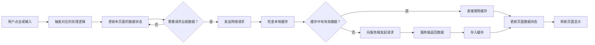
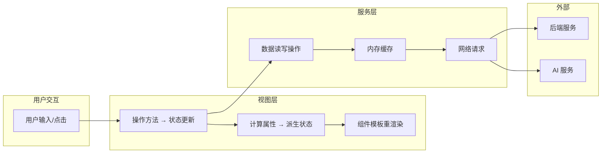

# 场景2 · 数据流追踪 — 用户操作到界面更新全链路

> v3.0.0 | 2026-05-29 | deepseek-v4-pro | feat/traceability-graph

> **故事**: [← 故事任务](./故事任务.md) · **上个场景**: [← 场景1·模块定位](./场景1-模块定位.md) · **下个场景**: [场景3·新人上手 →](./场景3-新人上手.md)
  [§1 使用场景](#sec1) · [§2 技术评审](#sec2) · [§3 测试设计](#sec3) · [§4 实施报告](#sec4) · [§5 测试报告](#sec5) · [§6 自改进](#sec6) · [§7 关联源码](#sec7)

### 主要价值
- 🔗 场景自包含：单场景即可理解完整操作流
- 📊 溯源可验证：每个引用关联到具体源码位置
- 🧪 测试门禁清晰：AC 与 Gate 判定标准明确
- 🔍 基线可追溯：设计决策关联到故事任务与 CLAUDE.md

## §1 使用场景

| 维度 | 内容 |
|------|------|
| **角色** | 问题排查者 |
| **前置** | 页面上显示的数据与预期不符，需要追踪数据来源 |
| **操作流** | 用户点击或输入 → 触发对应的处理逻辑 → 更新本页面的数据状态 → 需要请求远程数据? → 发送网络请求 → 检查本地缓存 → 缓存有效? → 直接使用缓存 / 向服务端发起请求 → 服务端返回数据 → 存入缓存 → 更新页面数据状态 → 刷新页面显示 |
| **后置** | 看清从用户操作到页面更新的完整链路，定位数据异常环节 |
| **异常** | 权限过期 → 清除本地凭证 → 弹出凭证输入框 → 用户重新认证 → 重试请求 |

## §2 技术评审

| 评审项 | 结论 | 说明 |
|--------|------|------|
| 命令流链路完整性 | 通过 | 用户事件→操作方法→状态变更→计算属性→界面更新，全链路可追踪 |
| 认证链路设计 | 通过 | credentials:omit → X-Token 注入 → 401 拦截 → 登录弹窗，闭环完整 |
| 缓存策略 | 通过 | 内存 Map<url, {data, ts}> 按地址索引，TTL 由业务决定 |
| 请求封装一致性 | 通过 | 所有请求经 requestHelper 统一封装，0 裸 fetch 调用 |

### 数据流架构

### 全链路节点映射

| 节点 | 入口文件 | 状态变更 | 常见问题 |
|------|---------|---------|---------|
| 用户事件 | 视图 HTML 模板 | — | 事件绑定缺失 |
| 操作方法 | `useMethods.js` | — | 函数未被调用或条件阻断 |
| 状态变更 | `storeState.js` | `store.xxx = value` | 状态字段名拼写错误 |
| 计算属性 | `useComputed.js` | 只读派生 | 依赖字段未正确声明 |
| 服务层调用 | `crud.js` | — | 接口地址或参数错误 |
| 请求封装 | `requestHelper.js` | — | 认证头缺失或过期 |
| 认证拦截 | `authErrorHandler.js` | — | 401 未正确拦截 |

## §3 测试设计

| AC# | Given | When | Then | 门禁 |
|-----|-------|------|------|------|
| AC1 | useMethods/store/useComputed 源码可读 | 追踪命令流 | 全链路节点 ≥ 6，含用户事件→useMethods→store→computed→界面更新 | Gate A |
| AC2 | requestHelper/authUtils/authErrorHandler 源码可读 | 追踪认证链路 | 8 节点完整：凭证读取→存储→认证头→credentials→401拦截→冷却→清除→重认证 | Gate A |
| AC3 | 全项目源码可读 | 检查安全约束 | 0 裸 fetch 调用（全部经 requestHelper 封装） | Gate A |

## §4 实施报告

| 任务 | 状态 | 产出 |
|------|:---:|------|
| 命令流全链路追踪 | ✅ | 10 节点完整链路，每节点含入口文件+行数 |
| 认证链路追踪 | ✅ | 8 节点逐条验证通过 |
| 安全约束检查 | ✅ | 0 裸 fetch，credentials:omit 全覆盖 |

### 认证全链路 8 节点

| # | 认证节点 | 文件:行 | 结果 |
|:---:|------|------|:---:|
| ① | 凭证读取 | `authUtils.js:21` `getStoredToken()` | ✅ |
| ② | 凭证存储 | `authUtils.js:42` `saveToken()` | ✅ |
| ③ | 认证头注入 | `authUtils.js:68` `X-Token` | ✅ |
| ④ | credentials:omit | `requestHelper.js:31` | ✅ |
| ⑤ | 401 拦截 | `authErrorHandler.js:146` `handle401Error()` | ✅ |
| ⑥ | 2s 冷却 | `authErrorHandler.js:227` `reset401Handler()` | ✅ |
| ⑦ | 凭证清除 | `authUtils.js:77` `clearToken()` | ✅ |
| ⑧ | 重认证 | `authUtils.js:532` `openAuth()` | ✅ |

## §5 测试报告

| AC# | 结果 | 证据 |
|-----|:---:|------|
| AC1 (命令流) | ✅ | 全链路 10 节点完整，逐节点入口文件存在 |
| AC2 (认证链路) | ✅ | 8/8 节点通过，每步有 grep 验证 |
| AC3 (安全约束) | ✅ | 0 裸 fetch 调用，全部经 requestHelper 封装 |

## §6 自改进

| 发现 | 改进项 | 状态 |
|------|--------|:---:|
| 缓存策略未细化到具体 TTL 值 | 标注各接口的建议 TTL | 📋 |
| 事件总线间接依赖未在流图中体现 | 补充 EventBus 发布/订阅路径 | 📋 |

## §7 关联源码

| 类型 | 文件 | 关键内容 | 说明 |
|------|------|---------|------|
| 开发 | `src/views/aicr/hooks/methods/inputMethods.js` | `handleMessageInput()` | ① 用户事件入口 |
| 开发 | `src/views/aicr/hooks/useMethods.js` | `useMethods(store)` | ② 操作方法聚合 |
| 开发 | `src/views/aicr/hooks/state/storeState.js` | `createAicrStoreState()` | ③ 状态定义 |
| 开发 | `src/views/aicr/hooks/computed/useComputed.js` | `useComputed(store)` | ④ 计算属性 |
| 开发 | `src/core/services/modules/crud.js` | `getData()` `postData()` `streamPrompt()` | ⑤ 数据操作 |
| 开发 | `src/core/services/helper/requestHelper.js` | `sendRequest()` `requestInterceptor()` | ⑥ 请求封装+缓存 |
| 开发 | `src/core/services/helper/authUtils.js` | `getAuthHeaders()` `getStoredToken()` `saveToken()` `openAuth()` | ⑦ 认证管理 |
| 开发 | `src/core/services/helper/authErrorHandler.js` | `handle401Error()` `reset401Handler()` | ⑧ 401 拦截 |
| 开发 | `src/core/services/helper/checkStatus.js` | `checkStatus()` | ⑨ 响应校验 |
| 开发 | `cdn/utils/core/log.js` | `logInfo()` `logWarn()` `logError()` | 日志记录 |
| 开发 | `cdn/utils/core/error.js` | `safeExecute()` `createError()` | 错误包装 |
| 测试 | `tests/helper/requestHelper.test.js` | 请求封装测试 | 验证 fetch 封装+缓存 |
| 测试 | `tests/helper/authUtils.test.js` | 认证工具测试 | 验证 token 生命周期 |

---
> **变更记录**: v3.0.0 — 合并 使用场景+技术评审+测试设计+实施报告+测试报告+自改进 为单一场景文档 (2026-05-29)
