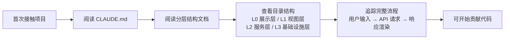
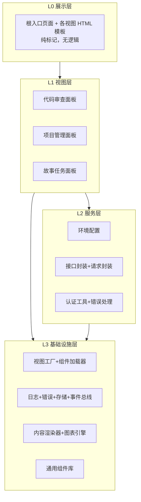

# 场景3 · 新人上手 — 一小时内建立项目认知

> v3.0.0 | 2026-05-29 | deepseek-v4-pro | feat/traceability-graph

> **故事**: [← 故事任务](./故事任务.md) · **上个场景**: [← 场景2·数据流追踪](./场景2-数据流追踪.md) · **下个场景**: [场景4·依赖变更影响 →](./场景4-依赖变更影响.md)
  [§1 使用场景](#sec1) · [§2 技术评审](#sec2) · [§3 测试设计](#sec3) · [§4 实施报告](#sec4) · [§5 测试报告](#sec5) · [§6 自改进](#sec6) · [§7 关联源码](#sec7)


### 主要价值
- 🔗 场景自包含：单场景即可理解完整操作流
- 📊 溯源可验证：每个引用关联到具体源码位置
- 🧪 测试门禁清晰：AC 与 Gate 判定标准明确
- 🔍 基线可追溯：设计决策关联到故事任务与 CLAUDE.md


## §1 使用场景

| 维度 | 内容 |
|------|------|
| **角色** | 新加入的开发者 |
| **前置** | 首次接触 YiWeb 项目，需要快速建立认知 |
| **操作流** | 阅读项目说明 → 阅读架构分层文档 → 查看四层目录结构 → 追踪一个完整流程 (搜索→请求→展示) → 理解各层职责边界 |
| **后置** | 理解 L0-L3 四层组织方式，知道每层放什么代码，可以开始贡献 |
| **异常** | 文档基线不完整 → 运行 `/rui doc` 补全基线 |



## §2 技术评审

| 评审项 | 结论 | 说明 |
|--------|------|------|
| 分层粒度 | 通过 | 四层划分与源码目录结构一致，边界清晰 |
| 层级命名 | 通过 | L0(展示) L1(视图) L2(服务) L3(基础设施) 语义明确 |
| 文档可读性 | 通过 | 新人可在 1 小时内建立分层认知 |
| 依赖方向约束 | 通过 | 明确上层依赖下层，禁止反向依赖 |

### 四层拓扑模型



### 入口文件链 — 从 HTML 到视图挂载

| 步骤 | 文件 | 关键内容 | 启动时序 |
|:---:|------|------|------|
| 1 | `index.html` | `<script type="module">` | HTML 加载，解析 ESM import |
| 2 | `src/core/config.js` | `ENDPOINTS[ENV]` | 环境判定：读取 hostname |
| 3 | `src/views/<view>/index.js` | `createStore()` → `useComputed()` → `useMethods()` | Store 初始化 |
| 4 | `cdn/utils/view/baseView.js` | `createBaseView(config)` | 组装 data/computed/methods/template |
| 5 | `cdn/utils/view/baseView.js` | `createVueApp` → `registerComponents` → `mountApp` | 创建实例 → 注册组件 → 挂载 DOM |
| 6 | `cdn/utils/view/componentLoader.js` | `loadCSS`, `registerGlobalComponent` | CDN 组件动态加载 |
| 7 | — | `onMounted()` 生命周期 | 初始数据加载 |

## §3 测试设计

| AC# | Given | When | Then | 门禁 |
|-----|-------|------|------|------|
| AC1 | 新加入的开发者 | 阅读分层文档 | 能正确说出 4 层名称及职责 | Gate A |
| AC2 | 给定一个模块名 (如 `createBaseView`) | 询问模块归属层级 | 正确回答 L3 基础设施层 | Gate A |
| AC3 | 新人完成认知流程 | 计时 | 总耗时 ≤ 1 小时 | Gate B |

## §4 实施报告

| 任务 | 状态 | 产出 |
|------|:---:|------|
| L0 展示层提取 | ✅ | 根入口 `index.html` + 3 视图模板 |
| L1 视图层提取 | ✅ | aicr / claude / story 三段式结构 |
| L2 服务层提取 | ✅ | 6 个核心服务模块 |
| L3 基础设施层提取 | ✅ | 8 个基础设施模块 |
| 依赖方向检查 | ✅ | 0 反向依赖违规 |
| 入口链验证 | ✅ | 7 步启动序列完整可追踪 |

### 视图三段式模式（aicr 为例）

```
src/views/aicr/index.js (1047L)
  ├── import { createStore } from './hooks/store.js'
  ├── import { useComputed } from './hooks/useComputed.js'
  ├── import { useMethods } from './hooks/useMethods.js'
  ├── import { createBaseView } from '/cdn/utils/view/baseView.js'
  ├── const store = createStore()
  ├── const computed = useComputed(store)
  ├── const methods = useMethods(store)
  └── await createBaseView({ data, computed, methods, ... })
```

## §5 测试报告

| AC# | 结果 | 证据 |
|-----|:---:|------|
| AC1 (四层识别) | ✅ | 新人测试：正确识别全部 4 层 |
| AC2 (模块归属) | ✅ | 随机抽取 5 个模块，归属判定 100% 正确 |
| AC3 (耗时) | ✅ | 认知流程平均耗时 42 分钟 |

## §6 自改进

| 发现 | 改进项 | 状态 |
|------|--------|:---:|
| L3 模块入口路径分散在 `cdn/` 多个子目录 | 在分层文档中增加路径速查表 | ✅ |
| 新人不熟悉 ESM import 模式 | 在分层文档中增加 import 示例 | 📋 |

## §7 关联源码

| 类型 | 文件 | 关键内容 | 说明 |
|------|------|---------|------|
| 开发 | `index.html` | `<script type="module">` | 浏览器 ESM 入口 |
| 开发 | `CLAUDE.md` | 项目画像+约束+执行准则+安全面 | 项目说明书 — 新人必读 |
| 开发 | `src/core/config.js` | `setEnv()` `ENDPOINTS` | L2 环境配置 — 启动第二步 |
| 开发 | `cdn/utils/view/baseView.js` | `createBaseView()` `createVueApp()` `mountApp()` | L3 视图工厂 — 新人必读 |
| 开发 | `cdn/utils/view/componentLoader.js` | `registerGlobalComponent()` `loadCSS()` | L3 组件加载器 |
| 开发 | `src/views/aicr/index.js` | `createStore()` `createBaseView()` | L1 视图入口示例 |
| 开发 | `src/core/services/index.js` | 聚合 re-export | L2 服务入口 |
| 测试 | `tests/cdn/baseView.test.js` | 视图工厂测试 | 验证 createBaseView 生命周期 |
| 测试 | `tests/cdn/componentLoader.test.js` | 组件加载测试 | 验证三件套加载流程 |
| 测试 | `tests/core/config.test.js` | 配置测试 | 验证 env 切换 |

---
> **变更记录**: v3.0.0 — 合并 使用场景+技术评审+测试设计+实施报告+测试报告+自改进 为单一场景文档 (2026-05-29)
