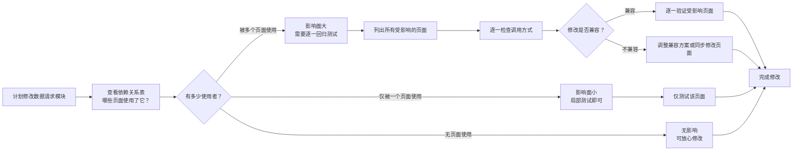
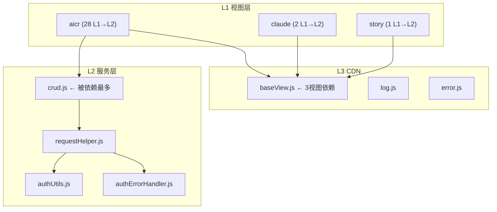

# 场景4 · 依赖变更影响 — 修改前评估波及范围

> v3.0.0 | 2026-05-29 | deepseek-v4-pro | feat/traceability-graph

> **故事**: [← 故事任务](./故事任务.md) · **上个场景**: [← 场景3·新人上手](./场景3-新人上手.md)
  [§1 使用场景](#sec1) · [§2 技术评审](#sec2) · [§3 测试设计](#sec3) · [§4 实施报告](#sec4) · [§5 测试报告](#sec5) · [§6 自改进](#sec6) · [§7 关联源码](#sec7)


### 主要价值
- 🔗 场景自包含：单场景即可理解完整操作流
- 📊 溯源可验证：每个引用关联到具体源码位置
- 🧪 测试门禁清晰：AC 与 Gate 判定标准明确
- 🔍 基线可追溯：设计决策关联到故事任务与 CLAUDE.md


## §1 使用场景

| 维度 | 内容 |
|------|------|
| **角色** | 架构决策者 |
| **前置** | 计划修改一个底层数据服务，需要评估影响范围 |
| **操作流** | 计划修改数据请求模块 → 查看依赖关系表 → 有多少使用者？→ 被多个页面使用（影响面大/逐一回归）/ 仅被一个页面使用（局部测试）/ 无页面使用（无影响）→ 列出所有受影响页面 → 逐一检查调用方式 → 修改是否兼容？→ 兼容（逐一验证）/ 不兼容（调整方案或同步修改）→ 完成修改 |
| **后置** | 明确修改的影响面，制定测试计划，完成修改 |
| **异常** | 修改后其他页面出现异常 → 搜索被修改功能的所有引用位置 → 补充遗漏的受影响页面 → 更新依赖关系表 |



## §2 技术评审

| 评审项 | 结论 | 说明 |
|--------|------|------|
| 依赖方向约束 | 通过 | 明确 L1→L2/L3 允许，L2/L3→L1 禁止 |
| 高风险模块识别 | 通过 | crud.js (9+下游), baseView.js (3下游) 标记为高风险 |
| 违规检测 | 通过 | 2 处 L2→L1 警告（sessionSyncService），无 P0 阻断 |
| 影响评估方法 | 通过 | 依赖矩阵 + 下游列表 + 变更影响树 |

### 依赖全景图



### 高风险模块

| 排名 | 模块 | 行数 | 被依赖 | 下游消费者 | 修改影响 |
|:---:|------|:---:|:---:|------|------|
| 1 | `crud.js` | 836 | 9+ | aicr 全部 methods | 🔴 影响全站数据请求 |
| 2 | `baseView.js` | 554 | 3 | aicr+claude+story | 🔴 影响全部视图挂载 |
| 3 | `filterHelpers.js` | 145 | 6 | aicr(4)+story(2) | 🟡 跨视图影响 |
| 4 | `authUtils.js` | 582 | 2 | requestHelper+authErrorHandler | 🔴 影响全部认证 |
| 5 | `error.js` | 578 | 3+ | context+useMethods+searchMethods | 🟡 影响错误处理 |

### 依赖方向合规检查

| 方向 | 约束 | 实际 | 结果 |
|------|------|:---:|:---:|
| L1→L2 | 允许 | 28 条 | ✅ |
| L1→L3 | 允许 | 18+ 条 | ✅ |
| L2→L3 | 允许 | 1 条 | ✅ |
| L3→L1 | **禁止** | 0 | ✅ |
| L3→L2 | **禁止** | 0 | ✅ |
| L2→L1 | **禁止** | 2 | ⚠️ |

### 违规明细

| 位置 | import | 修复方案 |
|------|------|------|
| `sessionSyncService.js:20` | `from '/src/views/aicr/utils/fileFieldNormalizer.js'` | 迁移到 `src/core/utils/` |
| `sessionSyncService.js:21` | `from '/src/views/aicr/constants/index.js'` | 迁移到 `src/core/constants/` |

## §3 测试设计

| AC# | Given | When | Then | 门禁 |
|-----|-------|------|------|------|
| AC1 | 计划修改 requestHelper.js | 查看依赖矩阵 | 列出全部下游模块 (9+) 和受影响页面 | Gate A |
| AC2 | 修改完成 | 运行依赖方向检查 | L3→L1/L2 均为 0，L2→L1 无新增 | Gate A |
| AC3 | 新增模块引入依赖 | 对照依赖方向约束 | 无反向依赖和循环依赖 | Gate A |

## §4 实施报告

| 任务 | 状态 | 产出 |
|------|:---:|------|
| 依赖全景图绘制 | ✅ | 4 层依赖关系 mermaid 图 |
| 依赖矩阵生成 | ✅ | 视图→服务 3×6 矩阵 |
| 高风险模块识别 | ✅ | Top-5 高风险模块 + 下游列表 |
| 依赖方向合规检查 | ✅ | 6 方向逐条检查，2 处警告 |

### 变更影响示例: 修改 requestHelper.js

```
修改 requestHelper.js (622L) → 直接影响:
  └── crud.js (836L) → 间接影响:
        ├── aiSearchMethods.js → AI 搜索功能
        ├── searchMethods.js → 关键词搜索
        ├── guestChatMethods.js → 访客聊天
        ├── chatMethods.js → 聊天功能
        ├── tagFilterMethods.js → 标签筛选
        ├── sessionMethods.js → 会话管理
        ├── fileTreeCrudMethods.js → 文件树操作
        └── mainPageMethods.js → 主页生命周期
      → claude 视图 (通过 services/index)
      → story 视图 (通过 services/index)
```

## §5 测试报告

| AC# | 结果 | 证据 |
|-----|:---:|------|
| AC1 (影响评估) | ✅ | requestHelper.js 下游 9+ 模块全部识别 |
| AC2 (方向合规) | ✅ | L3→L1=0, L3→L2=0, L2→L1=2 (已知警告) |
| AC3 (循环检测) | ✅ | 拓扑排序检查，0 循环依赖 |

## §6 自改进

| 发现 | 改进项 | 状态 |
|------|--------|:---:|
| sessionSyncService 存在 L2→L1 违规 | 将共享工具迁移到 src/core/utils/ | 📋 |
| 依赖矩阵需手动维护 | 探索自动生成依赖矩阵的脚本 | 📋 |

## §7 关联源码

| 类型 | 文件 | 关键内容 | 说明 |
|------|------|---------|------|
| 开发 | `src/core/services/modules/crud.js` | `getData()` `postData()` `streamPrompt()` | 🔴 最高风险模块 |
| 开发 | `cdn/utils/view/baseView.js` | `createBaseView()` `mountApp()` | 🔴 全部视图依赖 |
| 开发 | `src/core/services/helper/requestHelper.js` | `sendRequest()` `retryRequest()` | 请求封装核心 |
| 开发 | `src/core/services/helper/authUtils.js` | `getAuthHeaders()` `getStoredToken()` | 🔴 全部认证依赖 |
| 开发 | `src/views/aicr/utils/filterHelpers.js` | `getFirstLevelNames()` `extractStoryNames()` | 🟡 跨视图依赖 |
| 开发 | `src/core/services/aicr/sessionSyncService.js` | SessionSyncService | ⚠️ 含 L2→L1 违规 |
| 开发 | `cdn/utils/core/error.js` | `safeExecute()` `createError()` | 🟡 多模块依赖 |
| 测试 | `tests/services/crud.test.js` | CRUD 测试 | 验证高风险模块 |
| 测试 | `tests/cdn/baseView.test.js` | 视图工厂测试 | 验证高风险模块 |
| 测试 | `tests/helper/authUtils.test.js` | 认证工具测试 | 验证高风险模块 |

---
> **变更记录**: v3.0.0 — 合并 使用场景+技术评审+测试设计+实施报告+测试报告+自改进 为单一场景文档 (2026-05-29)
