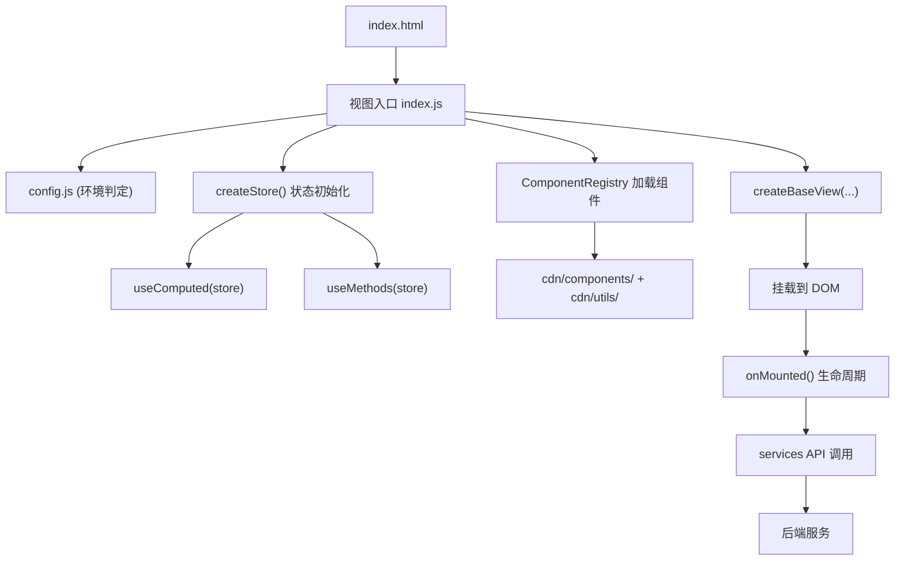
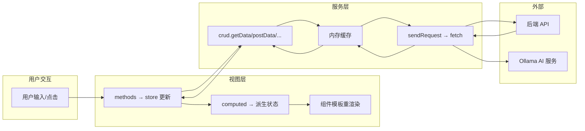
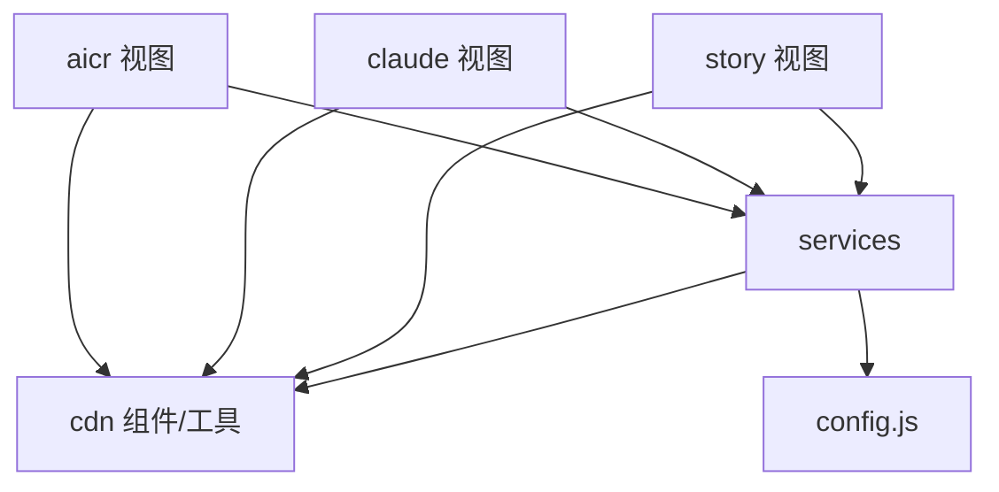

# 技术评审

> v1.1.0 | 2026-05-28 | deepseek-v4-pro | feat/yiweb-arch

> **导航**: [← 使用场景](./使用场景.md) · [→ 测试设计](./测试设计.md) · **子故事**: [layers](../yiweb-arch-layers/技术评审.md) · [modules](../yiweb-arch-modules/技术评审.md) · [dataflow](../yiweb-arch-dataflow/技术评审.md) · [security](../yiweb-arch-security/技术评审.md) · [deps](../yiweb-arch-deps/技术评审.md)

### 主要价值

- 🏗️ 4 层架构拓扑 — 视图层→核心服务层→CDN 基础设施层的完整分层模型
- 🔄 数据流可视化 — 用户交互→状态更新→API 调用→缓存→响应 全链路 mermaid 图
- 🗺️ 模块地图 — 14 个模块的完整目录树 + 职责矩阵 + 依赖图
- 🔒 信任边界显式化 — 认证链路、安全面、第三方依赖独立标注

---

## §0 基线溯源

| 本文档章节 | 溯源至故事任务 | 溯源至使用场景 |
|-----------|-------------|-------------|
| §1 架构分层 | FP1 架构分层文档 | S1 模块定位 |
| §2 运行时架构 | FP2 运行时架构文档 | S2 数据流追踪 |
| §3 数据流架构 | FP3 数据流架构文档 | S2 数据流追踪 |
| §4 认证架构 | FP4 认证架构文档 | S2 错误恢复 |
| §5 技术栈总览 | FP5 技术栈总览 | S3 新人上手 |
| §6 部署架构 | FP6 部署架构文档 | S3 新人上手 |
| §7 安全面 | 安全约束 | S4 依赖变更影响 |
| §8 模块地图 | FP7 模块目录树 + FP8 依赖矩阵 | S1 模块定位 + S4 依赖变更 |

---

## §1 架构分层

```
┌─────────────────────────────────────────────────────┐
│                    视图层 (Views)                      │
│  ┌──────────┐  ┌──────────┐  ┌──────────┐           │
│  │   aicr   │  │  claude  │  │  story   │           │
│  │ 代码审查  │  │ 项目管理  │  │ 任务面板  │           │
│  └────┬─────┘  └────┬─────┘  └────┬─────┘           │
│       │              │              │                 │
├───────┴──────────────┴──────────────┴─────────────────┤
│                 核心服务层 (Core Services)              │
│  ┌──────────────┐ ┌──────────┐ ┌──────────────────┐  │
│  │ requestHelper│ │   crud   │ │ sessionSync      │  │
│  ├──────────────┤ ├──────────┤ ├──────────────────┤  │
│  │  authUtils   │ │  goals   │ │ businessProcess  │  │
│  └──────────────┘ └──────────┘ └──────────────────┘  │
│       │                                             │
├───────┴─────────────────────────────────────────────┤
│                 CDN 基础设施层                         │
│  ┌────────┐ ┌──────────┐ ┌────────┐ ┌───────────┐  │
│  │组件库   │ │ Markdown  │ │ Mermaid│ │  工具库    │  │
│  │14个组件 │ │ 渲染引擎  │ │ 图表   │ │  40+文件   │  │
│  └────────┘ └──────────┘ └────────┘ └───────────┘  │
│  ┌────────┐ ┌──────────┐                           │
│  │ 样式体系│ │ 视图框架  │                           │
│  │ CSS    │ │BaseView  │                           │
│  └────────┘ └──────────┘                           │
└─────────────────────────────────────────────────────┘
```

### 层间依赖规则

| 规则 | 说明 |
|------|------|
| 视图层 → 核心服务层 | 单向依赖，视图通过 `src/core/services/` 调用 API |
| 视图层 → CDN 层 | 单向依赖，视图注册 CDN 组件并使用工具库 |
| 核心服务层 → CDN 层 | 单向依赖，使用工具库的 log/error/storage |
| 视图间隔离 | 每个视图独立目录，不交叉引用 |

> 证据: CLAUDE.md "视图隔离" 约束 + `src/views/` 目录结构
>
> **详细分层提取方法论**: 见子故事 [yiweb-arch-layers](../yiweb-arch-layers/技术评审.md) — 分层判定规则、依赖方向约束、分层提取流

---

## §2 运行时架构



### 启动时序

| 阶段 | 操作 | 关键文件 |
|------|------|---------|
| 1. HTML 加载 | 浏览器加载 `index.html`，解析 `<script type="module">` | `index.html` |
| 2. 环境判定 | `config.js` 读取 `location.hostname` 判定 local/prod | `src/core/config.js:1` |
| 3. Store 初始化 | `createStore()` 创建全部 vueRef 状态变量 | `src/views/<view>/hooks/storeFactory.js` |
| 4. Computed | `useComputed(store)` 注册计算属性 | `src/views/<view>/hooks/useComputed.js` |
| 5. Methods | `useMethods(store)` 注册方法 | `src/views/<view>/hooks/useMethods.js` |
| 6. 组件加载 | `ComponentRegistry` 按需加载 CDN 组件 | `cdn/utils/view/componentLoader.js` |
| 7. 视图创建 | `createBaseView()` 组装 data/computed/methods/template | `cdn/utils/view/createBaseView.js` |
| 8. DOM 挂载 | 模板渲染并挂载到目标容器 | 浏览器运行时 |
| 9. onMounted | 触发数据加载（sessions/files 等） | 各视图入口 |

> 证据: `src/views/aicr/index.js` — aicr 视图的完整 IIFE 启动流程

---

## §3 数据流架构



### 数据流关键节点

| 节点 | 方向 | 技术实现 | 关键约束 |
|------|------|---------|---------|
| UI → methods | 用户事件 | `@click` / `@input` 绑定 | 禁止跨组件直接修改 vueRef |
| methods → store | 状态更新 | `store.xxx.value = newVal` | 所有变更走 store mutation |
| store → computed | 派生计算 | `vueRef` 响应式依赖追踪 | computed 只读 |
| computed → render | 模板渲染 | Vue 3 模板引擎 | 自动追踪依赖 |
| methods → crud | API 调用 | `crud.getData(url, params)` | 统一走 sendRequest |
| crud → cache | 缓存查询 | `Map<url, {data, ts}>` 内存缓存 | TTL 由业务决定 |
| cache → request | 网络请求 | `fetch(url, {headers, credentials:'omit'})` | 显式 omit Cookie |
| request → API | HTTP | `X-Token` 头认证 | 统一通过 getAuthHeaders() |
| API → request | HTTP Response | JSON 解析 | 统一 checkStatus() |
| API → 401 | 错误处理 | `handle401Error()` → `openAuth()` | 2s 冷却防重复弹窗 |

> 证据: `src/core/services/helper/requestHelper.js` — sendRequest 实现; `src/core/services/modules/crud.js` — CRUD 封装
>
> **详细数据流追踪方法**: 见子故事 [yiweb-arch-dataflow](../yiweb-arch-dataflow/技术评审.md) — 命令流/加载流/文档流的三条完整 mermaid 图和节点表

---

## §4 认证架构

```
┌─ 认证生命周期 ──────────────────────────────────────┐
│                                                     │
│  1. 用户打开应用                                     │
│  2. getStoredToken() 读取 localStorage               │
│  3. hasValidToken() 检查存在性                        │
│  4. 每次请求: getAuthHeaders() → { X-Token }         │
│  5. API 返回 401:                                    │
│     └→ handle401Error()                             │
│         ├→ clearToken()                             │
│         ├→ openAuth() 弹窗                          │
│         └→ 2s 冷却防重复                             │
│  6. 用户输入新 Token:                                │
│     └→ saveToken() → 重试请求                        │
│                                                     │
└─────────────────────────────────────────────────────┘
```

### 认证关键文件

| 文件 | 职责 |
|------|------|
| `src/core/services/helper/authUtils.js` | Token 存储/读取/清除/Header 构建 |
| `src/core/services/helper/authErrorHandler.js` | 401 拦截 + 弹窗触发 + 冷却控制 |

> 证据: `src/core/services/helper/authUtils.js` + `src/core/services/helper/authErrorHandler.js`

---

## §5 技术栈总览

| 维度 | 选型 | 说明 |
|------|------|------|
| 运行环境 | 浏览器 (ESM) | 无 Node.js 构建/服务端运行时 |
| 模块规范 | ESM | `import` / `export` 原生支持 |
| 视图框架 | createBaseView | 自研，Vue 3 CDN 内核 |
| 响应式 | vueRef | Vue 3 Composition API 的 ref/reactive |
| 状态管理 | Store 工厂 | 集中式 store + computed + methods |
| 组件系统 | ComponentRegistry | 动态加载 + 超时降级 |
| HTTP 客户端 | fetch + AbortController | 浏览器原生 |
| Markdown | marked + 自研插件 | Sanitize / Mermaid / TOC / Container |
| 图表 | mermaid + 自研插件 | 工具栏 / 全屏 / 下载 / AI 修复 |
| 图标 | Font Awesome CDN | YiIcon 语义映射 |
| 样式 | 原生 CSS | CSS Reset + 主题变量 + BEM |
| 存储 | localStorage | Token / 环境 / 偏好设置 |

> 证据: CLAUDE.md "项目画像" + `cdn/` 目录结构

---

## §6 部署架构

```
┌──────────────┐     ┌──────────────┐     ┌──────────────┐
│   CDN 静态    │     │  API 网关     │     │  AI 服务      │
│  (Nginx)     │     │  (effiy.cn)  │     │  (Ollama)    │
├──────────────┤     ├──────────────┤     ├──────────────┤
│ HTML/JS/CSS  │────→│ REST API     │     │ 聊天/分析    │
│ 组件库       │     │ SSE 流式     │     │ 模型列表    │
│ 工具库       │     │ 数据服务     │     │             │
└──────────────┘     └──────────────┘     └──────────────┘
     local                prod                prod
  localhost:9000    https://api.effiy.cn   https://ollama.effiy.cn
```

### 环境切换

| 环境 | 判定条件 | DATA_URL | API_URL | OLLAMA_URL |
|------|---------|----------|---------|------------|
| local | `location.hostname` 含 `localhost` 或 `127.0.0.1` | CDN 本地路径 | 本地代理 | 直连 |
| prod | 其他情况 | CDN 远程路径 | `https://api.effiy.cn` | `https://ollama.effiy.cn` |

> 证据: `src/core/config.js`

---

## §7 安全面

| 维度 | 实现 | 关键文件 | 风险等级 |
|------|------|---------|:--:|
| 输入 | URLSearchParams 参数解析、文件上传、聊天输入 | `config.js` / `projectZipMethods.js` / `inputMethods.js` | M |
| API | 所有请求经 `sendRequest` → `fetch`，`credentials: 'omit'` | `requestHelper.js` | L |
| 存储 | `localStorage` 存 X-Token / env / debug | `authUtils.js` | M |
| 认证 | Token 生命周期管理 + 401 拦截弹窗 | `authUtils.js` + `authErrorHandler.js` | M |
| 第三方 | Markdown 渲染启用 SanitizePlugin 防 XSS | `cdn/markdown/` | L |

> 证据: CLAUDE.md "安全面"
>
> **详细安全边界标注**: 见子故事 [yiweb-arch-security](../yiweb-arch-security/技术评审.md) — 五类信任面详细标注、接口面防护链、认证面生命周期、渲染面安全链

---

## §8 模块地图

### 完整目录树

```
YiWeb/
├── CLAUDE.md
├── README.md
├── src/
│   ├── core/
│   │   ├── config.js                      # 环境配置
│   │   ├── services/                      # ★ 核心服务层
│   │   │   ├── index.js                   # 聚合导出
│   │   │   ├── helper/
│   │   │   │   ├── requestHelper.js       # fetch 封装
│   │   │   │   ├── authUtils.js           # 认证管理
│   │   │   │   ├── authErrorHandler.js    # 401 处理
│   │   │   │   ├── checkStatus.js         # 响应校验
│   │   │   │   └── apiUtils.js            # URL/网络工具
│   │   │   ├── modules/
│   │   │   │   ├── crud.js                # CRUD + 流式
│   │   │   │   └── goals.js               # 目标服务
│   │   │   ├── aicr/
│   │   │   │   └── sessionSyncService.js  # 会话同步
│   │   │   └── business/
│   │   │       ├── businessProcessManager.js
│   │   │       ├── businessScenarioAnalyzer.js
│   │   │       └── requirementAnalysisManager.js
│   │   └── utils/
│   │       └── index.js
│   └── views/
│       ├── aicr/                          # ★ AICR 面板
│       │   ├── index.js                   # 入口 (IIFE)
│       │   ├── index.html                 # 模板
│       │   ├── components/                # 10 个业务组件
│       │   ├── hooks/                     # 40+ hooks 文件
│       │   ├── styles/                    # 样式
│       │   ├── utils/                     # 视图工具
│       │   └── constants/                 # 常量
│       ├── claude/                        # ★ Claude 面板
│       │   ├── index.js
│       │   ├── index.html
│       │   ├── components/
│       │   └── hooks/
│       └── story/                         # ★ Story 面板
│           ├── index.js
│           ├── index.html
│           ├── components/
│           └── hooks/
├── cdn/                                   # ★ CDN 基础设施
│   ├── components/
│   │   ├── common/   (buttons/feedback/forms/loaders/modals/tags)
│   │   └── business/ (HeaderActions/MarkdownView/SearchHeader/SkeletonLoader)
│   ├── icons/   YiIcon/
│   ├── markdown/  (Markdown 引擎 + 插件)
│   ├── mermaid/   (Mermaid 引擎 + 插件)
│   ├── styles/    (CSS 体系)
│   └── utils/     (40+ 工具文件 + view 框架)
└── docs/
    └── 故事任务面板/
```

### 模块依赖图



### 模块职责矩阵

| 模块 | 类型 | 行数(估) | 职责 | 关键产出 |
|------|------|---------|------|---------|
| aicr | 视图 | ~15K | 代码审查 + AI 聊天 + 文件管理 | 文件树 + 聊天面板 + 三级筛选 |
| claude | 视图 | ~3K | Claude 项目管理 | 项目卡片 + 详情 + 搜索 |
| story | 视图 | ~5K | 故事任务管理 | 列表/卡片 + 筛选排序 |
| services/helper | 服务 | ~3K | HTTP + 认证 + 错误处理 | fetch 封装 + 401 拦截 |
| services/modules | 服务 | ~1.5K | CRUD + 流式 + 服务封装 | getData/postData/streamPrompt |
| services/aicr | 服务 | ~1K | 会话同步 | 文件 ↔ 会话双向同步 |
| services/business | 服务 | ~1K | 业务分析 | 流程建模 + 场景分析 |
| cdn/components | 组件 | ~5K | 共享 UI 组件 | 14 个通用组件 |
| cdn/markdown | 引擎 | ~2K | Markdown 渲染 | Sanitize/Mermaid/TOC 插件 |
| cdn/mermaid | 引擎 | ~1K | 图表渲染 | 工具栏 + 主题 |
| cdn/utils | 工具 | ~5K | 通用工具库 | log/storage/date/http |
| cdn/utils/view | 框架 | ~1.5K | 视图框架 | createBaseView + ComponentRegistry |
| cdn/styles | 样式 | ~2K | CSS 体系 | Reset + 主题 + 工具类 |
| config.js | 配置 | ~100L | 环境切换 | local/prod 双环境 |

### 依赖矩阵

| 依赖方 | 被依赖方 | 方式 |
|------|------|------|
| 三个视图 | services | ESM import (`/src/core/services/...`) |
| 三个视图 | cdn 组件 | componentModules 路径加载 |
| 三个视图 | cdn 工具 | ESM import (`/cdn/utils/...`) |
| services | cdn 工具 | ESM import |
| services | config.js | ESM import |

### 视图功能对比

| 功能维度 | aicr | claude | story |
|---------|:----:|:------:|:-----:|
| 文件树浏览 | ✅ | — | — |
| 代码查看/编辑 | ✅ | — | — |
| AI 流式聊天 | ✅ | — | — |
| 三级联动筛选 | ✅ | — | — |
| 会话 CRUD | ✅ | — | — |
| 项目卡片列表 | — | ✅ | — |
| 项目详情 | — | ✅ | — |
| 故事列表/卡片 | — | — | ✅ |
| 故事详情 | — | — | ✅ |
| 状态筛选 | ✅ | ✅ | ✅ |
| 搜索过滤 | ✅ | ✅ | ✅ |
| 排序切换 | ✅ | ✅ | ✅ |
| 认证管理 | ✅ | ✅ | ✅ |

> 证据: 全项目源码目录扫描 + CLAUDE.md
>
> **详细模块地图方法**: 见子故事 [yiweb-arch-modules](../yiweb-arch-modules/技术评审.md) — 模块三元组提取、五大分类规则、模块扫描流
>
> **详细依赖矩阵方法**: 见子故事 [yiweb-arch-deps](../yiweb-arch-deps/技术评审.md) — N×N 矩阵生成、高风险模块识别、依赖方向校验

---

> **变更记录**
> | 日期 | 变更 | 触发 | 证据 |
> |------|------|------|------|
> | 2026-05-28 | v1.1.0 — 在各节追加子故事技术评审交叉引用（§1→layers, §3→dataflow, §7→security, §8→modules+deps） | /rui update | 5 子故事技术评审文档 |
> | 2026-05-26 | 基线化 — 吸收 技术架构.md + 模块地图.md 内容 | /rui init arch 步骤 | CLAUDE.md + 全项目源码 |
