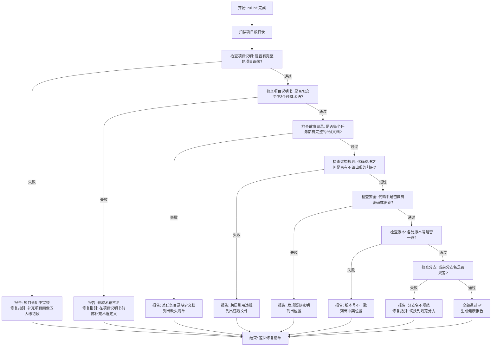
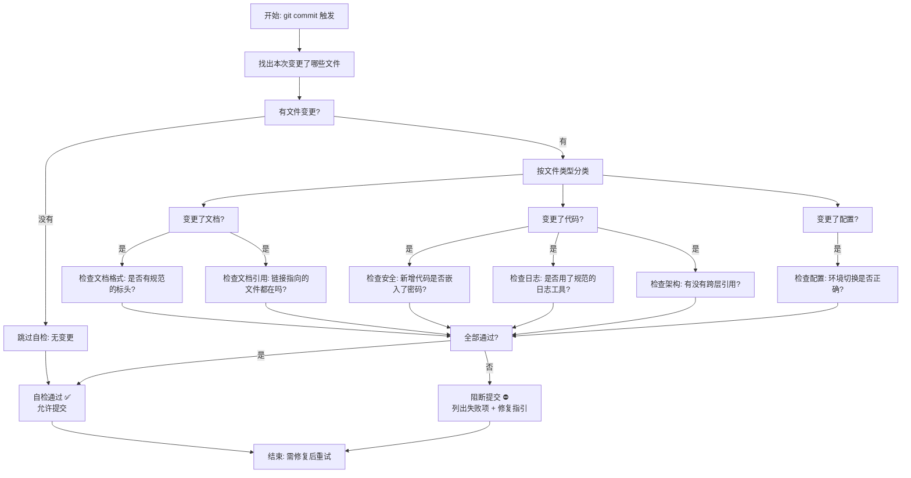
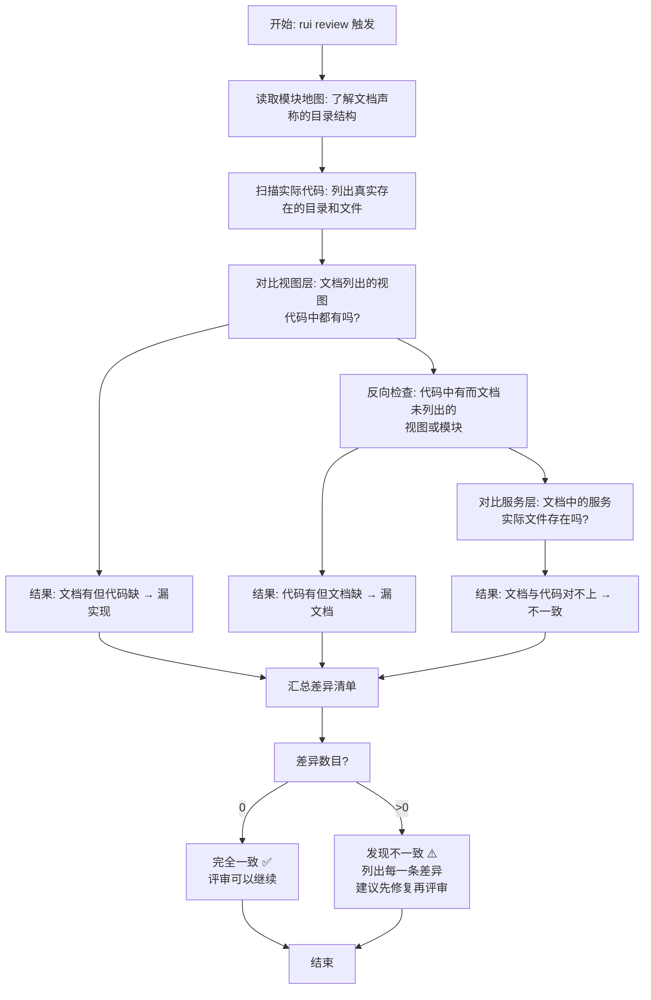
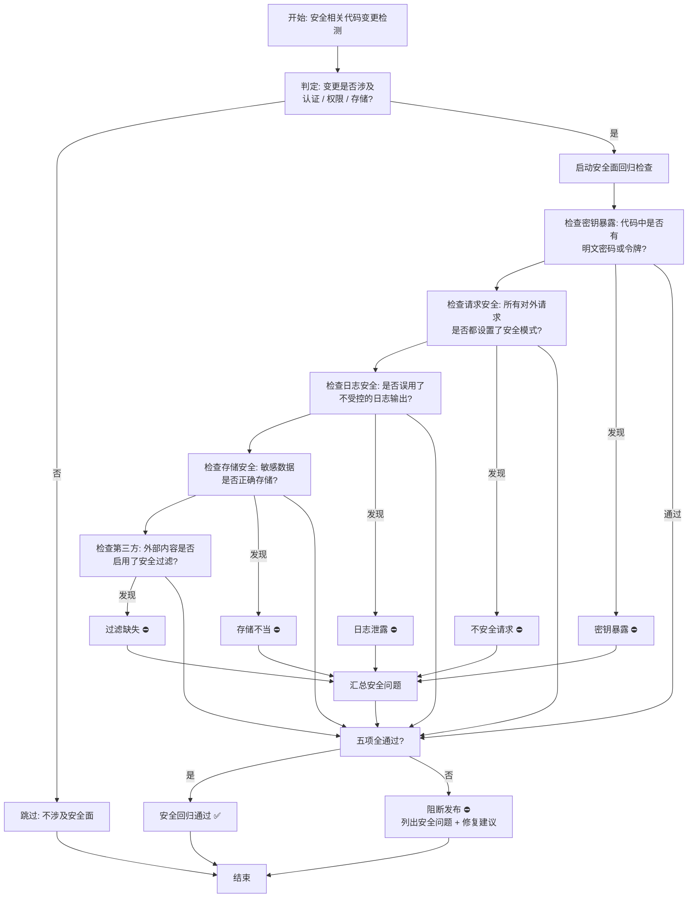
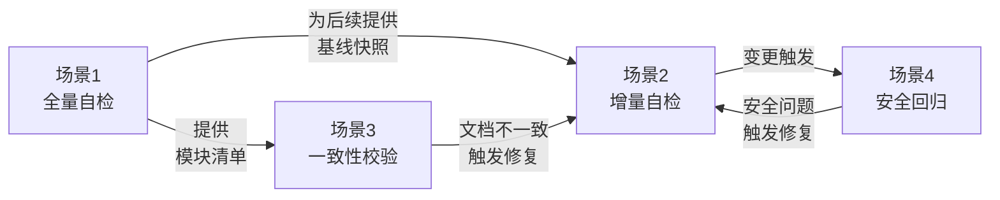

# YiWeb 自主测试方案 · 使用场景

> | v1.0.0 | 2026-05-26 | coder:Claude | 🌿 feat/yiweb-self-test | ⏱️ --:--–--:-- | 📎 [CLAUDE.md](../../../CLAUDE.md) |

## F.nav

| 文档 | 链接 |
|------|------|
| 故事任务 | [故事任务.md](./故事任务.md) |
| 使用场景 | [使用场景.md](./使用场景.md) ← 你在这里 |
| 技术评审 | [技术评审.md](./技术评审.md) |
| 测试设计 | [测试设计.md](./测试设计.md) |
| 安全审计 | [安全审计.md](./安全审计.md) |

---

## 概述

本文档从使用者的视角，描述自主测试方案在真实工作流中的应用场景。所有场景以流程图呈现，不出现组件名称、接口地址、文件路径等技术细节，确保任何角色（产品、开发、测试、运维）都能理解自检在什么时机触发，检查了什么，以及检查结果意味着什么。

---

### 主要价值

- 🧭 为 pm 提供"何时触发自检、如何解读结果"的操作手册
- 🔄 为 coder 提供"提交前必过自检"的标准化流程
- 📊 为 tester 提供"自检结果如何影响测试范围"的判断依据
- 🛡️ 为 reviewer 提供"文档与代码一致性"的自动验证入口

---

## 场景 1: 项目初始化后的全量自检

### 场景描述

每次通过 rui 工具初始化（或重新初始化）一个项目时，系统需要立即知道当前项目基线的健康状况 —— 所有必要的配置文件是否齐全、文档是否完整、安全约束是否到位。这就像买房子后的全屋验收：不能只检查客厅就入住。

### 流程图

### 参与者

- **触发者**: pm —— 执行 `rui init` 或 `rui update` 时自动触发
- **消费者**: 所有后续步骤的 agent（coder / reviewer / tester）—— 依赖健康报告决定是否继续

### 前置条件

- 项目已通过 `rui init` 完成初始化
- 项目根目录存在项目说明文件
- git 仓库处于可用状态

### 后置条件

- 生成一份完整的健康报告（JSON 格式），列出全部 7 项检查的通过/失败状态
- 任意一项失败 → rui 管道挂起，等待人工修复
- 全部通过 → 管道继续到下一阶段

---

## 场景 2: 每次提交前的增量自检

### 场景描述

开发者在完成一个功能或修复后，准备将代码提交到版本库。在提交之前，系统自动检查本次变更涉及的文件 —— 只检查改动过的部分，不扫描整个项目。这就像出门前检查口袋：只需要确认今天带的东西，不必翻遍整个家。

### 流程图

### 参与者

- **触发者**: coder —— 执行 `git commit` 时通过提交钩子自动触发
- **消费者**: 版本历史 —— 确保进入仓库的每个版本都通过了基本合规检查

### 前置条件

- 有实际的文件变更（`git diff` 非空）
- 当前在规范命名的功能分支上

### 后置条件

- 增量自检全部通过 → 提交成功
- 增量自检有失败 → 提交被拒绝，终端显示失败明细

---

## 场景 3: 文档与代码一致性校验

### 场景描述

当技术评审开始之前，需要确认文档中描述的项目结构与实际代码是否一致。例如：文档说有三个视图，实际代码中是否真的有这三个目录？文档中列出的模块，代码中是否都存在？这就像房屋图纸与实际施工的对照验收 —— 图纸上画的墙，施工现场必须有。

### 流程图

### 参与者

- **触发者**: reviewer —— 执行 `rui review` 时自动触发
- **消费者**: reviewer 本人 —— 根据差异清单决定是否继续评审

### 前置条件

- 模块地图文档存在且格式完整
- 代码目录结构与文档描述的是同一版本

### 后置条件

- 输出一份"文档声称 vs 代码实际"的差异对照表
- 差异数为 0 → 绿色通过
- 差异数 > 0 → 黄色警告（不阻断，但 reviewer 需要评估影响）

---

## 场景 4: 安全面回归自检

### 场景描述

每当涉及认证、权限、数据存储的代码发生变更后，需要触发一次安全面的快速回归检查，确保本次变更没有引入新的安全隐患。这就像保安换班时的装备检查 —— 不管上一班有没有出问题，接班前都要从头检查一遍。

### 流程图

### 参与者

- **触发者**: tester —— 安全相关变更后手动或自动触发
- **消费者**: 所有团队成员 —— 确保安全基线没有被破坏

### 前置条件

- 变更文件中至少有一处涉及：认证管理、请求发送、日志输出、数据存储、第三方内容渲染
- 项目有明确的安全规则定义

### 后置条件

- 生成安全回归报告
- P0 安全问题 → 阻断发布
- P1 安全问题 → 记录并跟踪修复

---

## 跨场景关系

---

> **变更记录**
> | 日期 | 变更 | 触发 | 证据 |
> |------|------|------|------|
> | 2026-05-26 | 基线化 | 项目分析 | CLAUDE.md + 模块地图.md + 故事任务.md |
