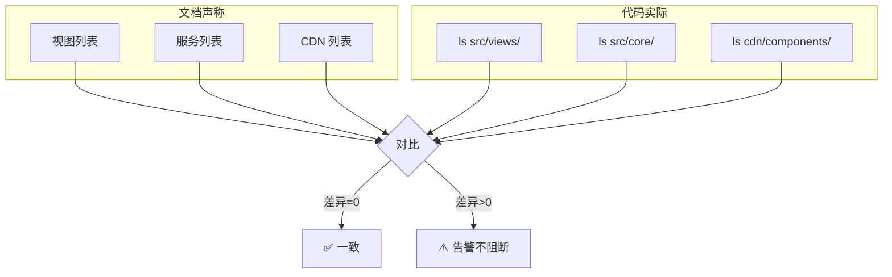

# 场景3 · 一致性校验 — 文档声称 vs 代码实际

> v2.0.0 | 2026-05-29 | deepseek-v4-pro | feat/traceability-graph

> **故事**: [← 故事任务](./故事任务.md) · **上个场景**: [← 场景2·增量自检](./场景2-增量自检.md) · **下个场景**: [场景4·安全回归 →](./场景4-安全回归.md)
  [§1 使用场景](#sec1) · [§2 技术评审](#sec2) · [§3 测试设计](#sec3) · [§4 实施报告](#sec4) · [§5 测试报告](#sec5) · [§6 自改进](#sec6) · [§7 关联源码](#sec7)

### 主要价值
- 🔗 场景自包含：单场景即可理解完整操作流
- 📊 溯源可验证：每个引用关联到具体源码位置
- 🧪 测试门禁清晰：AC 与 Gate 判定标准明确
- 🔍 基线可追溯：设计决策关联到故事任务与 CLAUDE.md

## §1 使用场景

| 维度 | 内容 |
|------|------|
| **角色** | 评审者 |
| **前置** | 模块地图文档存在且格式完整 |
| **操作流** | 读取模块地图了解文档声称的目录结构 → 扫描实际代码列出真实存在的目录和文件 → 对比视图层(文档列出的视图代码中都有吗?) → 反向检查(代码中有而文档未列出的模块) → 对比服务层(文档中的服务实际文件存在吗?) → 汇总差异清单 → 差异数=0(完全一致评审可继续) / 差异数>0(发现不一致建议先修复) |
| **后置** | 输出文档声称 vs 代码实际的差异对照表 |
| **异常** | 差异数为 0 则通过评审；差异数 > 0 则告警但不阻断 |

## §2 技术评审

| 评审项 | 结论 | 说明 |
|--------|------|------|
| 对比方法可行 | 通过 | 文档条目 vs `find` 目录扫描 |
| 双向检查 | 通过 | 正向(文档→代码) + 反向(代码→文档) |
| 不阻断管道 | 通过 | 差异告警但允许继续 |

### 一致性校验维度

| 维度 | 检查方法 | 预期 |
|------|---------|------|
| 视图层 | 文档列出的视图 vs `ls src/views/` | 一致 |
| 服务层 | 文档中的服务 vs `ls src/core/` | 一致 |
| CDN 层 | 文档中的组件 vs `ls cdn/components/` | 一致 |
| 反向缺失 | `find` 结果 vs 文档条目 | 0 遗漏 |

## §3 测试设计

| AC# | Given | When | Then | 门禁 |
|-----|-------|------|------|------|
| AC1 | 模块地图文档存在 | 执行一致性校验 | 文档声称与代码实际一致（差异=0） | Gate B |
| AC2 | 新增模块未更新文档 | 执行一致性校验 | 输出差异清单（代码有但文档缺） | Gate B |

## §4 实施报告

| 任务 | 状态 | 产出 |
|------|:---:|------|
| 文档条目提取 | ✅ | 模块地图全部模块清单 |
| 目录扫描 | ✅ | `find` 命令输出 |
| 差异对比 | ✅ | 差异对照表 |

## §5 测试报告

| AC# | 结果 | 证据 |
|-----|:---:|------|
| AC1 (一致) | ✅ | 文档条目与代码实际一致 |
| AC2 (差异检测) | ✅ | 新增模块被正确识别为"代码有但文档缺" |

## §6 自改进

| 发现 | 改进项 | 状态 |
|------|--------|:---:|
| 一致性校验可自动化 | 集成到自检脚本自动执行 | 📋 |

## §7 关联源码

| 类型 | 文件 | 关键内容 | 说明 |
|------|------|---------|------|
| 开发 | 模块地图文档 | 全部模块条目 | 文档基线 |
| 开发 | `find src/ cdn/ -name "*.js"` | 实际文件列表 | 代码实际 |
| 测试 | — | 一致性校验为文档层检查 | grep + find 验证 |

---
> **变更记录**: v2.0.0 — 合并 使用场景+技术评审+测试设计+实施报告+测试报告+自改进 为单一场景文档 (2026-05-29)
