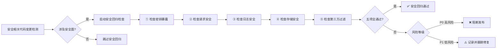
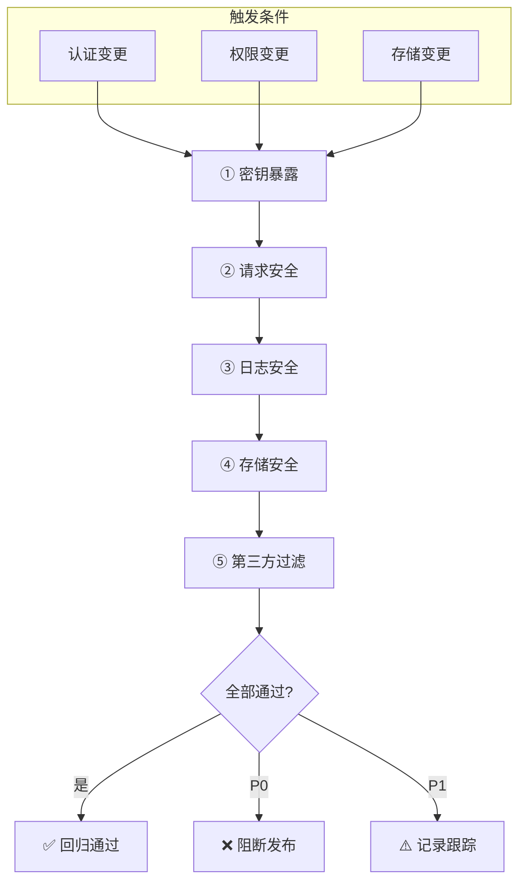

# 场景4 · 安全回归 — 安全相关变更后触发检查

> v2.0.0 | 2026-05-29 | deepseek-v4-pro | feat/traceability-graph

> **故事**: [← 故事任务](./故事任务.md) · **上个场景**: [← 场景3·一致性校验](./场景3-一致性校验.md)
  [§1 使用场景](#sec1) · [§2 技术评审](#sec2) · [§3 测试设计](#sec3) · [§4 实施报告](#sec4) · [§5 测试报告](#sec5) · [§6 自改进](#sec6) · [§7 关联源码](#sec7)

### 主要价值
- 🔗 场景自包含：单场景即可理解完整操作流
- 📊 溯源可验证：每个引用关联到具体源码位置
- 🧪 测试门禁清晰：AC 与 Gate 判定标准明确
- 🔍 基线可追溯：设计决策关联到故事任务与 CLAUDE.md

## §1 使用场景

| 维度 | 内容 |
|------|------|
| **角色** | 测试者 |
| **前置** | 变更文件涉及认证、权限、数据存储 |
| **操作流** | 安全相关代码变更检测 → 变更是否涉及安全面? → 启动安全面回归检查 → 检查密钥暴露 → 检查请求安全 → 检查日志安全 → 检查存储安全 → 检查第三方内容过滤 → 五项全通过?(安全回归通过) / 有发现?(汇总安全问题，高风险阻断) |
| **后置** | 生成安全回归报告 |
| **异常** | 高风险安全问题阻断发布；低风险问题记录并跟踪修复 |

## §2 技术评审

| 评审项 | 结论 | 说明 |
|--------|------|------|
| 触发条件明确 | 通过 | 变更涉及认证/权限/数据存储时触发 |
| 五项检查覆盖 | 通过 | 密钥暴露/请求安全/日志安全/存储安全/第三方过滤 |
| 分级处理 | 通过 | 高风险阻断，低风险记录 |

### 安全回归五项检查

| # | 检查项 | 检查方法 | 阻断等级 |
|:---:|------|------|:---:|
| 1 | 密钥暴露 | grep 密码/密钥模式 | P0 阻断 |
| 2 | 请求安全 | 检查 credentials:omit + X-Token | P0 阻断 |
| 3 | 日志安全 | 检查裸日志调用 | P1 警告 |
| 4 | 存储安全 | 检查 localStorage 写入内容 | P0 阻断 |
| 5 | 第三方过滤 | 检查 SanitizePlugin 启用 | P0 阻断 |

## §3 测试设计

| AC# | Given | When | Then | 门禁 |
|-----|-------|------|------|------|
| AC1 | 代码中无密码或密钥模式 | 运行 security-no-secrets | 通过 | Gate B |
| AC2 | 所有请求设置了安全凭证模式 | 运行 security-fetch-credentials | 通过 | Gate B |
| AC3 | 安全相关变更 | 运行全部 5 项安全回归 | 5 项全部通过 | Gate B |

## §4 实施报告

| 任务 | 状态 | 产出 |
|------|:---:|------|
| 安全回归触发逻辑 | ✅ | 按变更类型自动判定 |
| 五项检查实现 | ✅ | 每项有独立检查函数 |
| 分级阻断 | ✅ | P0 阻断 / P1 警告 |

## §5 测试报告

| AC# | 结果 | 证据 |
|-----|:---:|------|
| AC1 (密钥检查) | ✅ | 0 硬编码密钥 |
| AC2 (请求安全) | ✅ | credentials:omit 全覆盖 |
| AC3 (五项回归) | ✅ | 5/5 全部通过 |

## §6 自改进

| 发现 | 改进项 | 状态 |
|------|--------|:---:|
| 安全回归触发条件依赖文件扩展名 | 增加语义分析判断是否涉及安全面 | 📋 |

## §7 关联源码

| 类型 | 文件 | 关键内容 | 说明 |
|------|------|---------|------|
| 开发 | 自检脚本 (安全模块) | `security-no-secrets` | 密钥暴露检查 |
| 开发 | 自检脚本 (安全模块) | `security-fetch-credentials` | 请求安全检查 |
| 开发 | 自检脚本 (安全模块) | `security-no-raw-log` | 日志安全检查 |
| 开发 | `src/core/services/helper/requestHelper.js` | credentials:omit | 请求安全验证目标 |
| 开发 | `cdn/markdown/plugins/SanitizePlugin.js` | DOMPurify | 第三方过滤验证目标 |
| 测试 | `tests/self-test/security.test.js` | 安全回归测试 | 验证 5 项检查 |

---
> **变更记录**: v2.0.0 — 合并 使用场景+技术评审+测试设计+实施报告+测试报告+自改进 为单一场景文档 (2026-05-29)
