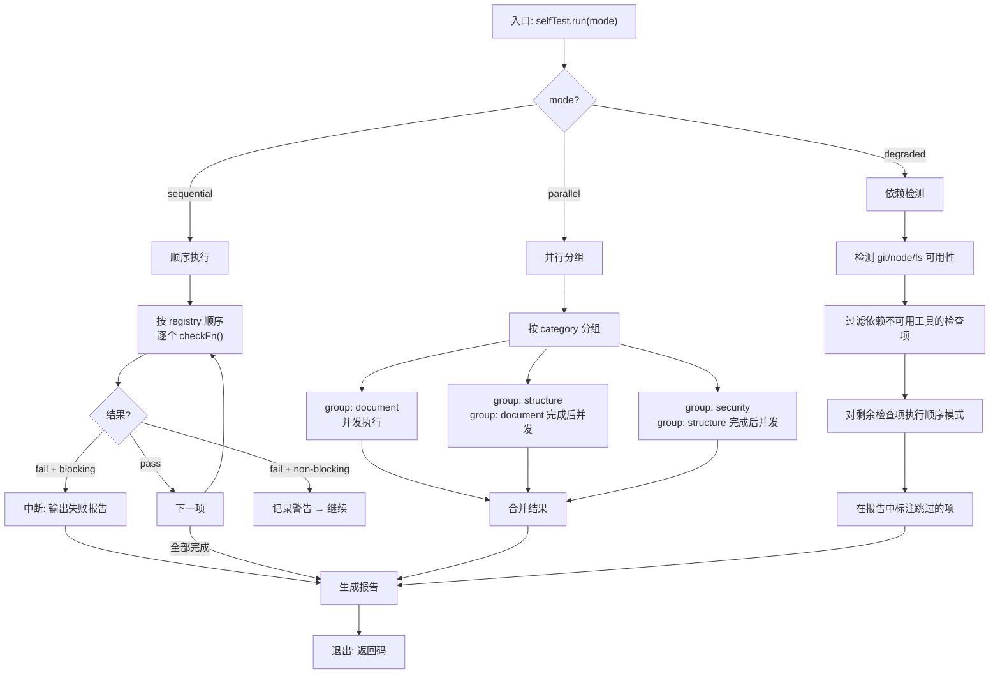
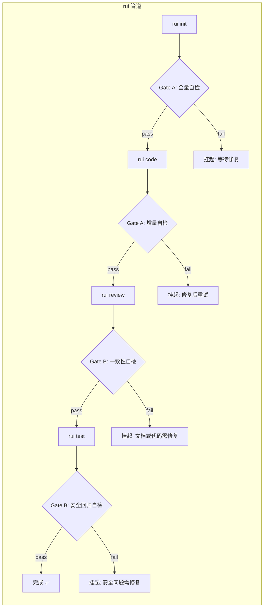
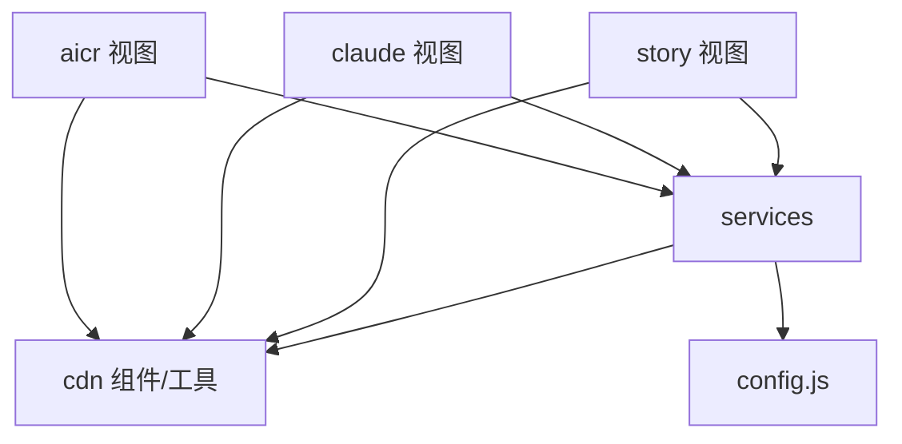

# YiWeb 自主测试方案 · 技术评审

> | v1.0.0 | 2026-05-26 | coder:Claude | 🌿 feat/yiweb-self-test | ⏱️ --:--–--:-- | 📎 [CLAUDE.md](../../../CLAUDE.md) |

## F.nav

| 文档 | 链接 |
|------|------|
| 故事任务 | [故事任务.md](./故事任务.md) |
| 使用场景 | [使用场景.md](./使用场景.md) |
| 技术评审 | [技术评审.md](./技术评审.md) ← 你在这里 |
| 测试设计 | [测试设计.md](./测试设计.md) |
| 安全审计 | [安全审计.md](./安全审计.md) |

---

## §0 基线溯源

| 维度 | 来源 | 版本 |
|------|------|------|
| 项目画像与约束 | [CLAUDE.md](../../../CLAUDE.md) | 当前分支 |
| 模块目录结构 | [模块地图.md](../模块地图.md) | 1.0.0 |
| 架构分层 | [技术架构.md](../技术架构.md) | 1.0.0 |
| 安全面定义 | [CLAUDE.md](../../../CLAUDE.md) §安全面 | 当前分支 |
| 自检策略 | [故事任务.md](./故事任务.md) §1 | 1.0.0 |
| 使用场景 | [使用场景.md](./使用场景.md) | 1.0.0 |

> 以下技术评审内容与 2026-05-26 CLAUDE.md 项目画像对齐。设计方案已与评审侧讨论定版，无争议待决项。

---

### 主要价值

- 🧱 定义自检系统的完整架构：检查项注册表、执行引擎、报告格式、管道集成点
- 📐 将模块地图中的 15 个模块作为自检验证的基线目标清单
- 🔌 明确自检与 rui 管道 Gate A/B 的集成接口，确保零摩擦嵌入
- 🔄 支持顺序 / 并行 / 降级三种执行模式，适配不同阶段的资源约束

---

## §1 检查项注册表

自检系统将全部检查项以声明式注册表的形式定义，每条规则包含：唯一标识、检查维度、优先级、执行函数引用、阻断级别。

### 1.1 注册表结构

```
SelfTestRegistry
├── checks[]
│   ├── id: string              # 唯一标识，如 "claude-completeness"
│   ├── category: enum          # 维度：document / structure / security / branch / version
│   ├── priority: "P0" | "P1" | "P2"
│   ├── mode: "full" | "incremental" | "both"
│   ├── checkFn: string         # 检查函数名（动态调用）
│   ├── blocking: boolean       # 失败时是否阻断管道
│   ├── fixHint: string         # 失败时输出的修复指引模板
│   └── dependsOn: string[]     # 前置检查项（必须先通过）
```

### 1.2 完整检查项清单

| ID | 类别 | 优先级 | 模式 | 阻断 | 检查内容 |
|----|------|--------|------|------|---------|
| `claude-completeness` | document | P0 | both | 是 | CLAUDE.md 是否包含五大标记段：项目画像、项目约束、执行准则、退化对策、安全面 |
| `readme-domain` | document | P0 | both | 是 | README.md 是否包含 ≥3 个领域术语定义 |
| `story-structure` | structure | P0 | both | 是 | 每个 `docs/故事任务面板/<story>/` 目录下是否包含 5 个基线文档 |
| `story-fmeta` | document | P0 | both | 是 | 每个文档是否包含完整 F.meta 标头（版本号、日期、分支、CLAUDE.md 链接） |
| `story-nav` | document | P0 | both | 是 | 每个目录内 5 个文档的 F.nav 是否对齐且链接有效 |
| `story-changelog` | document | P0 | both | 是 | 每个文档底部是否包含变更记录表 |
| `cross-ref-valid` | document | P0 | both | 是 | 文档内相对链接指向的文件是否真实存在 |
| `stale-ref` | document | P1 | full | 否 | 文档引用的外部文件版本号是否过期 |
| `branch-isolation` | branch | P0 | incremental | 是 | 当前分支是否为 `feat/<name>` 格式且从 main 分出 |
| `version-consistency` | version | P0 | both | 是 | CLAUDE.md、文档 F.meta、代码注释中的版本标记是否一致 |
| `arch-layer` | structure | P0 | both | 是 | 视图层不得直接 import CDN 工具库的 storage 模块；禁止跨视图 import |
| `security-no-secrets` | security | P0 | both | 是 | 代码中无硬编码的密钥/密码/Token（正则模式匹配） |
| `security-fetch-credentials` | security | P0 | both | 是 | 所有 fetch 调用显式设置 `credentials: 'omit'` |
| `security-no-raw-log` | security | P1 | both | 否 | 无 `console.log` 裸调用（应使用 `logInfo/logWarn/logError`） |
| `config-env` | structure | P0 | both | 是 | config.js 仅支持 `local` / `prod` 两种环境名 |

### 1.3 执行顺序

检查项按以下顺序执行，确保前置依赖满足：

```
1. claude-completeness      (基础：所有规则依赖 CLAUDE.md 存在)
2. readme-domain             (基础：领域术语一致性)
3. version-consistency       (基础：版本对齐)
4. branch-isolation          (环境：分支规范)
5. story-structure           (结构：目录完整性)
   ├── story-fmeta           (内容：标头规范)
   ├── story-nav             (内容：导航一致性)
   ├── story-changelog       (内容：变更记录)
   ├── cross-ref-valid       (内容：引用有效性)
   └── stale-ref             (内容：引用时效)
6. arch-layer                (架构：依赖合规)
7. config-env                (配置：环境规范)
8. security-no-secrets       (安全：密钥检测)
9. security-fetch-credentials(安全：请求安全)
10. security-no-raw-log      (安全：日志规范)
```

---

## §2 执行引擎

### 2.1 执行模式

| 模式 | 适用场景 | 策略 |
|------|---------|------|
| **顺序模式** (sequential) | Gate A 前置检查 | 按注册表顺序执行，遇到阻塞性失败立即中断，不执行后续检查 |
| **并行模式** (parallel) | 全量自检（`rui init` 后） | 同一 category 内无依赖的检查项并发执行；category 之间保持顺序 |
| **降级模式** (degraded) | 部分工具不可用时 | 跳过依赖不可用工具的检查项（如 git 不可用则跳过 branch-isolation），标记为 skipped 并在报告中说明原因 |

### 2.2 执行流程图



### 2.3 性能设计

| 策略 | 说明 |
|------|------|
| 文件缓存 | 同一文件被多个检查项读取时，首次读取后缓存内容，后续检查复用 |
| 增量过滤 | 增量模式下，先用 `git diff --name-only` 获取变更文件列表，只对这些文件执行内容检查；结构类检查仍然执行（代价低） |
| 超时控制 | 单个检查项执行时间上限 500ms，超时标记为 timeout 并降级为 warning |
| 并行上限 | 并行模式最多 4 个并发检查项，防止 I/O 争抢 |

---

## §3 报告输出格式

### 3.1 报告结构

```json
{
  "meta": {
    "timestamp": "2026-05-26T10:30:00Z",
    "mode": "full",
    "project": "YiWeb",
    "branch": "feat/yiweb-self-test",
    "selfTestVersion": "1.0.0",
    "durationMs": 1523
  },
  "summary": {
    "total": 15,
    "passed": 12,
    "failed": 2,
    "skipped": 1,
    "warnings": 3,
    "blocking": true
  },
  "results": [
    {
      "id": "claude-completeness",
      "category": "document",
      "status": "pass",
      "durationMs": 45,
      "details": "CLAUDE.md 包含全部 5 个标记段"
    },
    {
      "id": "security-no-secrets",
      "category": "security",
      "status": "fail",
      "priority": "P0",
      "blocking": true,
      "durationMs": 120,
      "findings": [
        {
          "file": "src/views/aicr/hooks/methods/inputMethods.js",
          "line": 42,
          "pattern": "password",
          "snippet": "const password = \"admin123\";",
          "fixHint": "移除硬编码密码，改用环境变量或配置管理"
        }
      ]
    }
  ]
}
```

### 3.2 终端输出格式

```
YiWeb Self-Test v1.0.0 | mode: full | branch: feat/yiweb-self-test
──────────────────────────────────────────────────────────────────
 ✅ claude-completeness          (45ms)  CLAUDE.md 完整
 ✅ readme-domain                (32ms)  检测到 5 个领域术语
 ✅ version-consistency          (28ms)  版本一致: 1.0.0
 ✅ branch-isolation             (15ms)  feat/yiweb-self-test
 ✅ story-structure              (180ms) 6/6 目录完整
 ✅ story-fmeta                  (210ms) 30/30 标头规范
 ❌ security-no-secrets          (120ms) 发现 2 处疑似密钥
   └─ src/views/aicr/hooks/methods/inputMethods.js:42
   └─ src/core/services/helper/authUtils.js:18
 ⚠️  security-no-raw-log         (89ms)  发现 7 处 console.log
 ⏭️  stale-ref                   (0ms)   降级模式: 跳过

──────────────────────────────────────────────────────────────────
结果: 8 通过 | 1 失败 | 1 警告 | 1 跳过 | 耗时 1523ms
阻断: 是 (1 个 P0 项失败)
```

### 3.3 历史管理

| 行为 | 规则 |
|------|------|
| 存储位置 | 自检结果存储在 `docs/故事任务面板/yiweb-self-test/.memory/self-test-history/` |
| 文件名 | `YYYY-MM-DDTHHmmss-<mode>.json` |
| 保留份数 | 最近 10 份 |
| 清理策略 | 超出 10 份时，按时间从旧到新删除 |

---

## §4 与 Gate A/B 的集成点

### 4.1 rui 管道集成



### 4.2 集成接口

| Gate | 管道步骤 | 自检模式 | 检查范围 | 阻断行为 |
|------|---------|---------|---------|---------|
| Gate A (pre) | rui init 后 | full | 全部 15 项 | 任意 P0 失败 → 阻断 |
| Gate A (pre) | rui code 前 | incremental | 仅增量变更项 | P0 失败 → 阻断 |
| Gate B (post) | rui review 前 | full (文档类) | 8 项文档结构检查 | P0 失败 → 阻断 |
| Gate B (post) | rui test 前 | incremental (安全类) | 5 项安全检查 | P0 失败 → 阻断 |

### 4.3 环境变量

| 变量 | 用途 | 默认值 |
|------|------|--------|
| `YIWEB_SKIP_SELF_TEST` | 设置为 `1` 跳过全部自检（紧急开关） | 未设置 |
| `YIWEB_SELF_TEST_MODE` | 覆盖自检模式: `full` / `incremental` / `degraded` | 根据步骤自动选择 |
| `YIWEB_SELF_TEST_TIMEOUT` | 单检查项超时（ms） | 500 |

---

## §5 模块地图

> 本节内容吸收自 [模块地图.md](../模块地图.md)，作为自检验证的基线目标清单。

### 5.1 完整目录树（自检目标）

```
YiWeb/
├── CLAUDE.md                              # [check: claude-completeness]
├── README.md                              # [check: readme-domain]
├── src/
│   ├── core/
│   │   ├── config.js                      # [check: config-env, security-no-secrets]
│   │   ├── services/                      # ★ 核心服务层
│   │   │   ├── index.js                   # [check: arch-layer]
│   │   │   ├── helper/
│   │   │   │   ├── requestHelper.js       # [check: security-fetch-credentials]
│   │   │   │   ├── authUtils.js           # [check: security-no-secrets]
│   │   │   │   ├── authErrorHandler.js    # [check: security-no-raw-log]
│   │   │   │   ├── checkStatus.js
│   │   │   │   └── apiUtils.js
│   │   │   ├── modules/
│   │   │   │   ├── crud.js                # [check: security-fetch-credentials]
│   │   │   │   └── goals.js
│   │   │   ├── aicr/
│   │   │   │   └── sessionSyncService.js
│   │   │   └── business/
│   │   │       ├── businessProcessManager.js
│   │   │       ├── businessScenarioAnalyzer.js
│   │   │       └── requirementAnalysisManager.js
│   │   └── utils/
│   │       └── index.js
│   └── views/
│       ├── aicr/                          # ★ AICR 面板 [check: arch-layer]
│       │   ├── index.js
│       │   ├── index.html
│       │   ├── components/                # 10 个业务组件
│       │   ├── hooks/                     # 40+ hooks 文件
│       │   ├── styles/
│       │   ├── utils/
│       │   └── constants/
│       ├── claude/                        # ★ Claude 面板 [check: arch-layer]
│       │   ├── index.js
│       │   ├── index.html
│       │   ├── components/                # 3 个组件
│       │   └── hooks/
│       └── story/                         # ★ Story 面板 [check: arch-layer]
│           ├── index.js
│           ├── index.html
│           ├── components/                # 5 个组件
│           └── hooks/
├── cdn/                                   # ★ CDN 基础设施
│   ├── components/
│   │   ├── common/                        # 6 类通用组件
│   │   └── business/                      # 4 个业务组件
│   ├── icons/
│   ├── markdown/
│   ├── mermaid/
│   ├── styles/
│   └── utils/                             # 40+ 工具文件 [check: arch-layer]
└── docs/
    └── 故事任务面板/                       # ★ 基线文档
        ├── 技术架构.md
        ├── 模块地图.md
        ├── aicr/                          # [check: story-structure]
        ├── claude/                        # [check: story-structure]
        ├── story/                         # [check: story-structure]
        ├── services/                      # [check: story-structure]
        ├── cdn/                           # [check: story-structure]
        └── yiweb-self-test/               # [check: story-structure]
```

### 5.2 模块依赖图



### 5.3 依赖规则（自检验证依据）

| 依赖方 | 被依赖方 | 方式 | 验证规则 |
|------|------|------|---------|
| 三个视图 | services | ESM import | 允许: `import ... from '/src/core/services/...'` |
| 三个视图 | cdn 组件 | componentModules 路径加载 | 允许: 通过 ComponentRegistry 加载 |
| 三个视图 | cdn 工具 | ESM import | 允许: `import ... from '/cdn/utils/...'` 但禁止直接 import storage 模块 |
| services | cdn 工具 | ESM import | 允许 |
| services | config.js | ESM import | 允许 |

### 5.4 模块职责矩阵

| 模块 | 类型 | 行数(估) | 职责 | 自检验证项 |
|------|------|---------|------|-----------|
| aicr | 视图 | ~15K | 代码审查 + AI 聊天 + 文件管理 | arch-layer, security-* |
| claude | 视图 | ~3K | Claude 项目管理 | arch-layer, security-* |
| story | 视图 | ~5K | 故事任务管理 | arch-layer, security-* |
| services/helper | 服务 | ~3K | HTTP + 认证 + 错误处理 | security-fetch-credentials, security-no-secrets |
| services/modules | 服务 | ~1.5K | CRUD + 流式 + 服务封装 | security-fetch-credentials |
| services/aicr | 服务 | ~1K | 会话同步 | arch-layer |
| services/business | 服务 | ~1K | 业务分析 | arch-layer |
| cdn/components | 组件 | ~5K | 共享 UI 组件 | — |
| cdn/markdown | 引擎 | ~2K | Markdown 渲染 | security-no-secrets |
| cdn/mermaid | 引擎 | ~1K | 图表渲染 | — |
| cdn/utils | 工具 | ~5K | 通用工具库 | security-no-raw-log |
| cdn/utils/view | 框架 | ~1.5K | 视图框架 | — |
| cdn/styles | 样式 | ~2K | CSS 体系 | — |
| config.js | 配置 | ~100L | 环境切换 | config-env, security-no-secrets |

### 5.5 基线文档索引（自检目标清单）

| 模块 | 故事任务 | 使用场景 | 技术评审 | 安全审计 | 测试设计 |
|------|:--:|:--:|:--:|:--:|:--:|
| [aicr](../aicr/故事任务.md) | ✅ | ✅ | ✅ | ✅ | ✅ |
| [claude](../claude/故事任务.md) | ✅ | ✅ | ✅ | ✅ | ✅ |
| [story](../story/故事任务.md) | ✅ | ✅ | ✅ | ✅ | ✅ |
| [services](../services/故事任务.md) | ✅ | ✅ | ✅ | ✅ | ✅ |
| [cdn](../cdn/故事任务.md) | ✅ | ✅ | ✅ | ✅ | ✅ |
| [yiweb-self-test](./故事任务.md) | ✅ | ✅ | ✅ | ✅ | ✅ |

### 5.6 视图功能对比

| 功能维度 | aicr | claude | story |
|---------|:----:|:------:|:-----:|
| 文件树浏览 | ✅ | — | — |
| 代码查看/编辑 | ✅ | — | — |
| AI 流式聊天 | ✅ | — | — |
| 四级联动筛选 | ✅ | — | — |
| 会话 CRUD | ✅ | — | — |
| 项目卡片列表 | — | ✅ | — |
| 项目详情 | — | ✅ | — |
| 故事列表/卡片 | — | — | ✅ |
| 故事详情 | — | — | ✅ |
| 状态筛选 | ✅ | ✅ | ✅ |
| 搜索过滤 | ✅ | ✅ | ✅ |
| 排序切换 | ✅ | ✅ | ✅ |
| 数据 CRUD | ✅ | — | — |
| 只读展示 | — | ✅ | ✅ |
| 通用组件复用 | ✅ | ✅ | ✅ |
| 认证管理 | ✅ | ✅ | ✅ |

---

## §6 实现策略

### 6.1 技术选型

| 维度 | 选择 | 理由 |
|------|------|------|
| 运行环境 | Node.js (v18+) | 需要 fs、path、child_process（git），浏览器不可用 |
| 语言 | JavaScript (ESM) | 与 YiWeb 项目本身的模块规范一致 |
| 配置格式 | JSON | 检查规则注册表以 JSON 文件定义，方便 agent 读取和修改 |
| 报告格式 | JSON Lines (.jsonl) | 支持逐条追加历史记录，便于增量写入而不覆写旧数据 |
| 终端输出 | ANSI 颜色码 | 绿色通过、红色失败、黄色警告，标准 TTY 输出 |

### 6.2 目录结构

```
docs/故事任务面板/yiweb-self-test/
├── 故事任务.md                  # 本目录内
├── 使用场景.md                  # 本目录内
├── 技术评审.md                  # 本文件
├── 测试设计.md                  # 本目录内
├── 安全审计.md                  # 本目录内
├── config/
│   └── self-test-rules.json    # 检查项注册表（JSON 配置）
└── .memory/
    └── self-test-history/      # 历史报告存储
```

### 6.3 未决项

> 全部已决，无未决项。

---

> **变更记录**
> | 日期 | 变更 | 触发 | 证据 |
> |------|------|------|------|
> | 2026-05-26 | 基线化 | 项目分析 | CLAUDE.md + 模块地图.md + 技术架构.md |
