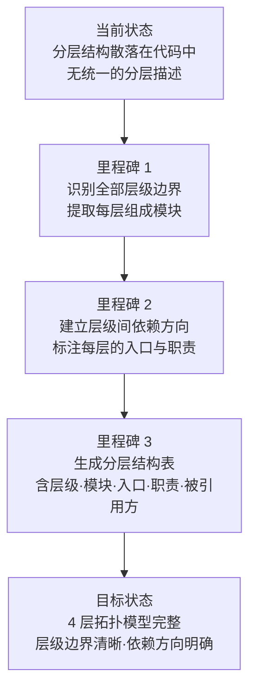

# YiWeb-系统架构-分层结构 · 故事任务

> v1.0.0 | 2026-05-28 | deepseek-v4-pro | feat/系统架构-sub-stories

> **父故事**: [← 系统架构](../系统架构/故事任务.md) · **导航**: [→ 场景1-新人上手-分层认知.md](./场景1-新人上手-分层认知.md)

> [§1 需求概述](#sec1) · [§2 功能点](#sec2) · [§3 范围边界](#sec3) · [§4 任务拆分](#sec4) · [§5 验收标准](#sec5) · [§6 风险与假设](#sec6)

### 主要价值

- 🏗️ 固化系统 4 层拓扑模型（L0 展示层 → L1 视图层 → L2 服务层 → L3 基础设施层）
- 📐 为新人提供系统分层结构全景图，降低认知门槛
- 🔍 支撑功能定位 — 按层级快速判断新增功能应归属哪一层
- 📏 建立层级间依赖方向约束（上层依赖下层，禁止反向依赖）

## §1 需求概述

从现有代码库中提取并文档化系统的分层组织结构，建立 L0–L3 四层拓扑模型，使每位开发者能快速理解系统骨架、判断功能归属、评估跨层影响。

## §2 功能点

| FP# | 描述 | 输入 | 输出 | 错误行为 | 优先级 |
|-----|------|------|------|---------|--------|
| FP1.1 | 识别展示层（L0）— 根入口页面及各视图 HTML 模板 | 项目根目录 + 各视图目录 | L0 模块清单（模板名 + 加载方式） | 模板缺失时标「待补充」 | P0 |
| FP1.2 | 识别视图层（L1）— aicr / claude / story 三个视图的入口与三段式结构 | `src/views/<name>/index.js` | L1 模块清单（入口 + 状态管理 + 计算属性 + 操作方法 + 业务组件数） | 入口文件缺失时阻断 | P0 |
| FP1.3 | 识别服务层（L2）— 环境配置 / 接口封装 / 请求封装 / 认证工具 / 业务流程 | `src/core/` | L2 模块清单（入口 + 职责 + 被引用方） | 关键服务模块入口缺失时告警 | P0 |
| FP1.4 | 识别基础设施层（L3）— 视图工厂 / 日志 / 错误处理 / 存储 / 事件总线 / 渲染器 | `cdn/utils/` + `cdn/markdown/` | L3 模块清单（入口 + 职责 + 被引用方） | 核心基础设施缺失时阻断 | P0 |
| FP1.5 | 建立层级依赖方向约束 — 上层可依赖下层，禁止反向 | 全部模块的 import 关系 | 依赖方向检查结果 + 违规清单 | 发现反向依赖时报 P0 违规 | P1 |
| FP1.6 | 生成分层结构全景 mermaid 图 | 四层模块清单 | mermaid flowchart TB 格式分层图 | 节点 < 4 时告警 | P0 |

## §3 范围边界

| # | 条目 | 包含/不包含 | 原因 |
|---|------|------------|------|
| 1 | 四层拓扑模型的全部层级 | 包含 | 系统分层结构基线 |
| 2 | 每层内全部模块的入口、职责、被引用方 | 包含 | 层级内模块清单 |
| 3 | 层级间依赖方向约束 | 包含 | 防止架构腐化 |
| 4 | 后端服务内部模块分层 | 不包含 | 不属于本系统边界 |
| 5 | 浏览器运行时依赖（如 Vue 3 CDN） | 不包含 | 外部运行时，非本系统层级 |
| 6 | 部署与运维基础设施分层 | 不包含 | 非源码结构范畴 |

## §4 任务拆分

| # | 任务 | Agent | 门禁 | 交接信号 | 依赖 |
|---|------|-------|------|---------|------|
| 1 | 扫描并提取 L0 展示层模块 | coder | 根入口 + 3 视图模板全覆盖 | L0 模块表 | — |
| 2 | 扫描并提取 L1 视图层模块 | coder | 3 视图入口全覆盖 + 三段式结构描述 | L1 模块表 | 任务 1 |
| 3 | 扫描并提取 L2 服务层模块 | coder | 6 个核心服务模块全覆盖 | L2 模块表 | 任务 1 |
| 4 | 扫描并提取 L3 基础设施层模块 | coder | ≥8 个基础设施模块覆盖 | L3 模块表 | 任务 1 |
| 5 | 建立依赖方向约束并检查违规 | coder | 0 反向依赖 | 违规清单（空 = 通过） | 任务 2–4 |
| 6 | 生成分层全景 mermaid 图 | coder | ≥ 4 层节点 + 依赖箭头 | mermaid flowchart | 任务 2–5 |

## §5 验收标准

| AC# | Given | When | Then | 门禁 |
|-----|-------|------|------|------|
| AC1 | 项目源码可访问 | 执行 L0 展示层提取 | 根入口 + 全部视图 HTML 模板记录在案 | Gate A |
| AC2 | L0 模块表完成 | 执行 L1 视图层提取 | 3 视图各含入口路径 + 三段式结构描述 + 业务组件数 | Gate A |
| AC3 | L1 模块表完成 | 执行 L2 服务层提取 | 6 个核心服务模块（config / services / crud / requestHelper / authUtils / authErrorHandler）各含入口 + 职责 + 被引用方 | Gate A |
| AC4 | L2 模块表完成 | 执行 L3 基础设施层提取 | ≥ 8 个基础设施模块（baseView / log / error / api / http / storage / eventBus / componentLoader / MarkdownRenderer / MermaidRenderer / PluginSystem）各含入口 + 职责 + 被引用方 | Gate A |
| AC5 | 全部层级模块表完成 | 执行依赖方向检查 | 0 反向依赖（L3 → L1、L2 → L0 等） | Gate A |
| AC6 | 依赖方向检查通过 | 生成分层全景图 | mermaid flowchart TB 含 4 层 subgraph + 依赖箭头 + 每层 ≥ 2 个模块节点 | Gate B |
| AC7 | 全部分层文档生成 | 文档校验 | 通过 P0 检查清单（F.meta + F.nav + F.toc + 主要价值 ≥ 4 + 效果示意 ≥ 5 节点 + 回溯链） | Gate B |

## §6 风险与假设

| # | 风险/假设 | 类型 | 可能性 | 影响 | 缓解/验证策略 | 关联 FP# |
|---|----------|------|--------|------|-------------|---------|
| 1 | L3 基础设施模块入口路径分散在 cdn/ 多个子目录 | 风险 | M | M | 多模式搜索交叉验证（utils/core + utils/view + markdown/core） | FP1.4 |
| 2 | 部分模块的职责边界模糊（如 api.js vs http.js） | 风险 | L | L | 阅读源码区分职责，不确定时标注「待确认」 | FP1.3, FP1.4 |
| 3 | 未来新增视图时分层结构文档可能过时 | 风险 | M | L | 父故事 系统架构 变更时触发增量刷新 | FP1.2 |
| 4 | 系统结构稳定，分层边界清晰可自动提取 | 假设 | — | — | 源码目录结构直接反映分层意图 | 全部 |
| 5 | L0 展示层模板数量 = 视图数量（当前 3 个） | 假设 | — | — | 新增视图时同步更新 L0 清单 | FP1.1 |

---

> **变更记录**：v1.0.0 — 从父故事 系统架构 FP1 拆分创建（2026-05-28，`/rui doc`）
