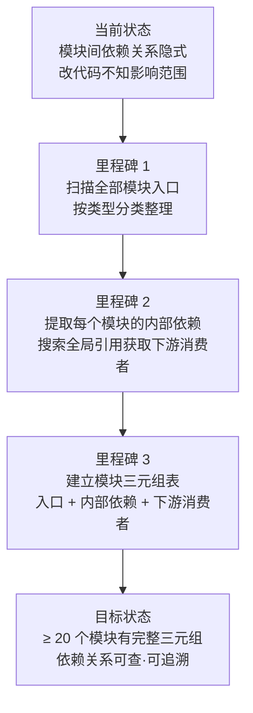

# YiWeb-系统架构-模块地图 · 故事任务

> v1.0.0 | 2026-05-28 | deepseek-v4-pro | feat/系统架构-sub-stories

> **父故事**: [← 系统架构](../系统架构/故事任务.md) · **导航**: [→ 场景1-查下游.md](./场景1-查下游.md)

> [§1 需求概述](#sec1) · [§2 功能点](#sec2) · [§3 范围边界](#sec3) · [§4 任务拆分](#sec4) · [§5 验收标准](#sec5) · [§6 风险与假设](#sec6)

### 主要价值

- 🗺️ 建立完整的模块关系图谱，每个模块有三元组记录（入口 + 依赖 + 下游消费者）
- 🔗 显式化模块间隐式依赖，消除「改了 A 不知道会影响 B」的风险
- 📋 提供按模块类型的分类索引（通用组件 / 业务组件 / 服务模块 / 基础设施 / 渲染插件）
- 🧭 支撑功能定位 — 按关键词快速找到目标模块及其上下游

## §1 需求概述

从现有代码库中提取每个模块的入口文件、内部依赖和下游消费者，建立覆盖 cdn/ 和 src/ 的完整模块关系图谱，使开发者能精准定位模块、理解依赖链、评估变更影响。

## §2 功能点

| FP# | 描述 | 输入 | 输出 | 错误行为 | 优先级 |
|-----|------|------|------|---------|--------|
| FP2.1 | 扫描通用组件模块（YiModal / YiButton / YiTag / YiLoading / YiEmptyState / YiErrorState / YiIcon / YiIconButton / YiSelect / YiInput / YiTextarea / HeaderActions / MarkdownView / SkeletonLoader） | `cdn/components/` | 每个组件的入口 + 内部依赖 + 下游消费者 | 入口文件缺失时标「待确认」 | P0 |
| FP2.2 | 扫描渲染插件模块（SanitizePlugin / MermaidPlugin / TocPlugin / FrontmatterPlugin / AccordionPlugin / ContainersPlugin / InternalLinkPlugin / TableCellMarkdownPlugin / NestedMarkdownPlugin） | `cdn/markdown/plugins/` | 每个插件的入口 + 职责 + 被引用方 | 插件入口缺失时告警 | P0 |
| FP2.3 | 扫描基础设施模块（baseView / log / error / api / http / storage / eventBus / componentLoader / MarkdownRenderer / MermaidRenderer / PluginSystem） | `cdn/utils/` + `cdn/markdown/core/` | 每个模块的入口 + 内部依赖 + 下游消费者 | 核心模块缺失时阻断 | P0 |
| FP2.4 | 扫描服务层模块（config / services / crud / requestHelper / authUtils / authErrorHandler / business） | `src/core/` | 每个模块的入口 + 内部依赖 + 下游消费者 | 关键服务缺失时告警 | P0 |
| FP2.5 | 扫描视图层状态管理模块（aicr / claude / story 各视图的 store + computed + methods） | `src/views/<name>/hooks/` | 每个视图的状态管理三元组 | 入口文件缺失时告警 | P1 |
| FP2.6 | 全局搜索模块间的交叉引用，补全下游消费者列表 | Grep 各模块入口路径 | 下游消费者补全表 | 搜索结果为空时标记为无下游 | P1 |
| FP2.7 | 校验依赖方向 — CDN 模块不 import src 模块，src 单向依赖 CDN | 全部 import 语句 | 违规清单 | 发现反向依赖时报 P0 违规 | P0 |

## §3 范围边界

| # | 条目 | 包含/不包含 | 原因 |
|---|------|------------|------|
| 1 | cdn/components/ 全部通用组件 | 包含 | 直接影响界面渲染和交互 |
| 2 | cdn/markdown/ 全部渲染器和插件 | 包含 | 内容渲染核心链路 |
| 3 | cdn/utils/ 全部基础设施模块 | 包含 | 系统运行基础支撑 |
| 4 | src/core/ 全部服务层模块 | 包含 | 接口封装与业务编排 |
| 5 | src/views/ 全部视图入口与状态管理 | 包含 | 当前全部业务功能入口 |
| 6 | 外部 CDN 依赖（如 Vue 3 运行时） | 不包含 | 非本仓库管理 |
| 7 | 后端服务模块间依赖 | 不包含 | 不属于本系统边界 |
| 8 | 浏览器扩展模块 | 不包含 | 非本系统组成部分 |

## §4 任务拆分

| # | 任务 | Agent | 门禁 | 交接信号 | 依赖 |
|---|------|-------|------|---------|------|
| 1 | 扫描通用组件（≥14 个）入口 + 依赖 + 下游 | coder | 组件入口全覆盖 | 通用组件三元组表 | — |
| 2 | 扫描渲染插件（≥9 个）入口 + 职责 | coder | 插件入口全覆盖 | 渲染插件表 | — |
| 3 | 扫描基础设施模块（≥11 个）入口 + 依赖 + 下游 | coder | 核心模块全覆盖 | 基础设施三元组表 | — |
| 4 | 扫描服务层模块（≥7 个）入口 + 依赖 + 下游 | coder | 关键服务全覆盖 | 服务层三元组表 | — |
| 5 | 扫描视图状态管理模块三元组 | coder | 3 视图全覆盖 | 视图状态三元组表 | — |
| 6 | 全局交叉引用搜索补全下游 | coder | 全局搜索完成 | 下游补全表 | 任务 1–5 |
| 7 | 依赖方向校验（CDN → src 禁止） | coder | 0 违规 | 违规清单（空 = 通过） | 任务 6 |
| 8 | 汇总生成模块地图总表 | coder | ≥ 20 个模块有完整三元组 | 模块地图总表 | 任务 1–7 |

## §5 验收标准

| AC# | Given | When | Then | 门禁 |
|-----|-------|------|------|------|
| AC1 | cdn/components/ 目录存在 | 扫描通用组件入口 | ≥ 14 个组件各含入口路径 + 内部依赖 + 下游消费者 | Gate A |
| AC2 | cdn/markdown/plugins/ 目录存在 | 扫描渲染插件入口 | ≥ 9 个插件各含入口路径 + 职责描述 | Gate A |
| AC3 | cdn/utils/ + cdn/markdown/core/ 目录存在 | 扫描基础设施模块 | ≥ 11 个模块各含入口 + 内部依赖 + 下游消费者 | Gate A |
| AC4 | src/core/ 目录存在 | 扫描服务层模块 | ≥ 7 个模块各含入口 + 内部依赖 + 下游消费者 | Gate A |
| AC5 | src/views/ 目录存在 | 扫描视图状态管理 | 3 视图各含 store + computed + methods 三元组 | Gate A |
| AC6 | 全部模块扫描完成 | 全局交叉引用搜索 | 每个模块的下游消费者列表完整（通过 grep 交叉验证） | Gate A |
| AC7 | 下游列表补全 | 执行依赖方向校验 | 0 反向依赖（CDN 模块不 import src 模块） | Gate A |
| AC8 | 全部校验通过 | 汇总生成模块地图总表 | ≥ 20 个模块有完整三元组（入口 + 内部依赖 + 下游消费者） | Gate B |

## §6 风险与假设

| # | 风险/假设 | 类型 | 可能性 | 影响 | 缓解/验证策略 | 关联 FP# |
|---|----------|------|--------|------|-------------|---------|
| 1 | 部分模块的 import 路径使用别名或动态拼接导致 grep 漏检 | 风险 | L | M | 多模式搜索（相对路径 + 绝对路径 + 动态 import 模式） | FP2.6 |
| 2 | 全局搜索下游时 cdn/ 目录过大导致结果噪音 | 风险 | M | L | 按模块入口文件名精确搜索，过滤 node_modules 和 .git | FP2.6 |
| 3 | 新增组件或模块时模块地图可能过时 | 风险 | M | L | 父故事 系统架构 变更时触发增量刷新 | FP2.1–2.5 |
| 4 | CDN 组件确实不依赖 src 模块 | 假设 | — | — | 源码结构反映依赖方向约束 | FP2.7 |
| 5 | ≥ 20 个模块覆盖可满足当前所有使用场景需求 | 假设 | — | — | 覆盖全部通用组件 + 渲染插件 + 基础设施 + 服务层即达标 | 全部 |

---

> **变更记录**：v1.0.0 — 从父故事 系统架构 FP2 拆分创建（2026-05-28，`/rui doc`）
