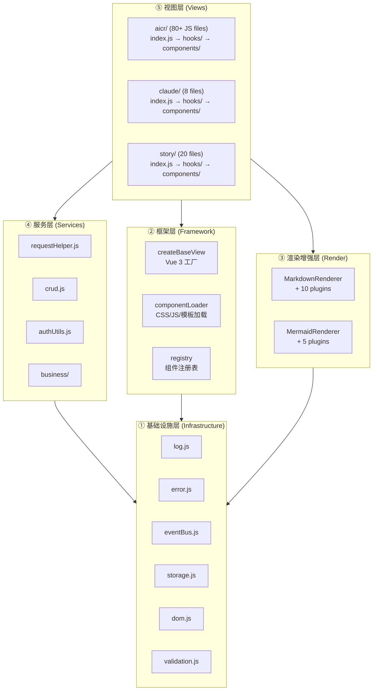
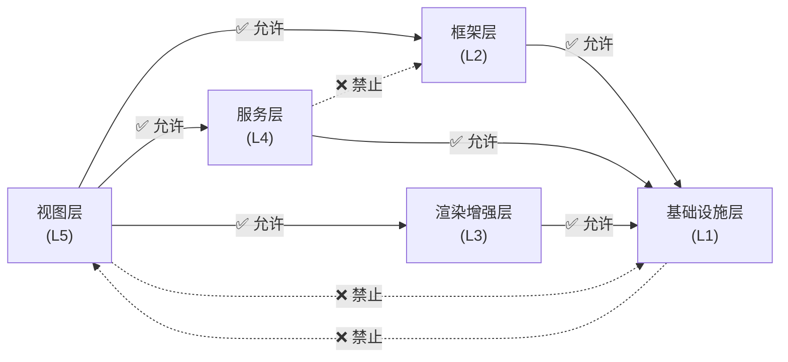
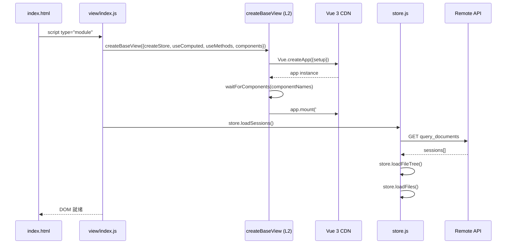
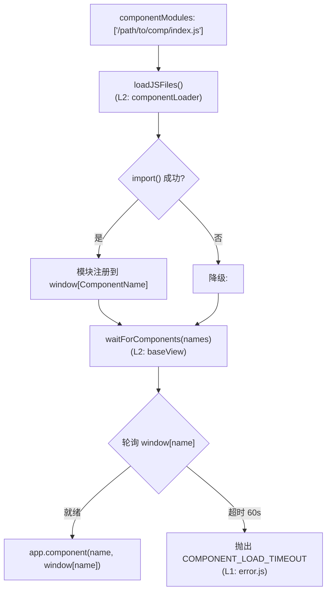

# 场景-1: 分层结构

> **场景 ID**: yiweb-arch-scene-1
> **关联 FP**: FP1
> **优先级**: P0

## §0 架构设计

### 分层总览

YiWeb 采用 **5 层运行时架构**，自底向上单向依赖。第 1 层为第三方依赖 / 框架基础，上层逐级构建于基础之上：

### 各层职责

| 层 | 路径 | 职责 | 依赖方向 | 文件数 |
|----|------|------|:------:|:-----:|
| 基础设施层 | `cdn/utils/core/` + `browser/` | 日志、错误、事件总线、DOM 操作、存储、验证 — 第三方工具基础 | — | 18 |
| 框架层 | `cdn/utils/view/` | Vue 3 应用创建/挂载/组件注册，CSS/JS 动态加载 | → L1 | 4 |
| 渲染增强层 | `cdn/markdown/` + `mermaid/` | Markdown 解析+Mermaid 图表渲染，插件化架构 | → L1 | 16 |
| 服务层 | `src/core/services/` | HTTP 封装、CRUD、认证、业务分析 | → L1, 远端 | 12 |
| 视图层 | `src/views/<name>/` | 用户界面 + 交互逻辑，通过 `createBaseView` 注册 | → L2, L3, L4 | ~110 |

### 分层渊源

第 1-3 层对应 `docs/index.html` 中的 **「CDN 基础设施」**板块——它们是第三方依赖 / 框架的运行时基底，由 CDN 托管，与应用源代码解耦：

| 架构层 | 对应 CDN 基础设施子板块 |
|--------|------------------------|
| ① 基础设施层 | 工具库 (18 模块) — log / error / eventBus / storage / dom / validation |
| ② 框架层 | 通用组件 (14) + 视图工厂 — YiModal / YiButton / createBaseView / componentLoader |
| ③ 渲染增强层 | 渲染增强 (16 文件) — MarkdownRenderer / SanitizePlugin / MermaidRenderer |

第 4-5 层对应 `docs/index.html` 中的 **「主要源代码」**板块，是业务应用的主体。

### 跨层约束

> 视图层可以直接引用服务层、框架层、渲染增强层，但 **禁止直接 import 基础设施层模块**（L1）。所有底层能力通过 L2/L3/L4 间接暴露，确保依赖方向自顶向下单向流动。

## §1 源码映射

### 基础设施层核心模块 (L1)

| 模块 | 文件 | 职责 |
|------|------|------|
| 分级日志 | `cdn/utils/core/log.js` | debug/info/warn/error 四级日志 + 性能计时器 |
| 错误处理 | `cdn/utils/core/error.js` | 统一错误类型 + ErrorCodes + createError + safeExecute |
| 事件总线 | `cdn/utils/core/eventBus.js` | 发布订阅，模块间松耦合通信 |
| 存储 | `cdn/utils/core/storage.js` | localStorage 安全读写封装 |
| DOM 辅助 | `cdn/utils/browser/dom.js` | DOM 查询/创建/操作辅助 |
| 验证 | `cdn/utils/core/validation.js` | 数据/输入验证规则 |
| 通用工具 | `cdn/utils/core/common.js` | 字符串/数组/对象通用函数 |

### 框架层核心 API (L2)

| 函数 | 文件 | 签名 |
|------|------|------|
| `createBaseView(config)` | `cdn/utils/view/baseView.js` | 视图工厂，接收 store/computed/methods |
| `loadCSS(paths)` | `cdn/utils/view/componentLoader.js` | 动态注入 CSS |
| `loadTemplate(path)` | `cdn/utils/view/componentLoader.js` | 加载 HTML 模板（带缓存） |
| `waitForComponents(names, timeout)` | `cdn/utils/view/baseView.js` | 轮询+事件等待 CDN 组件就绪 |

### 渲染增强层 (L3)

| 模块 | 路径 | 说明 |
|------|------|------|
| MarkdownRenderer | `cdn/markdown/core/` | marked 引擎 + PluginSystem 插件架构，含 10 插件 |
| SanitizePlugin | `cdn/markdown/plugins/` | DOMPurify 白名单 XSS 防护 |
| MermaidRenderer | `cdn/mermaid/` | 流程图/时序图/甘特图渲染 + 5 插件 |
| TocPlugin | `cdn/markdown/plugins/` | 文档目录自动生成 |
| AccordionPlugin | `cdn/markdown/plugins/` | 折叠面板渲染 |

### 服务层 API 分类 (L4)

| 类别 | 模块 | 核心函数 |
|------|------|---------|
| HTTP | `requestHelper.js` | getRequest, postRequest, putRequest, deleteRequest, sendRequest, retryRequest, batchRequests |
| 缓存 | `requestHelper.js` | CachedRequest, createCachedRequest |
| CRUD | `crud.js` | getData, postData, updateData, deleteData, streamPrompt, batchOperations |
| 认证 | `authUtils.js` | getStoredToken, saveToken, getAuthHeaders, clearToken, hasValidToken |
| 401 | `authErrorHandler.js` | handle401Error, isAuthError, setAuthErrorConfig |

### 视图层入口 (L5)

| 视图 | 入口文件 | store | computed | methods |
|------|---------|:----:|:----:|:----:|
| aicr | `src/views/aicr/index.js` | `hooks/state/store.js` | `hooks/useComputed.js` | `hooks/useMethods.js` |
| claude | `src/views/claude/index.js` | `hooks/store.js` | `hooks/useComputed.js` | `hooks/useMethods.js` |
| story | `src/views/story/index.js` | `hooks/state/store.js` | `hooks/useComputed.js` | `hooks/useMethods.js` |

## §2 实现细节

### 视图初始化时序

### 组件加载流程

## §3 测试要点

| 测试维度 | 用例 | 验证点 |
|---------|------|--------|
| 跨层导入 | 视图层 (L5) 不直接 import 基础设施层 (L1) 模块 | 依赖方向合规 |
| 入口一致性 | 每个视图都调用 `createBaseView` (L2) 且传入三件套 | 模式统一 |
| 全局暴露 | CDN 组件通过 `window[Name]` 暴露且触发 `{Name}Loaded` 事件 | 加载协议 |
| 基础模块纯度 | L1 模块零扇出，不依赖任何业务代码 | 第三方依赖纯度 |

## §4 复盘

| 维度 | 评估 |
|------|------|
| 分层清晰度 | ✅ 5 层边界明确，自底向上单向依赖。L1-L3 为 CDN 基础设施（第三方依赖 / 框架），L4-L5 为应用源码 |
| 模块内聚 | ✅ 视图层自包含（index.js + hooks/ + components/ + styles/） |
| 基础纯度 | ✅ L1 基础设施层零业务依赖，扇出为 0，是纯净的第三方工具基底 |
| 待改进 | 框架层与服务层之间存在隐式依赖（baseView 中 import log.js），可考虑通过事件总线解耦 |
