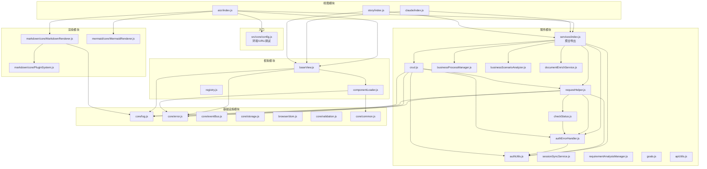
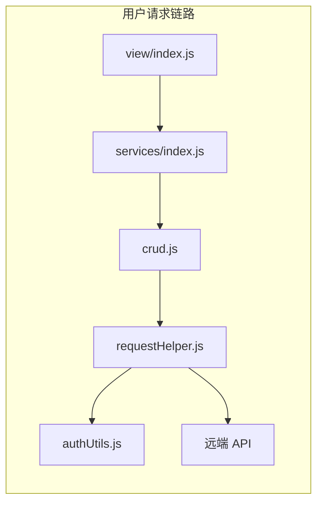
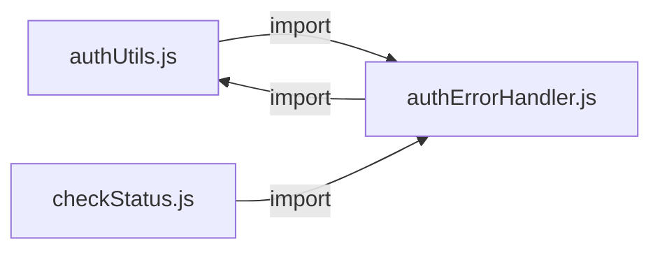

# 场景-2: 模块关系图谱

> **场景 ID**: yiweb-arch-scene-2
> **关联 FP**: FP2
> **优先级**: P0

## §0 架构设计

### 模块依赖全景



### 耦合强度标注

| 源模块 | 目标模块 | 耦合类型 | 强度 | 说明 |
|--------|---------|:------:|:---:|------|
| aicr/index.js | baseView.js | API 调用 | 强 | 通过 `createBaseView(config)` 初始化 |
| baseView.js | log.js | 工具导入 | 弱 | 仅用于日志输出 |
| requestHelper.js | authUtils.js | API 调用 | 强 | 每次请求注入 `X-Token` 头 |
| requestHelper.js | authErrorHandler.js | 条件触发 | 中 | 仅 401 时调用 |
| crud.js | requestHelper.js | 委托 | 强 | 所有 HTTP 操作委托给 requestHelper |
| checkStatus.js | authErrorHandler.js | 条件触发 | 中 | 仅 401 状态码时调用 |
| services/index.js | * | 聚合导出 | 弱 | 纯 re-export，不引入新逻辑 |
| aicr/index.js | config.js | 数据读取 | 弱 | 读取 apiUrl/dataUrl 配置 |

## §1 源码映射

### 核心依赖链



| 文件 | 导入的模块 | 被谁导入 |
|------|-----------|---------|
| `src/core/services/index.js` | helper/ + modules/ + business/ 全部 10 个模块 | 三个视图入口 |
| `src/core/services/helper/requestHelper.js` | authUtils, authErrorHandler, checkStatus, error, log | crud.js |
| `src/core/services/modules/crud.js` | requestHelper, authUtils, authErrorHandler, error, log | services/index.js |
| `src/core/services/helper/authUtils.js` | modelService (懒加载) | requestHelper, crud, authErrorHandler |
| `cdn/utils/view/baseView.js` | log, error, componentLoader | 三个视图入口 |

### 扇入/扇出 Top 5

| 模块 | 扇入 (被依赖次数) | 扇出 (依赖他人次数) | 角色 |
|------|:---:|:---:|------|
| `log.js` | 15+ | 0 | 纯被依赖（基础设施） |
| `error.js` | 8+ | 0 | 纯被依赖（基础设施） |
| `authUtils.js` | 5 | 1 (modelService 懒加载) | 主要被依赖 |
| `requestHelper.js` | 3 | 5 | 枢纽（hub） |
| `services/index.js` | 3 | 10 | 聚合门面（facade） |

## §2 实现细节

### 循环依赖检测



**发现**: `authUtils.js` ↔ `authErrorHandler.js` 存在**双向依赖**：
- `authUtils.js` 不直接 import authErrorHandler
- `authErrorHandler.js` import `authUtils.js`（`getStoredToken`, `saveToken`）
- `checkStatus.js` import `authErrorHandler.js`（`handle401Error`）
- `requestHelper.js` 同时 import 两者

**影响**: 非循环（单向），但存在共享依赖的菱形结构。ESM 的静态分析特性可安全处理。

### 懒加载模式

`authUtils.js` 对 `modelService.js` 采用动态 `import()` 懒加载，避免初始化时的循环引用风险：

```javascript
const fetchModels = async () => {
  if (!ModelService) {
    const module = await import('/src/views/aicr/utils/modelService.js?v=1');
    ModelService = module.default || module;
  }
  // ...
};
```

## §3 测试要点

| 测试维度 | 用例 | 验证点 |
|---------|------|--------|
| 导出完整性 | `services/index.js` 的 re-export 覆盖所有子模块 | 无遗漏 |
| 循环依赖 | 全量 ESM import 不触发循环依赖错误 | Node/Vitest 不报 cycle |
| 聚合门面 | `services/index.js` 只做 re-export，不新增逻辑 | 纯代理 |

## §4 复盘

| 维度 | 评估 |
|------|------|
| 模块边界 | ✅ 基础设施层与业务层清晰分离 |
| 耦合控制 | ⚠️ `authUtils` 和 `authErrorHandler` 菱形依赖可通过合并或提取接口解耦 |
| 聚合模式 | ✅ `services/index.js` 作为门面统一对外，降低视图层 import 复杂度 |
