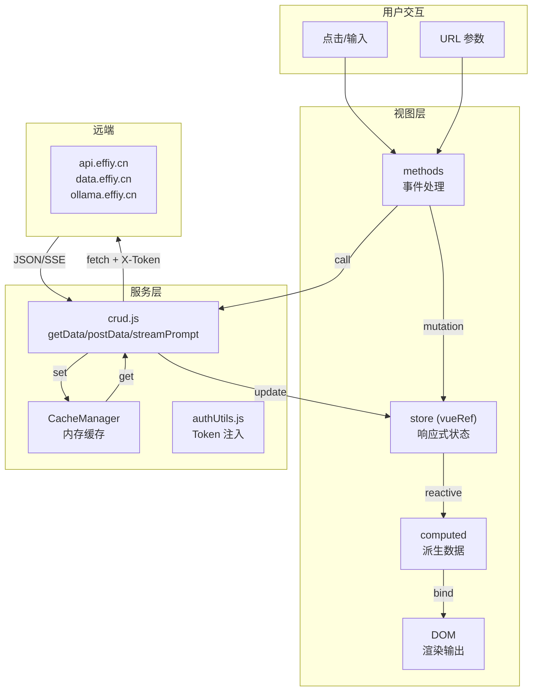
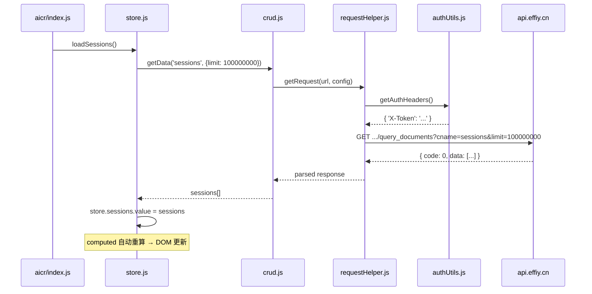
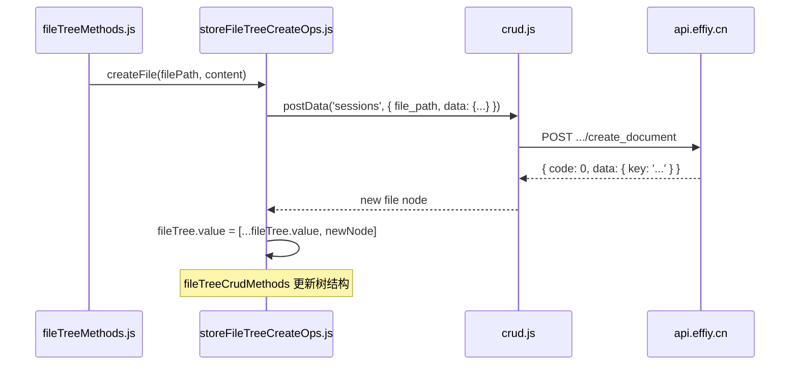
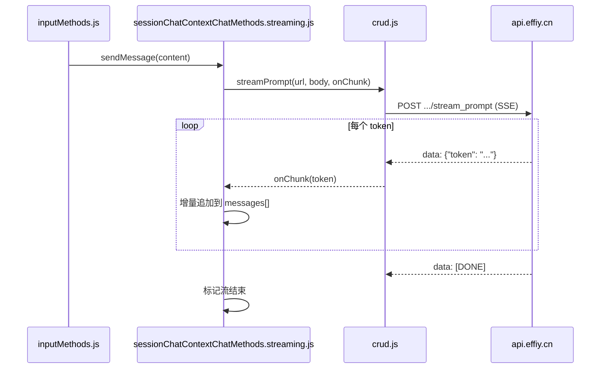
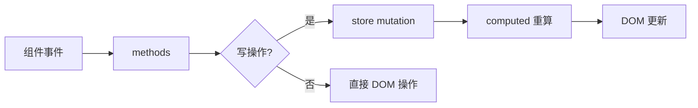

# 场景-3: 数据流转路径

> **场景 ID**: yiweb-arch-scene-3
> **关联 FP**: FP3
> **优先级**: P0

## §0 架构设计

### 主数据流全景

### 数据流分类

| 流向 | 触发源 | 途经 | 目标 | 延迟 |
|------|--------|------|------|:---:|
| 读 (Query) | 视图挂载 / URL 参数 / 用户选择 | methods → crud → requestHelper → fetch → 响应 → store mutation | DOM 更新 | 100-500ms |
| 写 (Mutation) | 用户表单提交 / 文件上传 | methods → crud → requestHelper → fetch → 响应 → store mutation | 远端持久化 + UI 反馈 | 200-2000ms |
| 流 (Stream) | AI 聊天输入 | methods → streamPrompt → fetch (SSE) → 增量 store update | 逐 token DOM 更新 | 实时 |
| 缓存 (Cache) | 重复 API 调用 | CachedRequest.get → 内存命中 / fetch 穿透 | 直接返回 | <1ms (命中) |

## §1 源码映射

### 读链路: 会话列表加载

**关键文件**: `src/views/aicr/hooks/storeSessionsOps.js` → `src/core/services/modules/crud.js` → `src/core/services/helper/requestHelper.js`

### 写链路: 文件树节点创建

**关键文件**: `src/views/aicr/hooks/storeFileTreeCreateOps.js` → `src/views/aicr/hooks/fileTreeCrudMethods.js`

### 流链路: AI 聊天

**关键文件**: `src/views/aicr/hooks/methods/inputMethods.js` → `src/views/aicr/hooks/sessionChatContextChatMethods.streaming.js` → `src/core/services/modules/crud.js`

## §2 实现细节

### 缓存策略

| 缓存层 | 位置 | TTL | 容量 | 失效策略 |
|--------|------|-----|:---:|---------|
| CachedRequest | requestHelper.js | 可配置 (默认 5min) | 按 key | TTL 过期自动穿透 |
| CacheManager | crud.js | 5min | 100 条 | LRU + 定时清理 |
| 模板缓存 | componentLoader.js | 永久 | 内存 Map | 无（版本号 v1 控制） |
| ESM 模块缓存 | 浏览器 | 永久 | — | URL 查询参数 `?v=1` 刷新 |

### 状态变更约束

**铁律**: 跨组件禁止直接修改 `vueRef`。所有状态变更必须走 store mutation。

## §3 测试要点

| 测试维度 | 用例 | 验证点 |
|---------|------|--------|
| 读链路 | mock fetch 返回 sessions，验证 store 更新 | 数据从 API 到 store 的完整性 |
| 写链路 | mock fetch 返回 success，验证树节点创建 | 乐观更新 / 回滚逻辑 |
| 流链路 | mock SSE 事件流，验证逐 token 追加 | onChunk 调用次数 = token 数 |
| 缓存 | 同 URL 请求两次，fetch 只调用一次 | TTL 内命中 |

## §4 复盘

| 维度 | 评估 |
|------|------|
| 数据流清晰度 | ✅ 读写流三链路可追溯至具体函数 |
| 缓存策略 | ✅ 多层缓存，按场景选型（内存/模板/模块） |
| 待改进 | streamPrompt 无断线重连机制；写操作无乐观更新 |
