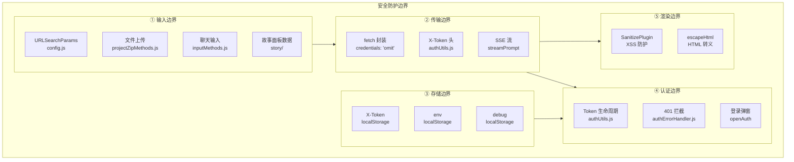
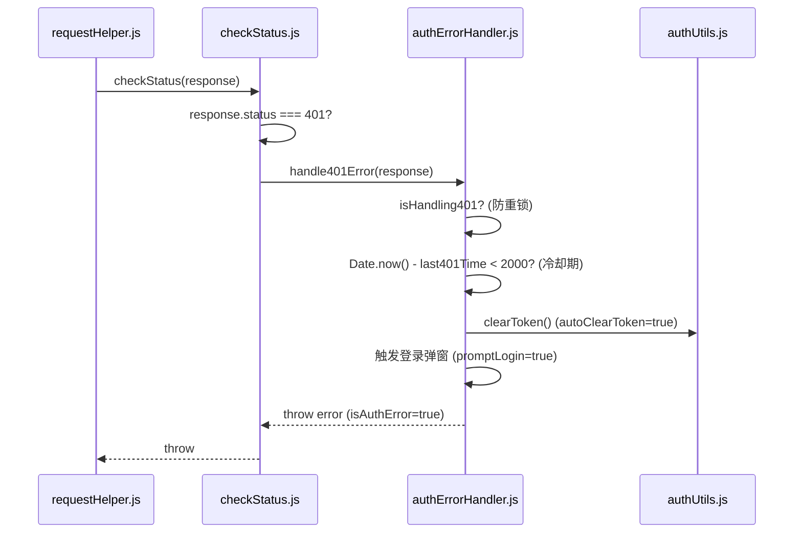
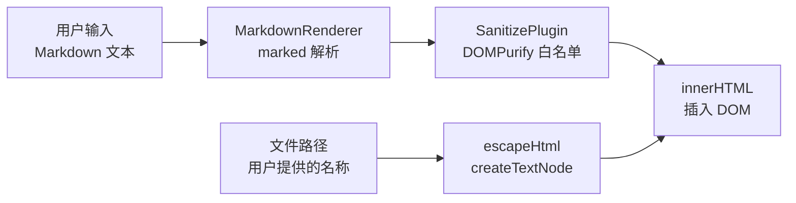

# 场景-4: 安全防护边界

> **场景 ID**: yiweb-arch-scene-4
> **关联 FP**: FP4
> **优先级**: P1

## §0 架构设计

### 安全边界总览



### 安全控制点矩阵

| 边界 | 控制点 | 文件 | 机制 | 威胁模型 |
|------|--------|------|------|---------|
| 输入 | URL 参数解析 | `src/core/config.js` | URLSearchParams 读取 → 严格比较 (`===`) | 参数注入 |
| 输入 | 文件上传 | `src/views/aicr/hooks/projectZipMethods.js` | JSZip 解压 → 文件名过滤 | 路径穿越 |
| 输入 | 聊天输入 | `src/views/aicr/hooks/methods/inputMethods.js` | 字符串 trim + 长度限制 | 超长输入 DoS |
| 传输 | fetch 凭据 | `src/core/services/helper/requestHelper.js` | `credentials: 'omit'` 硬编码 | CSRF / Cookie 泄露 |
| 传输 | 认证头 | `src/core/services/helper/authUtils.js` | `X-Token` 自定义头 | Session 劫持 |
| 存储 | Token | `localStorage` | `YiWeb.apiToken.v1` key | XSS 读取 token |
| 存储 | 环境配置 | `localStorage` | `env` / `debug` key | 环境篡改 |
| 认证 | 401 拦截 | `src/core/services/helper/authErrorHandler.js` | 冷却期 2s + 防重复锁 | 暴力重试 |
| 认证 | 登录弹窗 | `src/core/services/helper/authUtils.js` | `<dialog>` 遮罩 + showModal | 点击劫持 |
| 渲染 | Markdown XSS | `cdn/markdown/plugins/SanitizePlugin.js` | HTML 标签白名单 | 存储型 XSS |
| 渲染 | HTML 转义 | DOM `createTextNode` | 浏览器原生转义 | DOM XSS |

## §1 源码映射

### 401 处理流程



### XSS 防护链



**SanitizePlugin 白名单策略**: 允许标准 Markdown 标签（h1-h6, p, ul, ol, li, a, code, pre, table, etc.），禁止 `<script>`, `<iframe>`, `on*` 事件属性。

### 凭据隔离

```javascript
// src/core/services/helper/requestHelper.js — 硬编码凭据策略
const DEFAULT_CONFIG = {
  mode: 'cors',
  credentials: 'omit'  // ← 永不带 Cookie
};
```

## §2 实现细节

### Token 存储安全评估

| 风险 | 等级 | 缓解 | 残余风险 |
|------|:---:|------|---------|
| XSS 读取 localStorage | 中 | CSP 未配置；依赖代码审查 | 如存在 DOM XSS 可读取 token |
| Token 明文存储 | 低 | 无加密；依赖 HTTPS 传输安全 | 本地物理访问可读取 |
| Token 泄漏到日志 | 低 | logInfo 在 prod 模式下关闭 | debug 模式开启时有风险 |

### 认证错误防抖

```javascript
// authErrorHandler.js
let isHandling401 = false;
let last401Time = 0;
const HANDLE_401_COOLDOWN = 2000; // 2秒冷却期

// 防止并发 401 触发多次登录弹窗
if (isHandling401) return;
if (Date.now() - last401Time < HANDLE_401_COOLDOWN) return;
```

## §3 测试要点

| 测试维度 | 用例 | 验证点 |
|---------|------|--------|
| Token 存储 | saveToken → getStoredToken 往返 | localStorage key 正确 |
| 401 防抖 | 并发 3 次 401，只弹 1 次登录窗 | 冷却锁生效 |
| XSS | `<script>alert(1)</script>` 被转义 | escapeHtml 输出无 `<script>` |
| 凭据 | 所有 fetch 调用 `credentials: 'omit'` | 抓包验证无 Cookie |

## §4 复盘

| 维度 | 评估 |
|------|------|
| 安全深度 | ✅ 5 层边界覆盖全面 |
| 配置安全 | ⚠️ CSP 头缺失，建议在静态服务器配置中添加 |
| Token 管理 | ✅ 自定义头 + 凭据隔离 + 401 防抖三重保护 |
