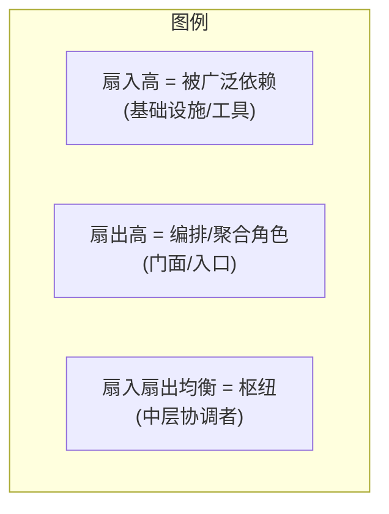
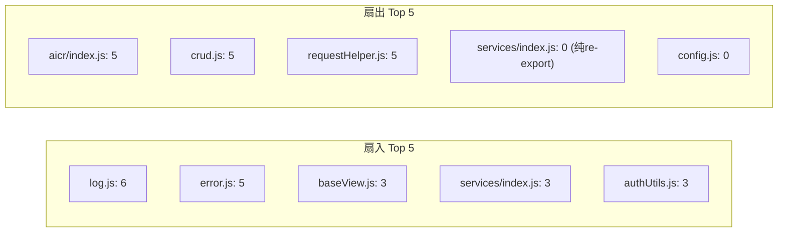
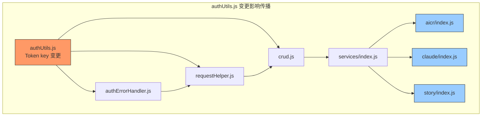
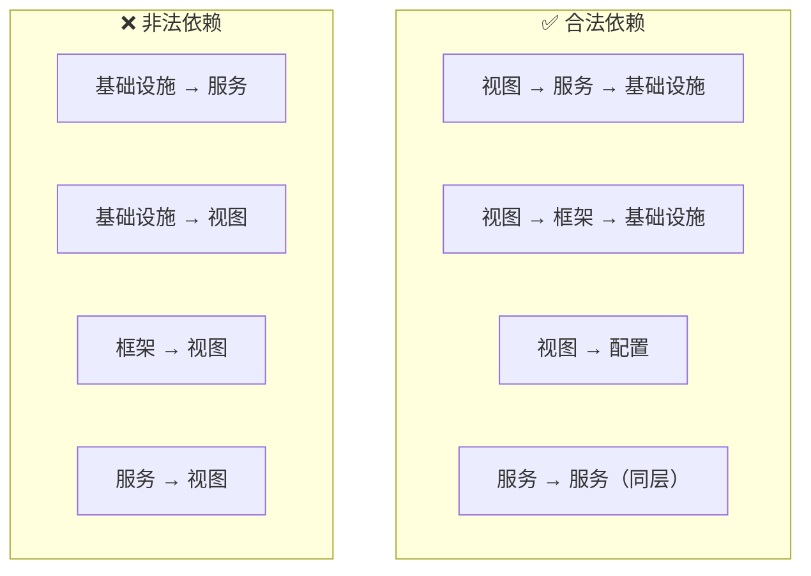

# 场景-5: 依赖关系矩阵

> **场景 ID**: yiweb-arch-scene-5
> **关联 FP**: FP5
> **优先级**: P1

## §0 架构设计

### 扇入/扇出矩阵

### 核心模块依赖矩阵

| 模块 (行依赖列) | log | error | authUtils | authErr | reqHelper | crud | baseView | config | svcIndex |
|:---|---:|:---:|:---:|:---:|:---:|:---:|:---:|:---:|:---:|
| **log.js** | — | · | · | · | · | · | · | · | · |
| **error.js** | · | — | · | · | · | · | · | · | · |
| **authUtils.js** | · | · | — | · | · | · | · | · | · |
| **authErrorHandler.js** | · | · | ✅ | — | · | · | · | · | · |
| **checkStatus.js** | ✅ | · | · | ✅ | · | · | · | · | · |
| **requestHelper.js** | ✅ | ✅ | ✅ | ✅ | — | · | · | · | · |
| **crud.js** | ✅ | ✅ | ✅ | ✅ | ✅ | — | · | · | · |
| **baseView.js** | ✅ | ✅ | · | · | · | · | — | · | · |
| **config.js** | · | · | · | · | · | · | · | — | · |
| **services/index.js** | · | · | · | · | · | · | · | · | — |
| **aicr/index.js** | ✅ | ✅ | · | · | · | · | ✅ | ✅ | ✅ |
| **claude/index.js** | · | · | · | · | · | · | ✅ | · | ✅ |
| **story/index.js** | · | · | · | · | · | · | ✅ | · | ✅ |
| **componentLoader.js** | · | ✅ | · | · | · | · | · | · | · |

> ✅ = 存在依赖  · = 无依赖  — = 自身

### 统计数据

### 稳定性指标

| 指标 | 值 | 说明 |
|------|:--:|------|
| 总模块数 | 14 (核心) | 不含组件内部模块和渲染插件 |
| 依赖边总数 | 28 | 有向边 |
| 平均扇入 | 2.0 | 每个模块平均被 2 个模块依赖 |
| 平均扇出 | 2.0 | 每个模块平均依赖 2 个模块 |
| 循环依赖 | 0 | 无有向环 |
| 最深依赖链 | 4 | aicr/index.js → crud.js → requestHelper.js → authUtils.js |
| 不稳定度最高 | crud.js (I=1.0) | 扇出 5，扇入 1 |
| 稳定度最高 | log.js (I=0.0) | 扇出 0，扇入 6 |

> 不稳定度 I = FanOut / (FanIn + FanOut)，0 = 最稳定，1 = 最不稳定。

## §1 源码映射

### 变更影响半径

| 变更模块 | 直接影响 | 间接影响 | 风险等级 |
|---------|---------|---------|:---:|
| **log.js** | — | 全部 6 个依赖者 | 🟢 低（接口稳定） |
| **error.js** | — | 全部 5 个依赖者 | 🟢 低（接口稳定） |
| **authUtils.js** | authErrorHandler | requestHelper, crud, services/index.js | 🟡 中（Token key 变更影响全链路） |
| **requestHelper.js** | crud.js | services/index.js, 三个视图 | 🟡 中（fetch 配置变更影响全量请求） |
| **baseView.js** | — | 三个视图入口 | 🔴 高（视图工厂接口变更影响全部视图） |
| **config.js** | — | aicr/index.js | 🟢 低（仅环境 URL 变更） |
| **crud.js** | — | services/index.js, 三个视图 | 🟡 中（CRUD 接口变更影响数据操作） |
| **services/index.js** | — | 三个视图入口 | 🟢 低（纯 re-export） |

### 变更传播路径

## §2 实现细节

### 依赖方向约束

### 版本化导入

项目中存在 `?v=1` 查询参数的 import，用于缓存刷新：

| 文件 | import 路径 |
|------|-----------|
| services/index.js | `./helper/authUtils.js?v=1` |
| requestHelper.js | `./authUtils.js?v=1` |
| crud.js | `../helper/authUtils.js?v=1` |
| authUtils.js | `/src/views/aicr/utils/modelService.js?v=1` |

**注意**: Vitest 模块解析会忽略查询参数，测试中模块会被缓存。

## §3 测试要点

| 测试维度 | 用例 | 验证点 |
|---------|------|--------|
| 无循环依赖 | 全量 import 无 cycle error | ESM 静态分析 |
| 依赖方向 | 基础设施层不 import 视图/服务层 | 分层合规 |
| 变更影响 | 修改 authUtils token key 后运行全量测试 | 影响范围 = 理论传播路径 |
| 版本一致性 | `?v=1` 的模块版本号统一 | 避免混用版本 |

## §4 复盘

| 维度 | 评估 |
|------|------|
| 整体健康度 | ✅ 无循环依赖，分层单向，平均扇入 2.0 |
| 风险点 | ⚠️ `baseView.js` 的接口变更影响全部视图，缺乏适配层 |
| 优化建议 | 为 `baseView.js` 的 config 参数增加默认值 + 版本兼容检测 |
