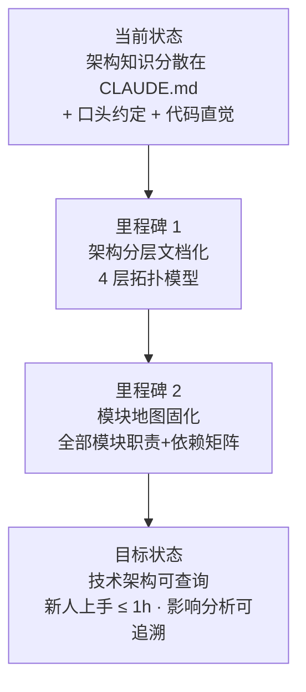
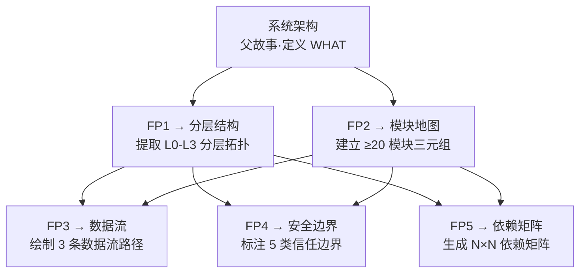

# YiWeb-系统架构 · 故事任务

> v1.1.0 | 2026-05-28 | deepseek-v4-pro | feat/系统架构

> **导航**: [→ 场景1-模块定位.md](./场景1-模块定位.md) · **子故事**: [layers](../分层结构/故事任务.md) · [modules](../模块地图/故事任务.md) · [dataflow](../数据流/故事任务.md) · [security](../安全边界/故事任务.md) · [deps](../依赖矩阵/故事任务.md)
  [子故事](#子故事) · [§1 Story](#sec1) · [§2 Requirements](#sec2) · [§3 成功标准](#sec3) · [§4 范围边界](#sec4) · [§5 AC](#sec5) · [§6 风险与假设](#sec6) · [§7 跨文档索引](#sec7)

### 需求概述

YiWeb 作为一个零构建的浏览器原生 ESM 单页应用，采用自研 `createBaseView` 视图框架，包含 3 个独立视图（aicr / claude / story）和 CDN 基础设施层。将系统架构知识固化为可查询、可验证的文档基线，确保团队成员能快速理解系统结构、模块职责和依赖关系。

### 效果示意

### 主要价值

- 🏗️ 架构分层可视化 — 视图层→核心服务层→CDN 基础设施层，依赖规则明确
- 🗺️ 模块地图可查询 — 每个模块的入口文件、核心依赖、下游消费者一目了然
- 🔗 依赖链可追溯 — import 图 + 数据流 + 认证链，影响分析有据可依
- 🔒 信任边界显式化 — 安全面、认证边界、第三方依赖独立建模

---

## 子故事

> 以下 5 个子故事从 §2 的 5 个功能点拆分而来，每个子故事独立走 rui 管线（doc → code），拥有完整的 4 文档基线。

| FP# | 子故事 | 目录 | 优先级 | 依赖 |
|-----|--------|------|:---:|------|
| FP1 | 提取系统分层结构 | [分层结构](../分层结构/故事任务.md) | P0 | — |
| FP2 | 建立模块关系图谱 | [模块地图](../模块地图/故事任务.md) | P0 | layers |
| FP3 | 绘制数据流转路径 | [数据流](../数据流/故事任务.md) | P1 | layers, modules |
| FP4 | 标注安全防护边界 | [安全边界](../安全边界/故事任务.md) | P0 | layers, modules |
| FP5 | 生成依赖关系矩阵 | [依赖矩阵](../依赖矩阵/故事任务.md) | P1 | layers, modules |

**协作模式**：父故事定义架构提取的 WHAT（需要提取什么），子故事定义 HOW（具体怎么提取、怎么验证）。子故事间按依赖顺序串行：`layers` + `modules` 优先 → `dataflow` / `security` / `deps` 依赖前两者产出。

---

## §1 Story

### Story 1: 系统架构知识固化

作为 开发者，我想要 查阅 YiWeb 的系统架构文档，以便 理解视图层、核心服务层、CDN 层的分层结构和依赖规则。优先级 P0。范围边界：覆盖 YiWeb 全部架构层次（视图层/服务层/CDN 层/部署拓扑），不涉及其他项目。依赖：CLAUDE.md、项目源码可访问。

#### 范围外

- 不涉及源码修改
- 不涉及新功能设计
- 不涉及性能测试数据

#### §1.1 User Operations

| # | 操作 | 触发条件 | 操作步骤 | 预期结果 |
|---|------|---------|---------|---------|
| 1 | 查询架构分层 | 开发者需要定位功能所属层次 | 打开技术评审 → 查看 §1 架构分层 | 理解 4 层模型和层间依赖规则 |
| 2 | 追踪数据流 | 调试数据从 UI 到 API 的完整路径 | 打开技术评审 → 查看 §3 数据流架构 | 看清用户交互→状态更新→API 调用→缓存→响应 全链路 |
| 3 | 了解认证机制 | 排查 401 错误 | 打开技术评审 → 查看 §4 认证架构 | 理解 Token 生命周期和 401 处理流程 |
| 4 | 查看技术栈 | 评估技术方案 | 打开技术评审 → 查看 §5 技术栈总览 | 了解全部技术选型和约束 |

---

### Story 2: 模块地图固化

作为 开发者，我想要 查询任意模块的职责、依赖和下游消费者，以便 评估代码变更的影响范围。优先级 P0。范围边界：覆盖 YiWeb 全部模块（3 视图 + 核心服务层 + CDN 层），不涉及外部系统。依赖：Story 1 完成，项目源码可访问。

#### 范围外

- 不涉及模块内部实现细节
- 不涉及运行时性能数据

#### §1.1 User Operations

| # | 操作 | 触发条件 | 操作步骤 | 预期结果 |
|---|------|---------|---------|---------|
| 1 | 查找模块职责 | 需要修改某模块前了解其职责 | 查看模块职责矩阵 | 获取模块类型、行数、职责说明、关键产出 |
| 2 | 查询模块依赖 | 评估修改某文件的影响范围 | 查看模块依赖图 + 依赖矩阵 | 获取该模块的所有上游依赖方和下游消费者 |
| 3 | 新人上手 | 首次接触项目 | 查看完整目录树 → 模块职责矩阵 → 依赖图 | 1 小时内理解项目整体结构 |

---

## §2 Requirements

### 功能点

| FP# | 描述 | 子故事 | 优先级 |
|-----|------|--------|:---:|
| FP1 | 架构分层文档 — 文档化 YiWeb 的 4 层架构拓扑 | [分层结构](../分层结构/故事任务.md) | P0 |
| FP2 | 运行时架构文档 — 文档化从 HTML 加载到 DOM 挂载的完整启动链 | [分层结构](../分层结构/故事任务.md) | P0 |
| FP3 | 数据流架构文档 — 文档化用户交互→状态更新→API→缓存→响应 全链路 | [数据流](../数据流/故事任务.md) | P0 |
| FP4 | 认证架构文档 — 文档化 Token 生命周期和 401 处理流程 | [安全边界](../安全边界/故事任务.md) | P0 |
| FP5 | 技术栈总览 — 汇总全部技术选型、版本和约束 | [分层结构](../分层结构/故事任务.md) | P0 |
| FP6 | 部署架构文档 — 文档化 local/prod 双环境部署拓扑 | [分层结构](../分层结构/故事任务.md) | P0 |
| FP7 | 模块目录树 — 完整项目目录结构含模块标注 | [模块地图](../模块地图/故事任务.md) | P0 |
| FP8 | 模块依赖矩阵 — 所有模块间的依赖关系表 | [依赖矩阵](../依赖矩阵/故事任务.md) | P1 |

### 业务规则

| R# | 描述 | 校验方式 | 证据级别 |
|----|------|---------|---------|
| R1 | 架构文档必须基于源码事实，不可凭空编造 | grep 关键文件验证文档中的路径和接口名 | A |
| R2 | 层间依赖必须是单向的（上层依赖下层，禁止反向） | 检查 import 方向 | A |
| R3 | 每个模块必须有明确的入口文件路径 | 检查文件是否存在 | A |
| R4 | 技术栈条目必须有对应的源码证据 | 检查 import / CDN 链接 | A |

### 数据约束

| 约束 | 类型 | 范围/格式 | 来源 |
|------|------|----------|------|
| 模块名称 | string | 小写字母，与目录名一致 | 项目目录结构 |
| 架构层次 | enum | 视图层 / 核心服务层 / CDN 基础设施层 | CLAUDE.md |
| 模块类型 | enum | 视图 / 服务 / 组件 / 引擎 / 工具 / 样式 / 配置 | 模块职责 |
| 依赖方向 | string | `模块A → 模块B` | import 分析 |

---

## §3 成功标准

| SC# | 描述 | 度量方式 | 目标值 | 优先级 | 关联 FP# |
|-----|------|---------|--------|--------|---------|
| SC1 | 架构分层文档覆盖全部层次 | 检查技术评审.md 架构分层章节 | 4 层全部覆盖 | P0 | FP1 |
| SC2 | 数据流链路从用户交互到 API 响应完整可追踪 | mermaid 图节点完整性检查 | 无断裂链路 | P0 | FP3 |
| SC3 | 模块地图覆盖全部已知模块 | 目录扫描 vs 文档条目对比 | 100% 覆盖 | P0 | FP7 |
| SC4 | 新人可通过文档在 1 小时内理解项目结构 | 新人上手场景测试 | ≤ 1 小时 | P1 | FP7, FP8 |

---

## §4 范围边界

### 范围内

| # | 条目 | 关联 FP# | 边界说明 |
|---|------|---------|---------|
| 1 | YiWeb 全部架构层次文档化 | FP1–FP6 | 视图层 + 核心服务层 + CDN 层 + 部署拓扑 |
| 2 | 全部模块的职责与依赖关系 | FP7, FP8 | 3 视图 + 服务层 + CDN 组件/工具 |
| 3 | 架构参考场景 | — | 模块定位 + 数据流追踪 + 新人上手 + 依赖变更 |

### 范围外

| # | 条目 | 排除原因 | 替代方案 |
|---|------|---------|---------|
| 1 | 后端 API 实现细节 | YiWeb 是纯前端项目 | — |
| 2 | CDN 部署配置 | 属于运维层面 | — |
| 3 | 性能基准数据 | 需实际测量 | 后续补充 |

---

## §5 AC

| AC# | Given | When | Then | 门禁 |
|-----|-------|------|------|------|
| AC1 | 开发者需要理解系统分层 | 查阅技术评审.md §1 | 看到 4 层架构图 + 层间依赖规则表 | Gate A |
| AC2 | 开发者需要追踪数据流 | 查阅技术评审.md §3 | 看到从 UI→状态→API→缓存→响应 的完整 mermaid 图 | Gate A |
| AC3 | 新人需要了解项目结构 | 查阅模块地图 | 看到完整目录树 + 每个模块的职责和依赖 | Gate A |
| AC4 | 开发者需要评估变更影响 | 查询依赖矩阵 | 看到任意模块的上游依赖方和下游消费者 | Gate A |
| AC5 | 架构文档需要保持准确 | 每次架构变更后 | 更新对应文档并追加变更记录 | Gate B |

---

## §6 风险与假设

| # | 风险/假设 | 类型 | 可能性 | 影响 | 缓解/验证策略 | 关联 FP# |
|---|----------|------|--------|------|-------------|---------|
| 1 | 架构文档与代码不同步导致误导 | 风险 | M | H | 每次架构变更后走 /rui update 更新文档 | FP1–FP8 |
| 2 | 模块地图遗漏新增模块 | 风险 | M | M | 定期扫描目录结构 vs 文档条目 | FP7 |
| 3 | 依赖关系分析不完整 | 风险 | M | M | 使用 grep 验证 import 语句 | FP8 |
| 4 | CLAUDE.md 包含足够的架构描述 | 假设 | — | — | 已验证 CLAUDE.md 含项目画像 + 执行准则 | FP1 |
| 5 | 源码结构反映了实际架构 | 假设 | — | — | 已验证目录结构与架构分层一致 | FP1 |

---

## §7 跨文档索引

| 本文档章节 | 基线内容 | 下游文档编号 | 预期覆盖 | 状态 |
|-----------|---------|-------------|---------|------|
| Story 1 | 系统架构知识固化 | 技术评审.md §1–§6 | 架构分层/运行时/数据流/认证/技术栈/部署 | ✅ |
| Story 2 | 模块地图固化 | 技术评审.md §8 | 目录树/职责矩阵/依赖图 | ✅ |
| AC# | 验收标准 | 测试设计.md | 四类测试用例覆盖全部 AC# | ✅ |
| R2 单向依赖 | 安全约束 | 安全审计.md | 信任边界验证 | ✅ |
| 子故事 FP1 | 提取分层结构 | [分层结构](../分层结构/故事任务.md) | 4 文档基线 | ✅ |
| 子故事 FP2 | 建立模块地图 | [模块地图](../模块地图/故事任务.md) | 4 文档基线 | ✅ |
| 子故事 FP3 | 绘制数据流 | [数据流](../数据流/故事任务.md) | 4 文档基线 | ✅ |
| 子故事 FP4 | 标注安全边界 | [安全边界](../安全边界/故事任务.md) | 4 文档基线 | ✅ |
| 子故事 FP5 | 生成依赖矩阵 | [依赖矩阵](../依赖矩阵/故事任务.md) | 4 文档基线 | ✅ |

---

> **变更记录**
> | 日期 | 变更 | 触发 | 证据 |
> |------|------|------|------|
> | 2026-05-28 | v1.1.0 — 新增子故事节、FP→子故事映射表、依赖关系图、跨文档索引补充 5 子故事链接 | /rui update | 5 子故事目录 + 父故事 FP# 映射 |
> | 2026-05-26 | 基线化 — 从 技术架构.md 和 模块地图.md 重组为故事目录 | /rui init arch 步骤 | CLAUDE.md + 技术架构.md + 模块地图.md |
