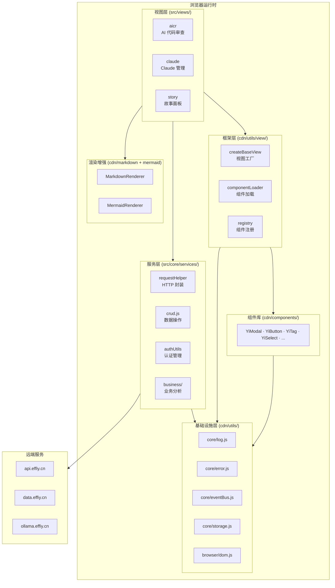

# 系统架构

> **Story ID**: yiweb-arch
> **版本**: v1.1.0
> **状态**: 文档基线
> **创建日期**: 2026-06-03
> **父故事**: —

## 概述

系统化梳理 YiWeb 的架构全貌：分层结构、模块关系、数据流转、安全边界、依赖矩阵。作为项目知识固化的起點，所有后续故事的技术决策均以此文档为事实基线。

## 系统架构总览

## 功能点 (FP)

| # | 功能点 | 描述 | 优先级 |
|---|--------|------|:------:|
| FP1 | 提取系统分层结构 | 识别并文档化 YiWeb 的 5 个运行时层次：视图层 → 框架层 → 服务层 → 基础设施层 → 渲染增强层 | P0 |
| FP2 | 建立模块关系图谱 | 绘制各层模块间的导入/调用/依赖关系，标注耦合强度与方向 | P0 |
| FP3 | 绘制数据流转路径 | 追踪用户操作→API 请求→响应处理→状态变更→DOM 更新的完整链路 | P0 |
| FP4 | 标注安全防护边界 | 定位 XSS 防护/Token 管理/401 拦截/凭据隔离等安全控制点 | P1 |
| FP5 | 生成依赖关系矩阵 | 计算模块扇入/扇出、循环依赖检测、变更影响半径 | P1 |

## 验收标准 (AC)

| # | 验收标准 | 关联 FP |
|---|---------|---------|
| AC1 | 分层结构图覆盖全部运行时模块，无遗漏 | FP1 |
| AC2 | 模块关系图标注的依赖方向与源码一致 | FP2 |
| AC3 | 数据流路径可追溯到具体源码文件和函数 | FP3 |
| AC4 | 安全边界标注覆盖 CLAUDE.md 安全面全部 5 类 | FP4 |
| AC5 | 依赖矩阵含全量模块的扇入/扇出计数 | FP5 |

## 成功标准 (SC)

| # | 成功标准 | 度量方式 |
|---|---------|---------|
| SC1 | 文档被 CLAUDE.md / README.md 引用 | 交叉链接验证 |
| SC2 | 新人可从架构文档还原项目全貌 | 盲测：只看文档画架构图 |
| SC3 | 知识图谱可被 story 面板加载展示 | 导入远端后 API 查询 |

## 风险

| 风险 | 等级 | 缓解措施 |
|------|:---:|---------|
| 文档与源码不同步 | 低 | 绑定 CLAUDE.md 版本号；源码变更后触发增量刷新 |
| 架构图过于抽象 | 低 | 每张图标注对应源码路径，mermaid 节点可追溯 |

## 场景列表

| # | 场景 | 文档 | 状态 |
|---|------|------|:---:|
| 1 | 分层结构 | 场景-1-分层结构.md | 📝 |
| 2 | 模块关系图谱 | 场景-2-模块关系图谱.md | 📝 |
| 3 | 数据流转路径 | 场景-3-数据流转路径.md | 📝 |
| 4 | 安全防护边界 | 场景-4-安全防护边界.md | 📝 |
| 5 | 依赖关系矩阵 | 场景-5-依赖关系矩阵.md | 📝 |
