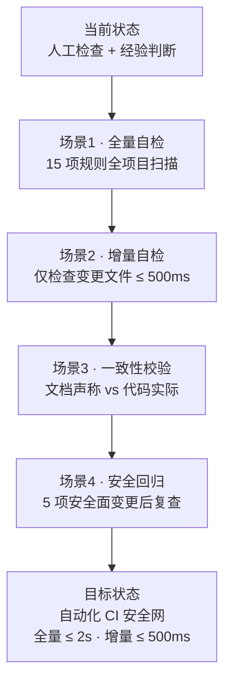

# YiWeb 自主测试方案 · 故事任务

> v3.0.0 | 2026-05-31 | deepseek-v4-pro | feat/traceability-graph

> **关联故事**: [← 系统架构](../系统架构/故事任务.md) · **导航**: [→ 场景1-全量自检](./场景1-全量自检.md) · [→ 场景2-增量自检](./场景2-增量自检.md) · [→ 场景3-一致性校验](./场景3-一致性校验.md) · [→ 场景4-安全回归](./场景4-安全回归.md)
  [场景导航](#场景导航) · [§1 Story](#sec1) · [§2 Requirements](#sec2) · [§3 成功标准](#sec3) · [§4 范围边界](#sec4) · [§5 AC](#sec5) · [§6 风险与假设](#sec6) · [§7 跨文档索引](#sec7)

### 需求概述

YiWeb 自主测试方案（下称"自检方案"）是项目级健康检查策略，用于在 rui 工作流的各个阶段自动验证项目基线是否完整、一致、合规。自检方案不依赖任何后端服务或第三方工具，仅在浏览器环境或 Node.js 环境中执行文件级与结构级校验。它是 rui 管道的**安全网**，确保每一次 `init` / `code` / `review` / `update` 操作都在可靠的基线上运行。

### 效果示意

### 主要价值

- 🔍 全量自检 — 15 项规则覆盖文档/代码/配置/安全/分支/版本，项目初始化后一次性验证
- ⚡ 增量自检 — 仅扫描变更文件，提交前快速反馈，杜绝破损基线进入版本历史
- 📋 一致性校验 — 文档声称的模块清单与代码实际目录双向对比，发现遗漏或过期条目
- 🔒 安全回归 — 安全相关变更后自动触发 5 项检查，高风险阻断、低风险记录
- 🔗 全链路覆盖 — 将文档、分支、版本、安全面串联为统一的规则网，避免孤立检查导致盲区

---

## 场景导航

> 4 个场景覆盖了从全量基线验证到增量快速反馈、从文档一致性到安全回归的完整自检链路。

| # | 场景 | 文件 | 角色 | 触发时机 |
|:---:|------|------|------|---------|
| 1 | 全量自检 | [场景1-全量自检.md](./场景1-全量自检.md) | 项目管理者 | `rui init` 后、版本升级后 |
| 2 | 增量自检 | [场景2-增量自检.md](./场景2-增量自检.md) | 功能开发者 | `git commit` 前 |
| 3 | 一致性校验 | [场景3-一致性校验.md](./场景3-一致性校验.md) | 评审者 | 技术评审前、定期任务 |
| 4 | 安全回归 | [场景4-安全回归.md](./场景4-安全回归.md) | 测试者 | 安全相关代码变更后 |

---

## §1 Story

### §1.1 用户角色

自检方案的主要"用户"是 rui 管道调度器（pm Agent）和各阶段 agent（coder / reviewer / tester）。人类开发者通过 rui 命令间接触发自检，不直接调用检查脚本。

| 角色 | 场景 | 操作 | 触发时机 |
|------|:---:|------|---------|
| pm Agent | 场景1 | `rui init` 后执行全量自检 | 每次项目初始化 |
| coder Agent | 场景2 | `git commit` 前执行增量自检 | 每次编码完成 |
| reviewer Agent | 场景3 | 文档→代码一致性校验 | 技术评审前 |
| tester Agent | 场景4 | 安全面回归自检 | 安全相关变更后 |

### §1.2 15 项检查规则

| ID | 类别 | 优先级 | 阻断 | 检查内容 | 所属场景 |
|----|------|:---:|:---:|------|:---:|
| claude-completeness | document | P0 | 是 | 项目说明是否包含五大标记段 | 场景1 |
| readme-domain | document | P0 | 是 | 项目说明书是否包含 ≥3 个领域术语 | 场景1 |
| story-structure | structure | P0 | 是 | 每个故事目录是否包含完整基线文档 | 场景1 |
| story-fmeta | document | P0 | 是 | 每个文档是否包含完整版头 | 场景1 |
| story-nav | document | P0 | 是 | 文档导航是否对齐且链接有效 | 场景1 |
| story-changelog | document | P0 | 是 | 每个文档底部是否包含变更记录表 | 场景1 |
| cross-ref-valid | document | P0 | 是 | 文档内相对链接指向的文件是否存在 | 场景1, 场景3 |
| stale-ref | document | P1 | 否 | 文档引用的外部文件版本号是否过期 | 场景1, 场景3 |
| branch-isolation | branch | P0 | 是 | 当前分支是否为规范格式且从 main 分出 | 场景1, 场景2 |
| version-consistency | version | P0 | 是 | 各处版本号是否一致 | 场景1, 场景3 |
| arch-layer | structure | P0 | 是 | 视图层是否违规直接引用基础设施层 | 场景1, 场景2 |
| security-no-secrets | security | P0 | 是 | 代码中无硬编码密钥或密码 | 场景1, 场景2, 场景4 |
| security-fetch-credentials | security | P0 | 是 | 所有网络请求是否设置安全凭证模式 | 场景1, 场景2, 场景4 |
| security-no-raw-log | security | P1 | 否 | 无裸日志调用 | 场景1, 场景2, 场景4 |
| config-env | structure | P0 | 是 | 环境配置仅支持规定的两种环境名 | 场景1, 场景2 |

### §1.3 执行模式

| 模式 | 适用场景 | 策略 |
|------|---------|------|
| 顺序模式 | Gate A 前置检查 | 按注册表顺序执行，遇阻断立即中断 |
| 并行模式 | 全量自检 | 同类别内并发执行 |
| 降级模式 | 部分工具不可用 | 跳过不可用检查项，标记原因 |

---

## §2 Requirements

### FP1: 全量自检执行器

| 属性 | 值 |
|------|-----|
| 功能点 | FP1 |
| 场景 | 场景1 · 全量自检 |
| 描述 | 提供全项目 15 项规则的全量扫描，输出通过/失败明细和修复指引 |
| AC | 见 §5 AC1-AC4 |

### FP2: 增量自检执行器

| 属性 | 值 |
|------|-----|
| 功能点 | FP2 |
| 场景 | 场景2 · 增量自检 |
| 描述 | 基于 `git diff` 识别变更文件，仅检查受影响规则，快速反馈 |
| AC | 见 §5 AC5-AC7 |

### FP3: 一致性校验器

| 属性 | 值 |
|------|-----|
| 功能点 | FP3 |
| 场景 | 场景3 · 一致性校验 |
| 描述 | 文档声称的模块清单与代码实际目录双向对比，识别遗漏或过期条目 |
| AC | 见 §5 AC8-AC10 |

### FP4: 安全回归执行器

| 属性 | 值 |
|------|-----|
| 功能点 | FP4 |
| 场景 | 场景4 · 安全回归 |
| 描述 | 安全相关变更后自动触发 5 项安全检查，高风险阻断、低风险记录 |
| AC | 见 §5 AC11-AC13 |

### 业务规则

| 编号 | 规则 |
|------|------|
| BR1 | P0 阻断项必须全部通过方可通过 Gate；失败时输出明确的修复指引 |
| BR2 | 增量模式的文件变更检测基于 `git diff --name-only`（缓存区 + 工作区） |
| BR3 | 自检结果写入标准化报告（JSON 格式），保留最近 10 次历史记录 |
| BR4 | 禁用手动跳过自检 —— 除非环境变量 `YIWEB_SKIP_SELF_TEST=1`（仅限紧急情况，记录警告日志） |
| BR5 | 一致性校验为告警模式（Gate B），不阻断管道；差异数 > 0 时输出清单但允许继续 |

### 数据约束

| 编号 | 约束 |
|------|------|
| DC1 | 单个自检报告大小不超过 1MB |
| DC2 | 历史报告保留最近 10 份，超出自动清理 |
| DC3 | 检查规则以 JSON 配置文件形式定义，不硬编码在脚本中 |

---

## §3 成功标准

| 编号 | 标准 | 度量方式 |
|------|------|---------|
| SC1 | 全量自检在包含 200+ 文件的项目中，执行时间不超过 2 秒 | 计时 |
| SC2 | 增量自检仅检查实际变更的文件（不扫描全项目），耗时 ≤ 500ms（≤20 文件） | 日志确认 + 计时 |
| SC3 | 自检脚本本身不引入任何外部依赖（npm/brew/pip 等） | 依赖检查 |
| SC4 | P0 阻断项的误报率为 0（不因规则编写不当而对合规代码报错） | 回归测试 |
| SC5 | 一致性校验可发现文档遗漏条目并输出差异清单 | 对照测试 |

---

## §4 范围边界

| 维度 | 范围内 | 范围外 |
|------|--------|--------|
| 检查对象 | 项目文件群（.md / .js / .html / .css） | 后端服务、数据库、部署环境 |
| 检查粒度 | 文件级结构 + 内容正则匹配 | 代码语义分析、运行时行为 |
| 运行环境 | Node.js（CI）+ 浏览器（开发者工具） | Python / Shell 等其他运行时 |
| 输出格式 | JSON 报告 + 终端彩色输出 | GUI、通知推送、聊天机器人 |
| 集成点 | rui 管道 Gate A/B | 独立 CI/CD 平台 |
| 被检查的故事目录 | 仅 `docs/故事任务面板/` 下的故事子目录 | 其他文档目录 |

---

## §5 验收条件 (AC)

### 场景1 · 全量自检

| 编号 | AC |
|------|-----|
| AC1 | 在 `rui init` 后运行全量自检，覆盖全部 15 个检查项，输出通过/失败明细 |
| AC2 | 全量自检任一 P0 项失败时返回非零退出码，并输出定位到具体文件+行号的修复指引 |
| AC3 | 合规项目全量自检应 15 项全部通过，耗时 ≤ 2s |
| AC4 | 违规项目（缺文档 + 硬编码密钥）应至少检出 2 项失败，含修复指引 |

### 场景2 · 增量自检

| 编号 | AC |
|------|-----|
| AC5 | 在 `git commit` 前运行增量自检，仅检查 `git diff` 变更文件 |
| AC6 | 增量自检耗时不超过 500ms（基于 ≤20 个变更文件的场景） |
| AC7 | 变更包含合规 + 违规 + 二进制三类文件时，合规通过、违规失败、二进制跳过 |

### 场景3 · 一致性校验

| 编号 | AC |
|------|-----|
| AC8 | 扫描 `docs/故事任务面板/` + 实际代码目录，双向对比输出差异清单 |
| AC9 | 文档声称与代码实际一致时输出差异 = 0，Gate B 通过 |
| AC10 | 新增模块未更新文档时，正确识别为"代码有但文档缺"并输出差异清单 |

### 场景4 · 安全回归

| 编号 | AC |
|------|-----|
| AC11 | 安全相关代码变更（认证/权限/存储）触发全部 5 项安全回归检查 |
| AC12 | 安全合规检查能检出硬编码的密钥模式（如 `password = "xxx"` 或 `token: "xxx"`） |
| AC13 | 高风险（P0）安全问题阻断发布，低风险（P1）记录并跟踪 |

---

## §6 风险与假设

| 编号 | 描述 | 影响 | 缓解措施 |
|------|------|------|---------|
| R1 | 自检脚本本身有 bug 导致误阻断 | 高 —— 阻断整个 rui 管道 | 自检脚本中编写全面的单元测试；提供 `YIWEB_SKIP_SELF_TEST` 紧急开关 |
| R2 | 检查规则配置（JSON）被意外修改 | 中 —— 漏检或误检 | 规则配置文件纳入版本管理；规则文件的 hash 值硬编码在自检脚本中校验 |
| R3 | 项目结构大规模重构导致检查规则大面积失效 | 中 —— 需要重新基线化 | 自检规则配置文件与项目结构解耦；重构时同步更新规则 |
| R4 | 某些检查项的正则匹配不够精确 | 低 —— 个别边缘 case 漏网 | 逐一验证已知的合法模式；异常模式默认报警（宁可误报不可漏报） |
| A1 | 项目根目录始终有 CLAUDE.md 作为权威配置来源 | — | — |
| A2 | git 仓库可用且 `git diff` 命令可正常执行 | — | — |
| A3 | 文档编码为 UTF-8，换行符为 LF | — | — |

---

## §7 跨文档索引

| 目标文档 | 关联点 |
|---------|--------|
| [CLAUDE.md](../../../CLAUDE.md) | 项目画像与约束 —— 自检规则的权威来源 |
| [分层结构](../分层结构/故事任务.md) | 分层约束 —— 架构层检查依据 |
| [安全边界](../安全边界/故事任务.md) | 安全面 —— 安全回归检查依据 |
| [依赖矩阵](../依赖矩阵/故事任务.md) | 依赖矩阵 —— 跨层引用检查依据 |
| [场景1-全量自检.md](./场景1-全量自检.md) | 全量自检使用场景 |
| [场景2-增量自检.md](./场景2-增量自检.md) | 增量自检使用场景 |
| [场景3-一致性校验.md](./场景3-一致性校验.md) | 一致性校验使用场景 |
| [场景4-安全回归.md](./场景4-安全回归.md) | 安全回归使用场景 |

---

> **变更记录**
> | 日期 | 变更 | 触发 | 证据 |
> |------|------|------|------|
> | 2026-05-31 | v3.0.0 重构：对齐 4 场景结构，补充 15 项检查规则表、场景导航、FP1-4 功能点 | 全场景补齐布局线框 | knowledge-graph.json + 4 场景文档 |
> | 2026-05-26 | v2.0.0 基线化 | 项目分析 | CLAUDE.md |
