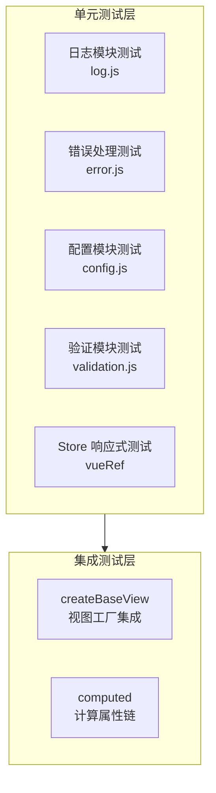

# 场景-1: 核心业务逻辑测试

> **场景 ID**: yiweb-auto-test-suite-scene-1
> **关联 FP**: FP1
> **优先级**: P0

## §0 测试架构

### 测试目标

验证 YiWeb 核心业务逻辑模块的正确性，包括视图工厂 `createBaseView`、日志系统、错误处理、配置管理、工具函数。

### 架构图



### 测试策略

| 模块 | 测试类型 | Mock 策略 | 文件路径 |
|------|:-------:|----------|---------|
| log.js | 单元 | mock console 方法 | `cdn/utils/core/log.js` |
| error.js | 单元 | 无 | `cdn/utils/core/error.js` |
| config.js | 单元 | mock window.location + localStorage | `src/core/config.js` |
| validation.js | 单元 | 无 | `cdn/utils/core/validation.js` |
| createBaseView | 集成 | mock Vue CDN 全局对象 | `cdn/utils/view/baseView.js` |

### 覆盖率目标

- 单元测试行覆盖率 ≥ 85%
- 集成测试分支覆盖率 ≥ 70%

## §1 可执行测试用例

### 模块-1: 日志系统 (log.js)

```javascript
// tests/scene-1-log.test.js
import { describe, it, expect, vi, beforeEach, afterEach } from 'vitest';

describe('日志系统 (log.js)', () => {
  let consoleSpy;

  beforeEach(() => {
    // 设置 debug 模式以启用日志
    window.__ENV__ = { DEBUG: true, name: 'test', isLocal: true };
    consoleSpy = {
      debug: vi.spyOn(console, 'debug').mockImplementation(() => {}),
      info: vi.spyOn(console, 'info').mockImplementation(() => {}),
      warn: vi.spyOn(console, 'warn').mockImplementation(() => {}),
      error: vi.spyOn(console, 'error').mockImplementation(() => {}),
    };
  });

  afterEach(() => {
    vi.restoreAllMocks();
  });

  it('logInfo 在 DEBUG 模式下输出 info 日志', async () => {
    const { logInfo } = await import('/cdn/utils/core/log.js');
    logInfo('test message');
    expect(consoleSpy.info).toHaveBeenCalled();
  });

  it('logError 始终输出 error 日志（不受 DEBUG 控制）', async () => {
    window.__ENV__ = { DEBUG: false, name: 'prod', isLocal: false };
    const { logError } = await import('/cdn/utils/core/log.js');
    logError('critical error');
    expect(consoleSpy.error).toHaveBeenCalled();
  });

  it('logWarn 在 DEBUG=false 时不输出 warn 日志', async () => {
    window.__ENV__ = { DEBUG: false, name: 'prod', isLocal: false };
    const { logWarn } = await import('/cdn/utils/core/log.js');
    logWarn('warning');
    expect(consoleSpy.warn).not.toHaveBeenCalled();
  });

  it('timeStart / timeEnd 记录耗时', async () => {
    const { timeStart, timeEnd } = await import('/cdn/utils/core/log.js');
    timeStart('test-timer');
    await new Promise(r => setTimeout(r, 10));
    timeEnd('test-timer');
    expect(consoleSpy.info).toHaveBeenCalled();
  });
});
```

### 模块-2: 错误处理 (error.js)

```javascript
// tests/scene-1-error.test.js
import { describe, it, expect, beforeEach } from 'vitest';

describe('错误处理 (error.js)', () => {
  let ErrorCodes, ErrorTypes, createError, safeExecute;

  beforeEach(async () => {
    const mod = await import('/cdn/utils/core/error.js');
    ErrorCodes = mod.ErrorCodes;
    ErrorTypes = mod.ErrorTypes;
    createError = mod.createError;
    safeExecute = mod.safeExecute;
  });

  it('ErrorCodes 包含所有标准错误码', () => {
    expect(ErrorCodes).toHaveProperty('UNKNOWN');
    expect(ErrorCodes).toHaveProperty('COMPONENT_LOAD_TIMEOUT');
    expect(ErrorCodes).toHaveProperty('MODULE_LOAD_FAILED');
  });

  it('ErrorTypes 包含所有错误类型', () => {
    expect(ErrorTypes).toHaveProperty('RUNTIME');
    expect(ErrorTypes).toHaveProperty('NETWORK');
    expect(ErrorTypes).toHaveProperty('VALIDATION');
    expect(ErrorTypes).toHaveProperty('AUTH');
  });

  it('createError 创建带完整信息的错误对象', () => {
    const err = createError('测试错误', ErrorTypes.RUNTIME, '测试模块', ErrorCodes.UNKNOWN);
    expect(err).toBeInstanceOf(Error);
    expect(err.message).toContain('测试错误');
  });

  it('safeExecute 捕获异常并返回默认值', () => {
    const result = safeExecute(() => {
      throw new Error('boom');
    }, 'test-op', 'fallback');
    expect(result).toBe('fallback');
  });

  it('safeExecute 正常执行时返回函数结果', () => {
    const result = safeExecute(() => 'success', 'test-op');
    expect(result).toBe('success');
  });
});
```

### 模块-3: 配置管理 (config.js)

```javascript
// tests/scene-1-config.test.js
import { describe, it, expect, beforeEach, afterEach, vi } from 'vitest';

describe('配置管理 (config.js)', () => {
  let originalLocation;
  let storageMock;

  beforeEach(() => {
    storageMock = {};
    vi.stubGlobal('localStorage', {
      getItem: vi.fn((key) => storageMock[key] ?? null),
      setItem: vi.fn((key, val) => { storageMock[key] = val; }),
      removeItem: vi.fn((key) => { delete storageMock[key]; }),
    });
    originalLocation = window.location;
  });

  afterEach(() => {
    vi.unstubAllGlobals();
    if (originalLocation) {
      Object.defineProperty(window, 'location', { value: originalLocation, writable: true });
    }
  });

  it('默认环境为 prod', async () => {
    const { default: config } = await import('/src/core/config.js?' + Date.now());
    expect(config.env).toBe('prod');
    expect(config.isProd).toBe(true);
  });

  it('buildApiUrl 拼接正确的 API URL', async () => {
    const { buildApiUrl } = await import('/src/core/config.js?' + Date.now());
    const url = buildApiUrl('/api/test');
    expect(url).toContain('effiy.cn');
    expect(url).toContain('/api/test');
  });

  it('buildDataUrl 处理空路径返回 base URL', async () => {
    const { buildDataUrl } = await import('/src/core/config.js?' + Date.now());
    const url = buildDataUrl('');
    expect(url).toBe('https://data.effiy.cn');
  });
});
```

### 模块-4: 验证工具 (validation.js)

```javascript
// tests/scene-1-validation.test.js
import { describe, it, expect, beforeEach } from 'vitest';

describe('验证工具 (validation.js)', () => {
  let validation;

  beforeEach(async () => {
    validation = await import('/cdn/utils/core/validation.js');
  });

  it('isEmptyObject 对空对象返回 true', () => {
    if (typeof validation.isEmptyObject === 'function') {
      expect(validation.isEmptyObject({})).toBe(true);
    }
  });

  it('isEmptyObject 对非空对象返回 false', () => {
    if (typeof validation.isEmptyObject === 'function') {
      expect(validation.isEmptyObject({ a: 1 })).toBe(false);
    }
  });

  it('至少导出一种验证函数', () => {
    const keys = Object.keys(validation);
    expect(keys.length).toBeGreaterThan(0);
  });
});
```

### 模块-5: createBaseView 集成

```javascript
// tests/scene-1-baseView.test.js
import { describe, it, expect, beforeEach, vi } from 'vitest';

describe('createBaseView 视图工厂', () => {
  beforeEach(() => {
    // Mock Vue CDN 全局对象
    vi.stubGlobal('Vue', {
      createApp: vi.fn(() => ({
        mount: vi.fn(() => ({})),
        component: vi.fn(),
        use: vi.fn(),
      })),
      ref: vi.fn((val) => ({ value: val, __v_isRef: true })),
      computed: vi.fn((fn) => ({ value: fn() })),
      isRef: vi.fn(() => false),
      provide: vi.fn(),
    });
    document.body.innerHTML = '<div id="app"><p>hello</p></div>';
  });

  afterEach(() => {
    vi.unstubAllGlobals();
  });

  it('createBaseView 导出为函数', async () => {
    const { createBaseView } = await import('/cdn/utils/view/baseView.js');
    expect(typeof createBaseView).toBe('function');
  });

  it('缺少必需函数时抛出错误', async () => {
    const { createBaseView } = await import('/cdn/utils/view/baseView.js');
    await expect(createBaseView({})).rejects.toThrow();
  });

  it('传入正确的 store/computed/methods 时成功挂载', async () => {
    const { createBaseView } = await import('/cdn/utils/view/baseView.js');
    const store = { count: { value: 0 }, msg: { value: 'hello' } };
    const app = await createBaseView({
      createStore: () => store,
      useComputed: (s) => ({ double: { value: s.count.value * 2 } }),
      useMethods: (s) => ({ inc: () => { s.count.value++; } }),
    });
    expect(app).toBeDefined();
  });
});
```
